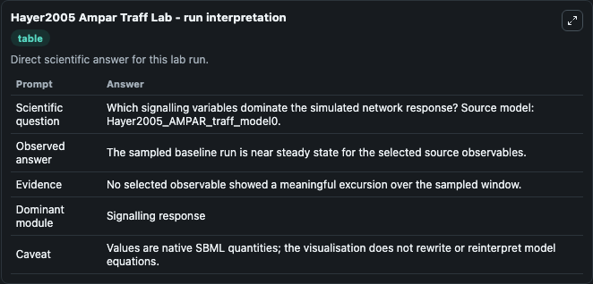
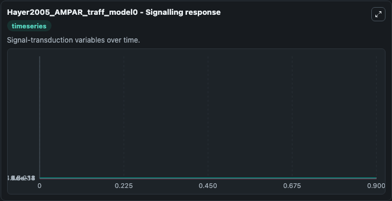
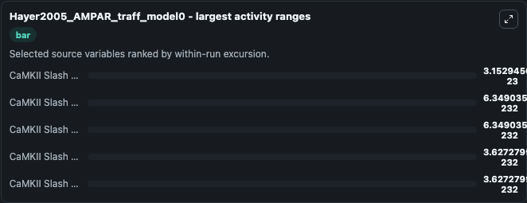
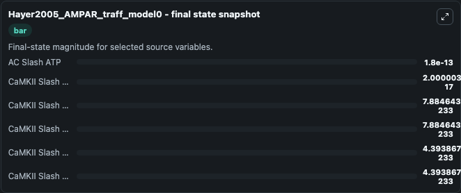
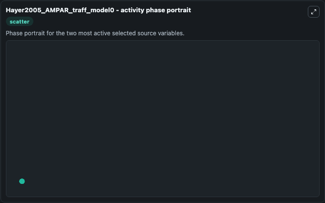

# Hayer2005 Ampar Traff

This Biosimulant lab wraps `Hayer2005 Ampar Traff` as a runnable systems biology model with a companion visualization module.
This is model 0 from Hayer and Bhalla, PLoS Comput Biol 2005. It can be used to explore the configured dynamics and compare scenario outcomes across configurations.

## What You'll See

The lab asks: Which signalling variables dominate the simulated network response? Source model: Hayer2005_AMPAR_traff_model0. It runs for 1.0 time units with a communication step of 0.1. The run uses the model defaults declared by the curated SBML wrapper. The generated visualizations focus on AC Slash ATP, CaMKII Slash ActCaMKII Minus PSD, CaMKII Slash ActCaMKII Minus PSD Slash CaMKII Slash CaMKII Cplx, CaMKII Slash ActCaMKII Minus PSD Slash CaMKII Sbo 4 Sbc Slash CaMKII Sbo 4 Sbc Cplx, CaMKII Slash ActCaMKII Minus PSD Slash CaMKII Sbo 8 Sbc Slash CaMKII Sbo 8 Sbc Cplx, and CaMKII Slash ActCaMKII Minus PSD Slash CaMKII Sbo 12 Sbc Slash CaMKII Sbo 12 Sbc Cplx, combining trajectory, endpoint-comparison, and summary-table views from one completed dark-mode run.

In this captured run, **CaMKII Slash ActCaMKII Minus PSD** moved from 2e-17 to 2e-17 across 1.0 simulation windows.


### Output Visualizations



*Summary table for Hayer2005 Ampar Traff, reporting the scientific question, observed answer, dominant module, and caveat.*



*Trajectories of CaMKII Slash ActCaMKII Minus PSD, CaMKII Slash ActCaMKII Minus PSD Slash CaMKII Slash CaMKII Cplx, CaMKII Slash ActCaMKII Minus PSD Slash CaMKII Sbo 4 Sbc Slash CaMKII Sbo 4 Sbc Cplx, CaMKII Slash ActCaMKII Minus PSD Slash CaMKII Sbo 8 Sbc Slash CaMKII Sbo 8 Sbc Cplx, CaMKII Slash ActCaMKII Minus PSD Slash CaMKII Sbo 12 Sbc Slash CaMKII Sbo 12 Sbc Cplx, and AC Slash ATP across the 1.0 simulation. In this run **CaMKII Slash ActCaMKII Minus PSD** climbed from 2e-17 to 2e-17 and **CaMKII Slash ActCaMKII Minus PSD Slash CaMKII Slash CaMKII Cplx** fell from 7.14e-232 to 7.88e-233 — the largest movements among the focused observables.*



*Largest-excursion ranking of the focused observables — the absolute movement magnitude during the run. Top 3: **CaMKII Slash ActCaMKII Minus PSD** = 3.15e-23, **CaMKII Slash ActCaMKII Minus PSD Slash CaMKII Slash CaMKII Cplx** = 6.35e-232, **CaMKII Slash ActCaMKII Minus PSD Slash CaMKII Sbo 4 Sbc Slash CaMKII Sbo 4 Sbc Cplx** = 6.35e-232, with 2 more observables below.*



*Endpoint snapshot of the focused observables — final values from the captured run. Top 3 by value: **AC Slash ATP** = 1.8e-13, **CaMKII Slash ActCaMKII Minus PSD** = 2e-17, **CaMKII Slash ActCaMKII Minus PSD Slash CaMKII Slash CaMKII Cplx** = 7.88e-233, with 3 more observables below.*



*Visualization card from the Hayer2005 Ampar Traff dark-mode run.*


## Model Context

- Core model: `models/core`
- Visualization model: `models/visualisation`
- Standard: `other`
- Upstream source: `biomodels_ebi:MODEL9086207764`
- License: `CC0`

## Inputs

| Input | Maps To | Default | Notes |
|---|---|---|---|
| Initial Ac Slash ATP | `systemsbiology_sbml_hayer2005_ampar_traff_model0_model9086207764_model.initial_ac_slash_atp` | | Source state initial condition exposed as a model-specific control because no explicit intervention parameter is identifiable. Maps to SBML symbol `AC_slash_ATP`. |
| Initial Ca Mkii Slash Act Ca Mkii Minus Psd | `systemsbiology_sbml_hayer2005_ampar_traff_model0_model9086207764_model.initial_ca_mkii_slash_act_ca_mkii_minus_psd` | | Source state initial condition exposed as a model-specific control because no explicit intervention parameter is identifiable. Maps to SBML symbol `CaMKII_slash_actCaMKII_minus_PSD`. |
| Initial Ca Mkii Slash Act Ca Mkii Minus Psd Slash Ca Mkii Slash Ca Mkii Cplx | `systemsbiology_sbml_hayer2005_ampar_traff_model0_model9086207764_model.initial_ca_mkii_slash_act_ca_mkii_minus_psd_slash_ca_mkii_slash_ca_mkii_cplx` | | Source state initial condition exposed as a model-specific control because no explicit intervention parameter is identifiable. Maps to SBML symbol `CaMKII_slash_actCaMKII_minus_PSD_slash_CaMKII_slash_CaMKII_cplx`. |
| Initial Ca Mkii Slash Act Ca Mkii Minus Psd Slash Ca Mkii Sbo 4 Sbc Slash Ca Mkii Sbo 4 Sbc Cplx | `systemsbiology_sbml_hayer2005_ampar_traff_model0_model9086207764_model.initial_ca_mkii_slash_act_ca_mkii_minus_psd_slash_ca_mkii_sbo_4_sbc_slash_ca_mkii_sbo_4_sbc_cplx` | | Source state initial condition exposed as a model-specific control because no explicit intervention parameter is identifiable. Maps to SBML symbol `CaMKII_slash_actCaMKII_minus_PSD_slash_CaMKII_sbo_4_sbc__slash_CaMKII_sbo_4_sbc__cplx`. |
| Initial Ca Mkii Slash Act Ca Mkii Minus Psd Slash Ca Mkii Sbo 8 Sbc Slash Ca Mkii Sbo 8 Sbc Cplx | `systemsbiology_sbml_hayer2005_ampar_traff_model0_model9086207764_model.initial_ca_mkii_slash_act_ca_mkii_minus_psd_slash_ca_mkii_sbo_8_sbc_slash_ca_mkii_sbo_8_sbc_cplx` | | Source state initial condition exposed as a model-specific control because no explicit intervention parameter is identifiable. Maps to SBML symbol `CaMKII_slash_actCaMKII_minus_PSD_slash_CaMKII_sbo_8_sbc__slash_CaMKII_sbo_8_sbc__cplx`. |
| Initial Ca Mkii Slash Act Ca Mkii Minus Psd Slash Ca Mkii Sbo 12 Sbc Slash Ca Mkii Sbo 12 Sbc Cplx | `systemsbiology_sbml_hayer2005_ampar_traff_model0_model9086207764_model.initial_ca_mkii_slash_act_ca_mkii_minus_psd_slash_ca_mkii_sbo_12_sbc_slash_ca_mkii_sbo_12_sbc_cplx` | | Source state initial condition exposed as a model-specific control because no explicit intervention parameter is identifiable. Maps to SBML symbol `CaMKII_slash_actCaMKII_minus_PSD_slash_CaMKII_sbo_12_sbc__slash_CaMKII_sbo_12_sbc__cplx`. |

## Outputs

| Output | Maps To | Role |
|---|---|---|
| `state` | `systemsbiology_sbml_hayer2005_ampar_traff_model0_model9086207764_model.state` | Available to the visualization model and downstream workflows. |
| `summary` | `systemsbiology_sbml_hayer2005_ampar_traff_model0_model9086207764_model.summary` | Available to the visualization model and downstream workflows. |
| `species_labels` | `systemsbiology_sbml_hayer2005_ampar_traff_model0_model9086207764_model.species_labels` | Available to the visualization model and downstream workflows. |
| `ac_slash_atp` | `systemsbiology_sbml_hayer2005_ampar_traff_model0_model9086207764_model.ac_slash_atp` | Available to the visualization model and downstream workflows. |
| `ca_mkii_slash_act_ca_mkii_minus_psd` | `systemsbiology_sbml_hayer2005_ampar_traff_model0_model9086207764_model.ca_mkii_slash_act_ca_mkii_minus_psd` | Available to the visualization model and downstream workflows. |
| `ca_mkii_slash_act_ca_mkii_minus_psd_slash_ca_mkii_slash_ca_mkii_cplx` | `systemsbiology_sbml_hayer2005_ampar_traff_model0_model9086207764_model.ca_mkii_slash_act_ca_mkii_minus_psd_slash_ca_mkii_slash_ca_mkii_cplx` | Available to the visualization model and downstream workflows. |
| `ca_mkii_slash_act_ca_mkii_minus_psd_slash_ca_mkii_sbo_4_sbc_slash_ca_mkii_sbo_4_sbc_cplx` | `systemsbiology_sbml_hayer2005_ampar_traff_model0_model9086207764_model.ca_mkii_slash_act_ca_mkii_minus_psd_slash_ca_mkii_sbo_4_sbc_slash_ca_mkii_sbo_4_sbc_cplx` | Available to the visualization model and downstream workflows. |
| `ca_mkii_slash_act_ca_mkii_minus_psd_slash_ca_mkii_sbo_8_sbc_slash_ca_mkii_sbo_8_sbc_cplx` | `systemsbiology_sbml_hayer2005_ampar_traff_model0_model9086207764_model.ca_mkii_slash_act_ca_mkii_minus_psd_slash_ca_mkii_sbo_8_sbc_slash_ca_mkii_sbo_8_sbc_cplx` | Available to the visualization model and downstream workflows. |
| `ca_mkii_slash_act_ca_mkii_minus_psd_slash_ca_mkii_sbo_12_sbc_slash_ca_mkii_sbo_12_sbc_cplx` | `systemsbiology_sbml_hayer2005_ampar_traff_model0_model9086207764_model.ca_mkii_slash_act_ca_mkii_minus_psd_slash_ca_mkii_sbo_12_sbc_slash_ca_mkii_sbo_12_sbc_cplx` | Available to the visualization model and downstream workflows. |

## Runtime

- Duration: `1.0`
- Communication step: `0.1`

## Running Locally

```bash
biosimulant labs serve
```
