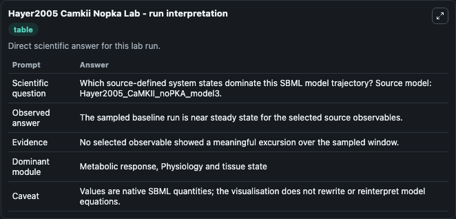
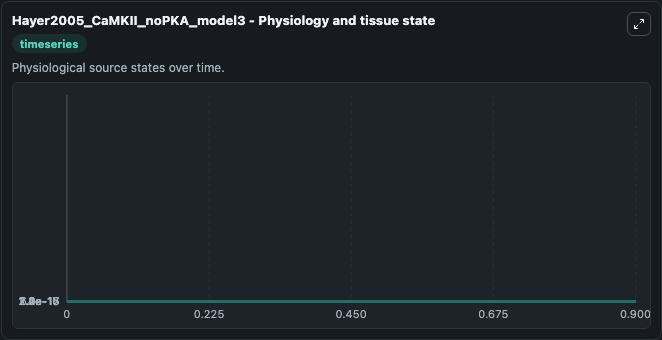
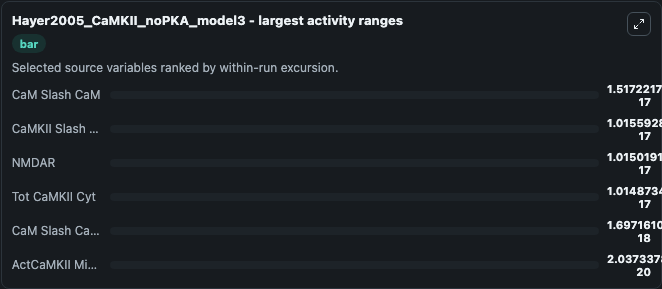
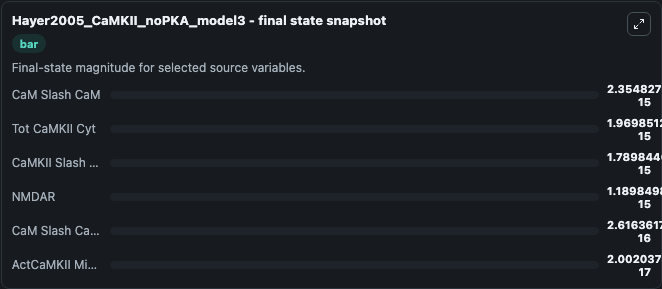
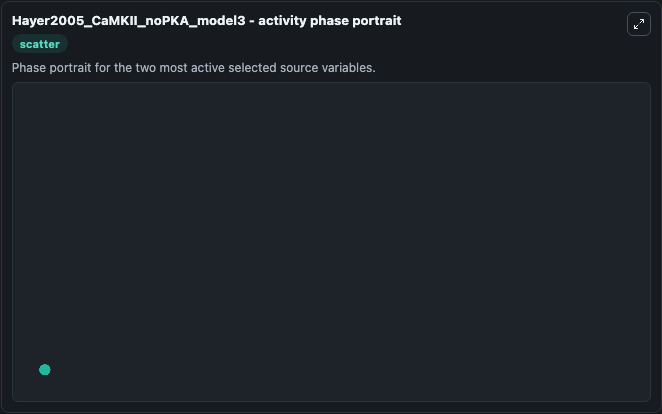

# Hayer2005 Camkii Nopka

This Biosimulant lab wraps `Hayer2005 Camkii Nopka` as a runnable systems biology model with a companion visualization module.
This is the model of CaMKII bistability, model 3. It can be used to explore the configured dynamics and compare scenario outcomes across configurations.

## What You'll See

The lab asks: Which source-defined system states dominate this SBML model trajectory? Source model: Hayer2005_CaMKII_noPKA_model3. It runs for 1.0 time units with a communication step of 0.1. The run uses the model defaults declared by the curated SBML wrapper. The generated visualizations focus on ActCaMKII Minus PSD, NMDAR, CaM Slash CaM Minus PSD, CaM Slash CaM, Tot CaMKII Cyt, and CaMKII Slash CaMKII, combining trajectory, endpoint-comparison, and summary-table views from one completed dark-mode run.

In this captured run, **CaM Slash CaM** moved from 2.37e-15 to 2.35e-15 across 1.0 simulation windows.


### Output Visualizations



*Summary table for Hayer2005 Camkii Nopka, reporting the scientific question, observed answer, dominant module, and caveat.*



*Trajectories of CaM Slash CaM, CaMKII Slash CaMKII, NMDAR, Tot CaMKII Cyt, CaM Slash CaM Minus PSD, and ActCaMKII Minus PSD across the 1.0 simulation. In this run **ActCaMKII Minus PSD** climbed from 2e-17 to 2e-17 and **CaM Slash CaM** fell from 2.37e-15 to 2.35e-15 — the largest movements among the focused observables.*



*Largest-excursion ranking of the focused observables — the absolute movement magnitude during the run. Top 3: **CaM Slash CaM** = 1.52e-17, **CaMKII Slash CaMKII** = 1.02e-17, **NMDAR** = 1.02e-17, with 3 more observables below.*



*Endpoint snapshot of the focused observables — final values from the captured run. Top 3 by value: **CaM Slash CaM** = 2.35e-15, **Tot CaMKII Cyt** = 1.97e-15, **CaMKII Slash CaMKII** = 1.79e-15, with 3 more observables below.*



*Visualization card from the Hayer2005 Camkii Nopka dark-mode run.*


## Model Context

- Core model: `models/core`
- Visualization model: `models/visualisation`
- Standard: `other`
- Upstream source: `biomodels_ebi:MODEL9086926384`
- License: `CC0`

## Inputs

| Input | Maps To | Default | Notes |
|---|---|---|---|
| Initial Act Ca Mkii Minus Psd | `systemsbiology_sbml_hayer2005_camkii_nopka_model3_model9086926384_model.initial_act_ca_mkii_minus_psd` | | Source state initial condition exposed as a model-specific control because no explicit intervention parameter is identifiable. Maps to SBML symbol `actCaMKII_minus_PSD`. |
| Initial Nmdar | `systemsbiology_sbml_hayer2005_camkii_nopka_model3_model9086926384_model.initial_nmdar` | | Source state initial condition exposed as a model-specific control because no explicit intervention parameter is identifiable. Maps to SBML symbol `NMDAR`. |
| Initial Ca M Slash Ca M Minus Psd | `systemsbiology_sbml_hayer2005_camkii_nopka_model3_model9086926384_model.initial_ca_m_slash_ca_m_minus_psd` | | Source state initial condition exposed as a model-specific control because no explicit intervention parameter is identifiable. Maps to SBML symbol `CaM_slash_CaM_minus_PSD`. |
| Initial Ca M Slash Ca M | `systemsbiology_sbml_hayer2005_camkii_nopka_model3_model9086926384_model.initial_ca_m_slash_ca_m` | | Source state initial condition exposed as a model-specific control because no explicit intervention parameter is identifiable. Maps to SBML symbol `CaM_slash_CaM`. |
| Initial Tot Ca Mkii Cyt | `systemsbiology_sbml_hayer2005_camkii_nopka_model3_model9086926384_model.initial_tot_ca_mkii_cyt` | | Source state initial condition exposed as a model-specific control because no explicit intervention parameter is identifiable. Maps to SBML symbol `tot_CaMKII_cyt`. |
| Initial Ca Mkii Slash Ca Mkii | `systemsbiology_sbml_hayer2005_camkii_nopka_model3_model9086926384_model.initial_ca_mkii_slash_ca_mkii` | | Source state initial condition exposed as a model-specific control because no explicit intervention parameter is identifiable. Maps to SBML symbol `CaMKII_slash_CaMKII`. |

## Outputs

| Output | Maps To | Role |
|---|---|---|
| `state` | `systemsbiology_sbml_hayer2005_camkii_nopka_model3_model9086926384_model.state` | Available to the visualization model and downstream workflows. |
| `summary` | `systemsbiology_sbml_hayer2005_camkii_nopka_model3_model9086926384_model.summary` | Available to the visualization model and downstream workflows. |
| `species_labels` | `systemsbiology_sbml_hayer2005_camkii_nopka_model3_model9086926384_model.species_labels` | Available to the visualization model and downstream workflows. |
| `act_ca_mkii_minus_psd` | `systemsbiology_sbml_hayer2005_camkii_nopka_model3_model9086926384_model.act_ca_mkii_minus_psd` | Available to the visualization model and downstream workflows. |
| `nmdar` | `systemsbiology_sbml_hayer2005_camkii_nopka_model3_model9086926384_model.nmdar` | Available to the visualization model and downstream workflows. |
| `ca_m_slash_ca_m_minus_psd` | `systemsbiology_sbml_hayer2005_camkii_nopka_model3_model9086926384_model.ca_m_slash_ca_m_minus_psd` | Available to the visualization model and downstream workflows. |
| `ca_m_slash_ca_m` | `systemsbiology_sbml_hayer2005_camkii_nopka_model3_model9086926384_model.ca_m_slash_ca_m` | Available to the visualization model and downstream workflows. |
| `tot_ca_mkii_cyt` | `systemsbiology_sbml_hayer2005_camkii_nopka_model3_model9086926384_model.tot_ca_mkii_cyt` | Available to the visualization model and downstream workflows. |
| `ca_mkii_slash_ca_mkii` | `systemsbiology_sbml_hayer2005_camkii_nopka_model3_model9086926384_model.ca_mkii_slash_ca_mkii` | Available to the visualization model and downstream workflows. |

## Runtime

- Duration: `1.0`
- Communication step: `0.1`

## Running Locally

```bash
biosimulant labs serve
```
