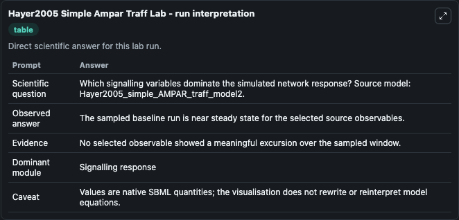
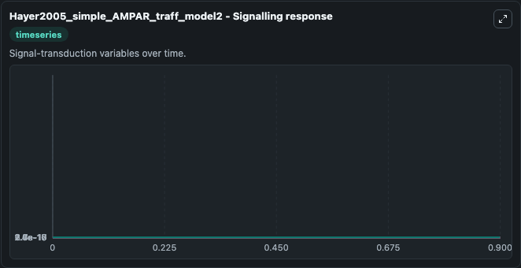
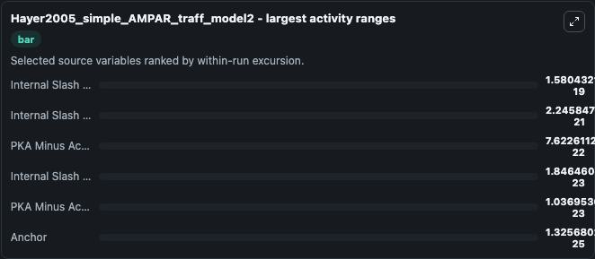
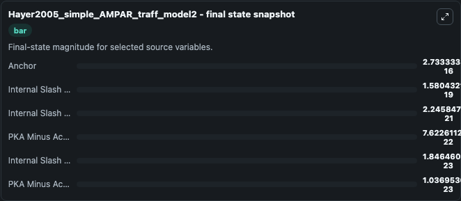
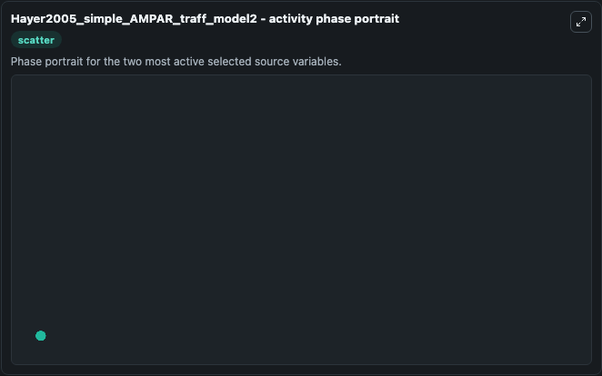

# Hayer2005 Simple Ampar Traff

This Biosimulant lab wraps `Hayer2005 Simple Ampar Traff` as a runnable systems biology model with a companion visualization module.
This is a highly simplified model of the AMPAR trafficking cycle that exhibits bistability. It can be used to explore the configured dynamics and compare scenario outcomes across configurations.

## What You'll See

The lab asks: Which signalling variables dominate the simulated network response? Source model: Hayer2005_simple_AMPAR_traff_model2. It runs for 1.0 time units with a communication step of 0.1. The run uses the model defaults declared by the curated SBML wrapper. The generated visualizations focus on Internal Slash IR Star, Internal Slash IR, PKA Minus Active Slash Internal Minus PKA Minus Act Slash Internal Minus PKA Minus Act Cplx, PKA Minus Active Slash Internal Minus PKA Minus Act Sbo 1 Sbc Slash Internal Minus PKA Minus Act Sbo 1 Sbc Cplx, Internal Slash IR Star Star, and Anchor, combining trajectory, endpoint-comparison, and summary-table views from one completed dark-mode run.

In this captured run, **Internal Slash IR** moved from 0 to 1.58e-19 across 1.0 simulation windows.


### Output Visualizations



*Summary table for Hayer2005 Simple Ampar Traff, reporting the scientific question, observed answer, dominant module, and caveat.*



*Trajectories of Internal Slash IR, Internal Slash IR Star, PKA Minus Active Slash Internal Minus PKA Minus Act Slash Internal Minus PKA Minus Act Cplx, Internal Slash IR Star Star, PKA Minus Active Slash Internal Minus PKA Minus Act Sbo 1 Sbc Slash Internal Minus PKA Minus Act Sbo 1 Sbc Cplx, and Anchor across the 1.0 simulation. In this run **Internal Slash IR** climbed from 0 to 1.58e-19 and **Anchor** fell from 2.73e-16 to 2.73e-16 — the largest movements among the focused observables.*



*Largest-excursion ranking of the focused observables — the absolute movement magnitude during the run. Top 3: **Internal Slash IR** = 1.58e-19, **Internal Slash IR Star** = 2.25e-21, **PKA Minus Active Slash Internal Minus PKA Minus Act Slash Internal Minus PKA Minus Act Cplx** = 7.62e-22, with 3 more observables below.*



*Endpoint snapshot of the focused observables — final values from the captured run. Top 3 by value: **Anchor** = 2.73e-16, **Internal Slash IR** = 1.58e-19, **Internal Slash IR Star** = 2.25e-21, with 3 more observables below.*



*Visualization card from the Hayer2005 Simple Ampar Traff dark-mode run.*


## Model Context

- Core model: `models/core`
- Visualization model: `models/visualisation`
- Standard: `other`
- Upstream source: `biomodels_ebi:MODEL9086628127`
- License: `CC0`

## Inputs

| Input | Maps To | Default | Notes |
|---|---|---|---|
| Initial Internal Slash Ir Star | `systemsbiology_sbml_hayer2005_simple_ampar_traff_model2_model9086628127_model.initial_internal_slash_ir_star` | | Source state initial condition exposed as a model-specific control because no explicit intervention parameter is identifiable. Maps to SBML symbol `Internal_slash_IR_star_`. |
| Initial Internal Slash Ir | `systemsbiology_sbml_hayer2005_simple_ampar_traff_model2_model9086628127_model.initial_internal_slash_ir` | | Source state initial condition exposed as a model-specific control because no explicit intervention parameter is identifiable. Maps to SBML symbol `Internal_slash_IR`. |
| Initial Pka Minus Active Slash Internal Minus Pka Minus Act Slash Internal Minus Pka Minus Act Cplx | `systemsbiology_sbml_hayer2005_simple_ampar_traff_model2_model9086628127_model.initial_pka_minus_active_slash_internal_minus_pka_minus_act_slash_internal_minus_pka_minus_act_cplx` | | Source state initial condition exposed as a model-specific control because no explicit intervention parameter is identifiable. Maps to SBML symbol `PKA_minus_active_slash_internal_minus_PKA_minus_act_slash_internal_minus_PKA_minus_act_cplx`. |
| Initial Pka Minus Active Slash Internal Minus Pka Minus Act Sbo 1 Sbc Slash Internal Minus Pka Minus Act Sbo 1 Sbc Cplx | `systemsbiology_sbml_hayer2005_simple_ampar_traff_model2_model9086628127_model.initial_pka_minus_active_slash_internal_minus_pka_minus_act_sbo_1_sbc_slash_internal_minus_pka_minus_act_sbo_1_sbc_cplx` | | Source state initial condition exposed as a model-specific control because no explicit intervention parameter is identifiable. Maps to SBML symbol `PKA_minus_active_slash_internal_minus_PKA_minus_act_sbo_1_sbc__slash_internal_minus_PKA_minus_act_sbo_1_sbc__cplx`. |
| Initial Internal Slash Ir Star Star | `systemsbiology_sbml_hayer2005_simple_ampar_traff_model2_model9086628127_model.initial_internal_slash_ir_star_star` | | Source state initial condition exposed as a model-specific control because no explicit intervention parameter is identifiable. Maps to SBML symbol `Internal_slash_IR_star__star_`. |
| Initial Anchor | `systemsbiology_sbml_hayer2005_simple_ampar_traff_model2_model9086628127_model.initial_anchor` | | Source state initial condition exposed as a model-specific control because no explicit intervention parameter is identifiable. Maps to SBML symbol `Anchor`. |

## Outputs

| Output | Maps To | Role |
|---|---|---|
| `state` | `systemsbiology_sbml_hayer2005_simple_ampar_traff_model2_model9086628127_model.state` | Available to the visualization model and downstream workflows. |
| `summary` | `systemsbiology_sbml_hayer2005_simple_ampar_traff_model2_model9086628127_model.summary` | Available to the visualization model and downstream workflows. |
| `species_labels` | `systemsbiology_sbml_hayer2005_simple_ampar_traff_model2_model9086628127_model.species_labels` | Available to the visualization model and downstream workflows. |
| `internal_slash_ir_star` | `systemsbiology_sbml_hayer2005_simple_ampar_traff_model2_model9086628127_model.internal_slash_ir_star` | Available to the visualization model and downstream workflows. |
| `internal_slash_ir` | `systemsbiology_sbml_hayer2005_simple_ampar_traff_model2_model9086628127_model.internal_slash_ir` | Available to the visualization model and downstream workflows. |
| `pka_minus_active_slash_internal_minus_pka_minus_act_slash_internal_minus_pka_minus_act_cplx` | `systemsbiology_sbml_hayer2005_simple_ampar_traff_model2_model9086628127_model.pka_minus_active_slash_internal_minus_pka_minus_act_slash_internal_minus_pka_minus_act_cplx` | Available to the visualization model and downstream workflows. |
| `pka_minus_active_slash_internal_minus_pka_minus_act_sbo_1_sbc_slash_internal_minus_pka_minus_act_sbo_1_sbc_cplx` | `systemsbiology_sbml_hayer2005_simple_ampar_traff_model2_model9086628127_model.pka_minus_active_slash_internal_minus_pka_minus_act_sbo_1_sbc_slash_internal_minus_pka_minus_act_sbo_1_sbc_cplx` | Available to the visualization model and downstream workflows. |
| `internal_slash_ir_star_star` | `systemsbiology_sbml_hayer2005_simple_ampar_traff_model2_model9086628127_model.internal_slash_ir_star_star` | Available to the visualization model and downstream workflows. |
| `anchor` | `systemsbiology_sbml_hayer2005_simple_ampar_traff_model2_model9086628127_model.anchor` | Available to the visualization model and downstream workflows. |

## Runtime

- Duration: `1.0`
- Communication step: `0.1`

## Running Locally

```bash
biosimulant labs serve
```
