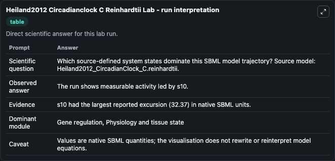
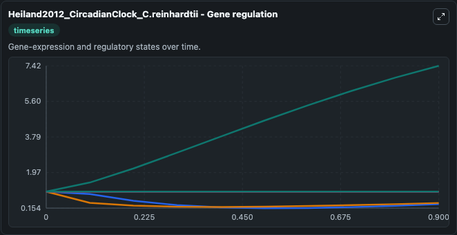
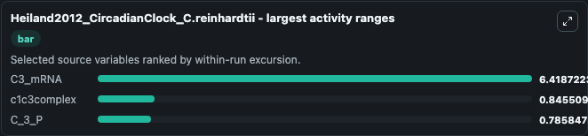
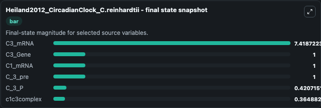
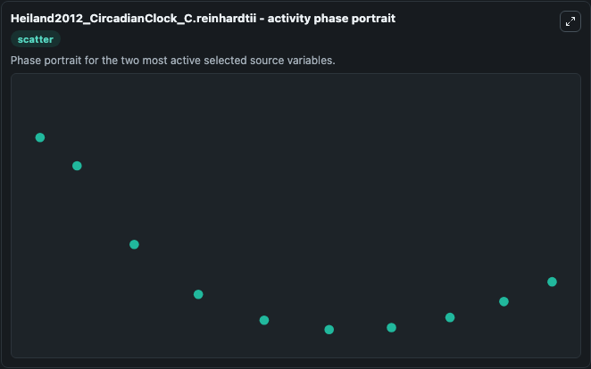

# Heiland2012 Circadianclock C Reinhardtii

This Biosimulant lab wraps `Heiland2012 Circadianclock C Reinhardtii` as a runnable systems biology model with a companion visualization module.
This model is from the article: Modeling temperature entrainment of circadian clocks using the Arrhenius equation and a reconstructed model from Chlamydomonas reinhardtii Ines Heiland, Christian Boden. It can be used to explore the configured dynamics and compare scenario outcomes across configurations.

## What You'll See

The lab asks: Which source-defined system states dominate this SBML model trajectory? Source model: Heiland2012_CircadianClock_C.reinhardtii. It runs for 1.0 time units with a communication step of 0.1. The run uses the model defaults declared by the curated SBML wrapper. The generated visualizations focus on C3_mRNA, C3_Gene, C1_mRNA, c1c3complex, C_3_pre, and C_3_P, combining trajectory, endpoint-comparison, and summary-table views from one completed dark-mode run.

In this captured run, **C3_mRNA** moved from 1.000 to 7.419 across 1.0 simulation windows.


### Output Visualizations



*Summary table for Heiland2012 Circadianclock C Reinhardtii, reporting the scientific question, observed answer, dominant module, and caveat.*



*Trajectories of C3_mRNA, c1c3complex, C_3_P, C3_Gene, C1_mRNA, and C_3_pre across the 1.0 simulation. In this run **C3_mRNA** climbed from 1.000 to 7.419 and **c1c3complex** fell from 1.000 to 0.3649 — the largest movements among the focused observables.*



*Largest-excursion ranking of the focused observables — the absolute movement magnitude during the run. Top 3: **C3_mRNA** = 6.419, **c1c3complex** = 0.8455, **C_3_P** = 0.7858.*



*Endpoint snapshot of the focused observables — final values from the captured run. Top 3 by value: **C3_mRNA** = 7.419, **C3_Gene** = 1.000, **C1_mRNA** = 1.000, with 3 more observables below.*



*Visualization card from the Heiland2012 Circadianclock C Reinhardtii dark-mode run.*


## Model Context

- Core model: `models/core`
- Visualization model: `models/visualisation`
- Standard: `other`
- Upstream source: `biomodels_ebi:BIOMD0000000411`
- License: `CC0`

## Inputs

| Input | Maps To | Default | Notes |
|---|---|---|---|
| Initial C3 MRNA | `systemsbiology_sbml_heiland2012_circadianclock_c_reinhardtii_biomd0000000411_model.initial_c3_mrna` | | Source state initial condition exposed as a model-specific control because no explicit intervention parameter is identifiable. Maps to SBML symbol `s9`. |
| Initial C3 Gene | `systemsbiology_sbml_heiland2012_circadianclock_c_reinhardtii_biomd0000000411_model.initial_c3_gene` | | Source state initial condition exposed as a model-specific control because no explicit intervention parameter is identifiable. Maps to SBML symbol `s2`. |
| Initial C1 MRNA | `systemsbiology_sbml_heiland2012_circadianclock_c_reinhardtii_biomd0000000411_model.initial_c1_mrna` | | Source state initial condition exposed as a model-specific control because no explicit intervention parameter is identifiable. Maps to SBML symbol `species_2`. |
| Initial C1c3complex | `systemsbiology_sbml_heiland2012_circadianclock_c_reinhardtii_biomd0000000411_model.initial_c1c3complex` | | Source state initial condition exposed as a model-specific control because no explicit intervention parameter is identifiable. Maps to SBML symbol `species_4`. |
| Initial C 3 Pre | `systemsbiology_sbml_heiland2012_circadianclock_c_reinhardtii_biomd0000000411_model.initial_c_3_pre` | | Source state initial condition exposed as a model-specific control because no explicit intervention parameter is identifiable. Maps to SBML symbol `s13`. |
| Initial C 3 P | `systemsbiology_sbml_heiland2012_circadianclock_c_reinhardtii_biomd0000000411_model.initial_c_3_p` | | Source state initial condition exposed as a model-specific control because no explicit intervention parameter is identifiable. Maps to SBML symbol `s11`. |

## Outputs

| Output | Maps To | Role |
|---|---|---|
| `state` | `systemsbiology_sbml_heiland2012_circadianclock_c_reinhardtii_biomd0000000411_model.state` | Available to the visualization model and downstream workflows. |
| `summary` | `systemsbiology_sbml_heiland2012_circadianclock_c_reinhardtii_biomd0000000411_model.summary` | Available to the visualization model and downstream workflows. |
| `species_labels` | `systemsbiology_sbml_heiland2012_circadianclock_c_reinhardtii_biomd0000000411_model.species_labels` | Available to the visualization model and downstream workflows. |
| `c3_mrna` | `systemsbiology_sbml_heiland2012_circadianclock_c_reinhardtii_biomd0000000411_model.c3_mrna` | Available to the visualization model and downstream workflows. |
| `c3_gene` | `systemsbiology_sbml_heiland2012_circadianclock_c_reinhardtii_biomd0000000411_model.c3_gene` | Available to the visualization model and downstream workflows. |
| `c1_mrna` | `systemsbiology_sbml_heiland2012_circadianclock_c_reinhardtii_biomd0000000411_model.c1_mrna` | Available to the visualization model and downstream workflows. |
| `c1c3complex` | `systemsbiology_sbml_heiland2012_circadianclock_c_reinhardtii_biomd0000000411_model.c1c3complex` | Available to the visualization model and downstream workflows. |
| `c_3_pre` | `systemsbiology_sbml_heiland2012_circadianclock_c_reinhardtii_biomd0000000411_model.c_3_pre` | Available to the visualization model and downstream workflows. |
| `c_3_p` | `systemsbiology_sbml_heiland2012_circadianclock_c_reinhardtii_biomd0000000411_model.c_3_p` | Available to the visualization model and downstream workflows. |

## Runtime

- Duration: `1.0`
- Communication step: `0.1`

## Running Locally

```bash
biosimulant labs serve
```
