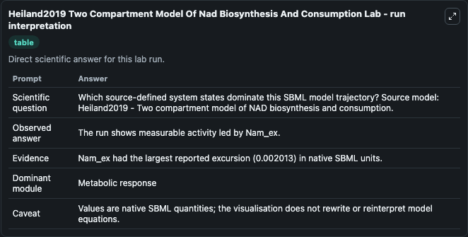
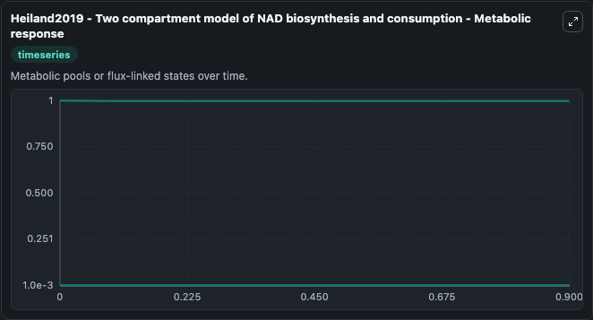
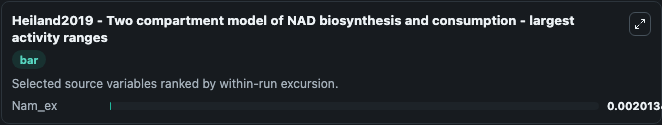
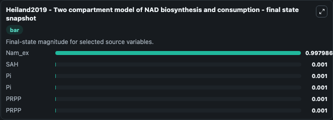

# Heiland2019 Two Compartment Model Of Nad Biosynthesis And Consumption

This Biosimulant lab wraps `Heiland2019 Two Compartment Model Of Nad Biosynthesis And Consumption` as a runnable systems biology model with a companion visualization module.
The model is based on MODEL1905220001 but has two compartments that have different composition of the biosynthetic enzymes NADA and NamPT. It can be used to explore the configured dynamics and compare scenario outcomes across configurations.

## What You'll See

The lab asks: Which source-defined system states dominate this SBML model trajectory? Source model: Heiland2019 - Two compartment model of NAD biosynthesis and consumption. It runs for 1.0 time units with a communication step of 0.1. The run uses the model defaults declared by the curated SBML wrapper. The generated visualizations focus on SAH, Pi, PRPP, and Nam_ex, combining trajectory, endpoint-comparison, and summary-table views from one completed dark-mode run.

In this captured run, **Nam_ex** moved from 1.000 to 0.9980 across 1.0 simulation windows.


### Output Visualizations



*Summary table for Heiland2019 Two Compartment Model Of Nad Biosynthesis And Consumption, reporting the scientific question, observed answer, dominant module, and caveat.*



*Trajectories of Nam_ex, SAH, Pi, Pi, PRPP, and PRPP across the 1.0 simulation. In this run **Nam_ex** fell from 1.000 to 0.9980 — the largest movements among the focused observables.*



*Largest-excursion ranking of the focused observables — the absolute movement magnitude during the run. Top 1: **Nam_ex** = 0.00201.*



*Endpoint snapshot of the focused observables — final values from the captured run. Top 3 by value: **Nam_ex** = 0.9980, **SAH** = 0.001, **Pi** = 0.001, with 3 more observables below.*


## Model Context

- Core model: `models/core`
- Visualization model: `models/visualisation`
- Standard: `other`
- Upstream source: `biomodels_ebi:MODEL1905220002`
- License: `CC0`

## Inputs

| Input | Maps To | Default | Notes |
|---|---|---|---|
| Initial Model State Sah | `systemsbiology_sbml_heiland2019_two_compartment_model_of_nad_biosynt_model1905220002_model.initial_model_state_sah` | | Source state initial condition exposed as a model-specific control because no explicit intervention parameter is identifiable. Maps to SBML symbol `SAH_NamPT_compartment`. |
| Initial Model State Pi | `systemsbiology_sbml_heiland2019_two_compartment_model_of_nad_biosynt_model1905220002_model.initial_model_state_pi` | | Source state initial condition exposed as a model-specific control because no explicit intervention parameter is identifiable. Maps to SBML symbol `Pi_NamPT_compartment`. |
| Initial Model State Pi 2 | `systemsbiology_sbml_heiland2019_two_compartment_model_of_nad_biosynt_model1905220002_model.initial_model_state_pi_2` | | Source state initial condition exposed as a model-specific control because no explicit intervention parameter is identifiable. Maps to SBML symbol `Pi_NADA_compartment`. |
| Initial Prpp | `systemsbiology_sbml_heiland2019_two_compartment_model_of_nad_biosynt_model1905220002_model.initial_prpp` | | Source state initial condition exposed as a model-specific control because no explicit intervention parameter is identifiable. Maps to SBML symbol `PRPP_NamPT_compartment`. |
| Initial Prpp 2 | `systemsbiology_sbml_heiland2019_two_compartment_model_of_nad_biosynt_model1905220002_model.initial_prpp_2` | | Source state initial condition exposed as a model-specific control because no explicit intervention parameter is identifiable. Maps to SBML symbol `PRPP_NADA_compartment`. |
| Initial Nam Ex | `systemsbiology_sbml_heiland2019_two_compartment_model_of_nad_biosynt_model1905220002_model.initial_nam_ex` | | Source state initial condition exposed as a model-specific control because no explicit intervention parameter is identifiable. Maps to SBML symbol `Nam_ex`. |

## Outputs

| Output | Maps To | Role |
|---|---|---|
| `state` | `systemsbiology_sbml_heiland2019_two_compartment_model_of_nad_biosynt_model1905220002_model.state` | Available to the visualization model and downstream workflows. |
| `summary` | `systemsbiology_sbml_heiland2019_two_compartment_model_of_nad_biosynt_model1905220002_model.summary` | Available to the visualization model and downstream workflows. |
| `species_labels` | `systemsbiology_sbml_heiland2019_two_compartment_model_of_nad_biosynt_model1905220002_model.species_labels` | Available to the visualization model and downstream workflows. |
| `sah` | `systemsbiology_sbml_heiland2019_two_compartment_model_of_nad_biosynt_model1905220002_model.sah` | Available to the visualization model and downstream workflows. |
| `model_state_pi` | `systemsbiology_sbml_heiland2019_two_compartment_model_of_nad_biosynt_model1905220002_model.model_state_pi` | Available to the visualization model and downstream workflows. |
| `model_state_pi_2` | `systemsbiology_sbml_heiland2019_two_compartment_model_of_nad_biosynt_model1905220002_model.model_state_pi_2` | Available to the visualization model and downstream workflows. |
| `prpp` | `systemsbiology_sbml_heiland2019_two_compartment_model_of_nad_biosynt_model1905220002_model.prpp` | Available to the visualization model and downstream workflows. |
| `prpp_2` | `systemsbiology_sbml_heiland2019_two_compartment_model_of_nad_biosynt_model1905220002_model.prpp_2` | Available to the visualization model and downstream workflows. |
| `nam_ex` | `systemsbiology_sbml_heiland2019_two_compartment_model_of_nad_biosynt_model1905220002_model.nam_ex` | Available to the visualization model and downstream workflows. |

## Runtime

- Duration: `1.0`
- Communication step: `0.1`

## Running Locally

```bash
biosimulant labs serve
```
