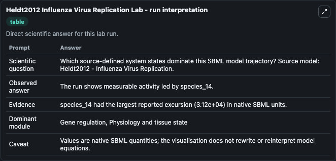
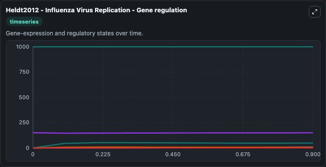
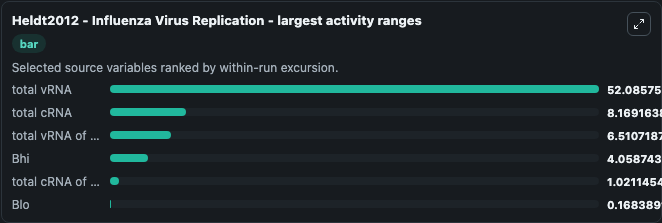
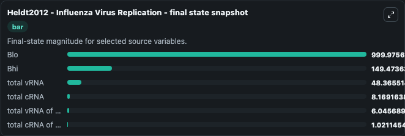
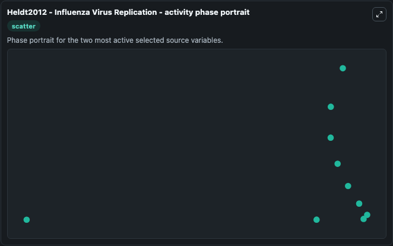

# Heldt2012 Influenza Virus Replication

This Biosimulant lab wraps `Heldt2012 Influenza Virus Replication` as a runnable systems biology model with a companion visualization module.
Heldt2012 - Influenza Virus Replication The model describes the life cycle of influenza A virus in a mammalian cell including the following steps: attachment of parental virions to the cell membrane,. It can be used to explore the configured dynamics and compare scenario outcomes across configurations.

## What You'll See

The lab asks: Which source-defined system states dominate this SBML model trajectory? Source model: Heldt2012 - Influenza Virus Replication. It runs for 1.0 time units with a communication step of 0.1. The run uses the model defaults declared by the curated SBML wrapper. The generated visualizations focus on total vRNA of a segment, total vRNA, total cRNA of a segment, total cRNA, Blo, and Bhi, combining trajectory, endpoint-comparison, and summary-table views from one completed dark-mode run.

In this captured run, **total vRNA** moved from 0 to 48.366 across 1.0 simulation windows.


### Output Visualizations



*Summary table for Heldt2012 Influenza Virus Replication, reporting the scientific question, observed answer, dominant module, and caveat.*



*Trajectories of total vRNA, total cRNA, total vRNA of a segment, Bhi, total cRNA of a segment, and Blo across the 1.0 simulation. In this run **total vRNA** climbed from 0 to 48.366 and **Bhi** fell from 150.0 to 149.5 — the largest movements among the focused observables.*



*Largest-excursion ranking of the focused observables — the absolute movement magnitude during the run. Top 3: **total vRNA** = 52.086, **total cRNA** = 8.169, **total vRNA of a segment** = 6.511, with 3 more observables below.*



*Endpoint snapshot of the focused observables — final values from the captured run. Top 3 by value: **Blo** = 1000.0, **Bhi** = 149.5, **total vRNA** = 48.366, with 3 more observables below.*



*Visualization card from the Heldt2012 Influenza Virus Replication dark-mode run.*


## Model Context

- Core model: `models/core`
- Visualization model: `models/visualisation`
- Standard: `other`
- Upstream source: `biomodels_ebi:BIOMD0000000463`
- License: `CC0`

## Inputs

| Input | Maps To | Default | Notes |
|---|---|---|---|
| Initial Total V RNA Of A Segment | `systemsbiology_sbml_heldt2012_influenza_virus_replication_biomd0000000463_model.initial_total_v_rna_of_a_segment` | | Source state initial condition exposed as a model-specific control because no explicit intervention parameter is identifiable. Maps to SBML symbol `species_39`. |
| Initial Total V RNA | `systemsbiology_sbml_heldt2012_influenza_virus_replication_biomd0000000463_model.initial_total_v_rna` | | Source state initial condition exposed as a model-specific control because no explicit intervention parameter is identifiable. Maps to SBML symbol `species_38`. |
| Initial Total C RNA Of A Segment | `systemsbiology_sbml_heldt2012_influenza_virus_replication_biomd0000000463_model.initial_total_c_rna_of_a_segment` | | Source state initial condition exposed as a model-specific control because no explicit intervention parameter is identifiable. Maps to SBML symbol `species_37`. |
| Initial Total C RNA | `systemsbiology_sbml_heldt2012_influenza_virus_replication_biomd0000000463_model.initial_total_c_rna` | | Source state initial condition exposed as a model-specific control because no explicit intervention parameter is identifiable. Maps to SBML symbol `species_36`. |
| Initial Model State Blo | `systemsbiology_sbml_heldt2012_influenza_virus_replication_biomd0000000463_model.initial_model_state_blo` | | Source state initial condition exposed as a model-specific control because no explicit intervention parameter is identifiable. Maps to SBML symbol `species_4`. |
| Initial Model State Bhi | `systemsbiology_sbml_heldt2012_influenza_virus_replication_biomd0000000463_model.initial_model_state_bhi` | | Source state initial condition exposed as a model-specific control because no explicit intervention parameter is identifiable. Maps to SBML symbol `species_1`. |

## Outputs

| Output | Maps To | Role |
|---|---|---|
| `state` | `systemsbiology_sbml_heldt2012_influenza_virus_replication_biomd0000000463_model.state` | Available to the visualization model and downstream workflows. |
| `summary` | `systemsbiology_sbml_heldt2012_influenza_virus_replication_biomd0000000463_model.summary` | Available to the visualization model and downstream workflows. |
| `species_labels` | `systemsbiology_sbml_heldt2012_influenza_virus_replication_biomd0000000463_model.species_labels` | Available to the visualization model and downstream workflows. |
| `total_v_rna_of_a_segment` | `systemsbiology_sbml_heldt2012_influenza_virus_replication_biomd0000000463_model.total_v_rna_of_a_segment` | Available to the visualization model and downstream workflows. |
| `total_v_rna` | `systemsbiology_sbml_heldt2012_influenza_virus_replication_biomd0000000463_model.total_v_rna` | Available to the visualization model and downstream workflows. |
| `total_c_rna_of_a_segment` | `systemsbiology_sbml_heldt2012_influenza_virus_replication_biomd0000000463_model.total_c_rna_of_a_segment` | Available to the visualization model and downstream workflows. |
| `total_c_rna` | `systemsbiology_sbml_heldt2012_influenza_virus_replication_biomd0000000463_model.total_c_rna` | Available to the visualization model and downstream workflows. |
| `blo` | `systemsbiology_sbml_heldt2012_influenza_virus_replication_biomd0000000463_model.blo` | Available to the visualization model and downstream workflows. |
| `bhi` | `systemsbiology_sbml_heldt2012_influenza_virus_replication_biomd0000000463_model.bhi` | Available to the visualization model and downstream workflows. |

## Runtime

- Duration: `1.0`
- Communication step: `0.1`

## Running Locally

```bash
biosimulant labs serve
```
