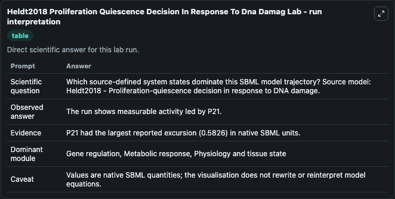
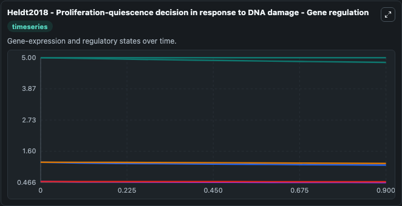
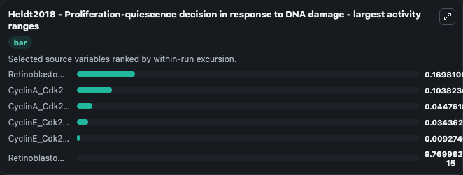
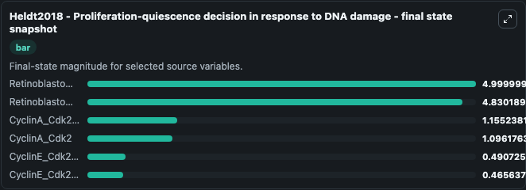
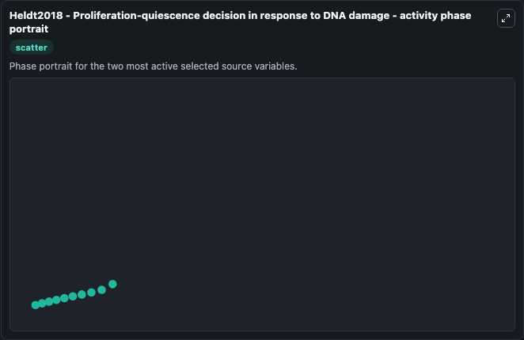

# Heldt2018 Proliferation Quiescence Decision In Response To Dna Damag

This Biosimulant lab wraps `Heldt2018 Proliferation Quiescence Decision In Response To Dna Damag` as a runnable systems biology model with a companion visualization module.
Heldt2018 - Proliferation-quiescence decisionin response to DNA damage This model is described in the article: A comprehensive model for the proliferation-quiescence decision in response to endogenous. It can be used to explore the configured dynamics and compare scenario outcomes across configurations.

## What You'll See

The lab asks: Which source-defined system states dominate this SBML model trajectory? Source model: Heldt2018 - Proliferation-quiescence decision in response to DNA damage. It runs for 1.0 time units with a communication step of 0.1. The run uses the model defaults declared by the curated SBML wrapper. The generated visualizations focus on CyclinA_Cdk2_total, Retinoblastoma_protein_total, Retinoblastoma_protein_hyperphosphorylated, CyclinA_Cdk2, CyclinE_Cdk2_total, and CyclinE_Cdk2_active, combining trajectory, endpoint-comparison, and summary-table views from one completed dark-mode run.

In this captured run, **Retinoblastoma_protein_hyperphosphorylated** moved from 5.000 to 4.830 across 1.0 simulation windows.


### Output Visualizations



*Trajectories of Retinoblastoma_protein_hyperphosphorylated, CyclinA_Cdk2, CyclinA_Cdk2_total, CyclinE_Cdk2_active, CyclinE_Cdk2_total, and Retinoblastoma_protein_total across the 1.0 simulation. In this run **Retinoblastoma_protein_hyperphosphorylated** fell from 5.000 to 4.830 — the largest movements among the focused observables.*



*Trajectories of Retinoblastoma_protein_hyperphosphorylated, CyclinA_Cdk2, CyclinA_Cdk2_total, CyclinE_Cdk2_active, CyclinE_Cdk2_total, and Retinoblastoma_protein_total across the 1.0 simulation. In this run **Retinoblastoma_protein_hyperphosphorylated** fell from 5.000 to 4.830 — the largest movements among the focused observables.*



*Trajectories of Retinoblastoma_protein_hyperphosphorylated, CyclinA_Cdk2, CyclinA_Cdk2_total, CyclinE_Cdk2_active, CyclinE_Cdk2_total, and Retinoblastoma_protein_total across the 1.0 simulation. In this run **Retinoblastoma_protein_hyperphosphorylated** fell from 5.000 to 4.830 — the largest movements among the focused observables.*



*Trajectories of Retinoblastoma_protein_hyperphosphorylated, CyclinA_Cdk2, CyclinA_Cdk2_total, CyclinE_Cdk2_active, CyclinE_Cdk2_total, and Retinoblastoma_protein_total across the 1.0 simulation. In this run **Retinoblastoma_protein_hyperphosphorylated** fell from 5.000 to 4.830 — the largest movements among the focused observables.*



*Trajectories of Retinoblastoma_protein_hyperphosphorylated, CyclinA_Cdk2, CyclinA_Cdk2_total, CyclinE_Cdk2_active, CyclinE_Cdk2_total, and Retinoblastoma_protein_total across the 1.0 simulation. In this run **Retinoblastoma_protein_hyperphosphorylated** fell from 5.000 to 4.830 — the largest movements among the focused observables.*


## Model Context

- Core model: `models/core`
- Visualization model: `models/visualisation`
- Standard: `other`
- Upstream source: `biomodels_ebi:BIOMD0000000700`
- License: `CC0`

## Inputs

| Input | Maps To | Default | Notes |
|---|---|---|---|
| Initial Cyclin A Cdk2 Total | `systemsbiology_sbml_heldt2018_proliferation_quiescence_decision_in_r_biomd0000000700_model.initial_cyclin_a_cdk2_total` | | Source state initial condition exposed as a model-specific control because no explicit intervention parameter is identifiable. Maps to SBML symbol `tCa`. |
| Initial Retinoblastoma Protein Total | `systemsbiology_sbml_heldt2018_proliferation_quiescence_decision_in_r_biomd0000000700_model.initial_retinoblastoma_protein_total` | | Source state initial condition exposed as a model-specific control because no explicit intervention parameter is identifiable. Maps to SBML symbol `tRb`. |
| Initial Retinoblastoma Protein Hyperphosphorylated | `systemsbiology_sbml_heldt2018_proliferation_quiescence_decision_in_r_biomd0000000700_model.initial_retinoblastoma_protein_hyperphosphorylated` | | Source state initial condition exposed as a model-specific control because no explicit intervention parameter is identifiable. Maps to SBML symbol `pRb`. |
| Initial Cyclin A Cdk2 | `systemsbiology_sbml_heldt2018_proliferation_quiescence_decision_in_r_biomd0000000700_model.initial_cyclin_a_cdk2` | | Source state initial condition exposed as a model-specific control because no explicit intervention parameter is identifiable. Maps to SBML symbol `Ca`. |
| Initial Cyclin E Cdk2 Total | `systemsbiology_sbml_heldt2018_proliferation_quiescence_decision_in_r_biomd0000000700_model.initial_cyclin_e_cdk2_total` | | Source state initial condition exposed as a model-specific control because no explicit intervention parameter is identifiable. Maps to SBML symbol `tCe`. |
| Initial Cyclin E Cdk2 Active | `systemsbiology_sbml_heldt2018_proliferation_quiescence_decision_in_r_biomd0000000700_model.initial_cyclin_e_cdk2_active` | | Source state initial condition exposed as a model-specific control because no explicit intervention parameter is identifiable. Maps to SBML symbol `Ce`. |

## Outputs

| Output | Maps To | Role |
|---|---|---|
| `state` | `systemsbiology_sbml_heldt2018_proliferation_quiescence_decision_in_r_biomd0000000700_model.state` | Available to the visualization model and downstream workflows. |
| `summary` | `systemsbiology_sbml_heldt2018_proliferation_quiescence_decision_in_r_biomd0000000700_model.summary` | Available to the visualization model and downstream workflows. |
| `species_labels` | `systemsbiology_sbml_heldt2018_proliferation_quiescence_decision_in_r_biomd0000000700_model.species_labels` | Available to the visualization model and downstream workflows. |
| `cyclin_a_cdk2_total` | `systemsbiology_sbml_heldt2018_proliferation_quiescence_decision_in_r_biomd0000000700_model.cyclin_a_cdk2_total` | Available to the visualization model and downstream workflows. |
| `retinoblastoma_protein_total` | `systemsbiology_sbml_heldt2018_proliferation_quiescence_decision_in_r_biomd0000000700_model.retinoblastoma_protein_total` | Available to the visualization model and downstream workflows. |
| `retinoblastoma_protein_hyperphosphorylated` | `systemsbiology_sbml_heldt2018_proliferation_quiescence_decision_in_r_biomd0000000700_model.retinoblastoma_protein_hyperphosphorylated` | Available to the visualization model and downstream workflows. |
| `cyclin_a_cdk2` | `systemsbiology_sbml_heldt2018_proliferation_quiescence_decision_in_r_biomd0000000700_model.cyclin_a_cdk2` | Available to the visualization model and downstream workflows. |
| `cyclin_e_cdk2_total` | `systemsbiology_sbml_heldt2018_proliferation_quiescence_decision_in_r_biomd0000000700_model.cyclin_e_cdk2_total` | Available to the visualization model and downstream workflows. |
| `cyclin_e_cdk2_active` | `systemsbiology_sbml_heldt2018_proliferation_quiescence_decision_in_r_biomd0000000700_model.cyclin_e_cdk2_active` | Available to the visualization model and downstream workflows. |

## Runtime

- Duration: `1.0`
- Communication step: `0.1`

## Running Locally

```bash
biosimulant labs serve
```
