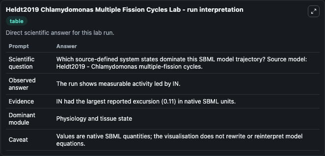
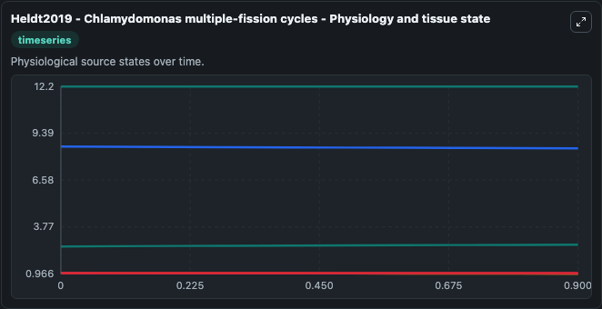
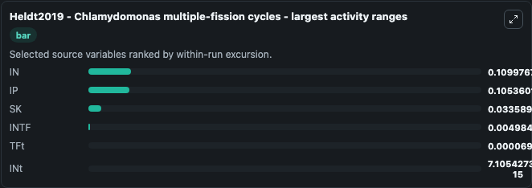
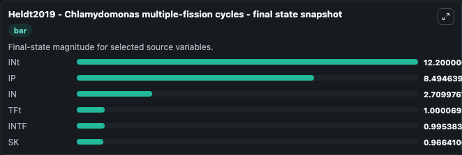
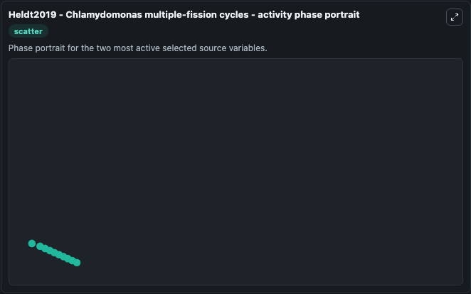

# Heldt2019 Chlamydomonas Multiple Fission Cycles

This Biosimulant lab wraps `Heldt2019 Chlamydomonas Multiple Fission Cycles` as a runnable systems biology model with a companion visualization module.
This model is described in the article:A single light-responsive sizer can control multiple-fission cycles in ChlamydomonasFrank S. It can be used to explore the configured dynamics and compare scenario outcomes across configurations.

## What You'll See

The lab asks: Which source-defined system states dominate this SBML model trajectory? Source model: Heldt2019 - Chlamydomonas multiple-fission cycles. It runs for 1.0 time units with a communication step of 0.1. The run uses the model defaults declared by the curated SBML wrapper. The generated visualizations focus on INt, IP, IN, TFt, SK, and INTF, combining trajectory, endpoint-comparison, and summary-table views from one completed dark-mode run.

In this captured run, **IN** moved from 2.600 to 2.710 across 1.0 simulation windows.


### Output Visualizations



*Summary table for Heldt2019 Chlamydomonas Multiple Fission Cycles, reporting the scientific question, observed answer, dominant module, and caveat.*



*Trajectories of IN, IP, SK, INTF, TFt, and INt across the 1.0 simulation. In this run **IN** climbed from 2.600 to 2.710 and **IP** fell from 8.600 to 8.495 — the largest movements among the focused observables.*



*Largest-excursion ranking of the focused observables — the absolute movement magnitude during the run. Top 3: **IN** = 0.1100, **IP** = 0.1054, **SK** = 0.0336, with 3 more observables below.*



*Endpoint snapshot of the focused observables — final values from the captured run. Top 3 by value: **INt** = 12.200, **IP** = 8.495, **IN** = 2.710, with 3 more observables below.*



*Visualization card from the Heldt2019 Chlamydomonas Multiple Fission Cycles dark-mode run.*


## Model Context

- Core model: `models/core`
- Visualization model: `models/visualisation`
- Standard: `other`
- Upstream source: `biomodels_ebi:MODEL1904020001`
- License: `CC0`

## Inputs

| Input | Maps To | Default | Notes |
|---|---|---|---|
| Light | `systemsbiology_sbml_heldt2019_chlamydomonas_multiple_fission_cycles_model1904020001_model.light` | | Source parameter exposed because its SBML label indicates a boundary, stimulus, dose, ligand, protocol, substrate, or environmental control. Maps to SBML symbol `Light`. |

## Outputs

| Output | Maps To | Role |
|---|---|---|
| `state` | `systemsbiology_sbml_heldt2019_chlamydomonas_multiple_fission_cycles_model1904020001_model.state` | Available to the visualization model and downstream workflows. |
| `summary` | `systemsbiology_sbml_heldt2019_chlamydomonas_multiple_fission_cycles_model1904020001_model.summary` | Available to the visualization model and downstream workflows. |
| `species_labels` | `systemsbiology_sbml_heldt2019_chlamydomonas_multiple_fission_cycles_model1904020001_model.species_labels` | Available to the visualization model and downstream workflows. |
| `i_nt` | `systemsbiology_sbml_heldt2019_chlamydomonas_multiple_fission_cycles_model1904020001_model.i_nt` | Available to the visualization model and downstream workflows. |
| `model_state_ip` | `systemsbiology_sbml_heldt2019_chlamydomonas_multiple_fission_cycles_model1904020001_model.model_state_ip` | Available to the visualization model and downstream workflows. |
| `in_value` | `systemsbiology_sbml_heldt2019_chlamydomonas_multiple_fission_cycles_model1904020001_model.in_value` | Available to the visualization model and downstream workflows. |
| `t_ft` | `systemsbiology_sbml_heldt2019_chlamydomonas_multiple_fission_cycles_model1904020001_model.t_ft` | Available to the visualization model and downstream workflows. |
| `model_state_sk` | `systemsbiology_sbml_heldt2019_chlamydomonas_multiple_fission_cycles_model1904020001_model.model_state_sk` | Available to the visualization model and downstream workflows. |
| `intf` | `systemsbiology_sbml_heldt2019_chlamydomonas_multiple_fission_cycles_model1904020001_model.intf` | Available to the visualization model and downstream workflows. |

## Runtime

- Duration: `1.0`
- Communication step: `0.1`

## Running Locally

```bash
biosimulant labs serve
```
