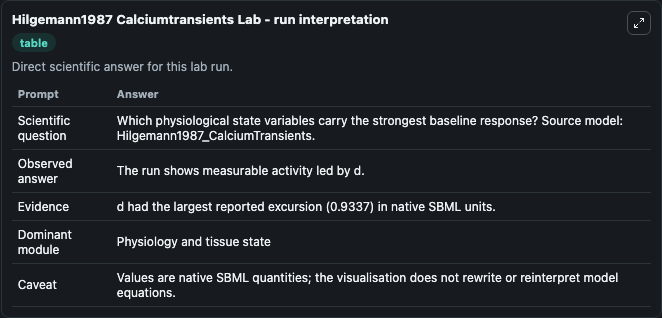
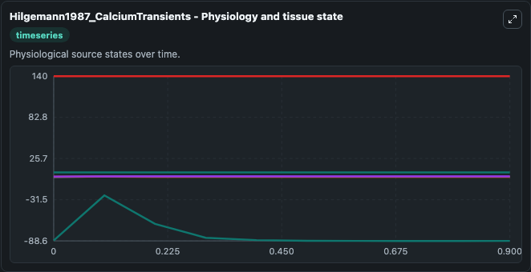
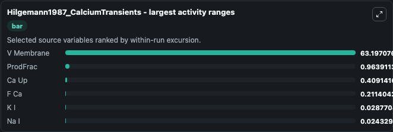
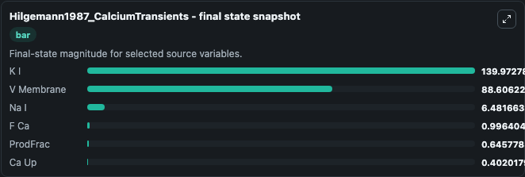
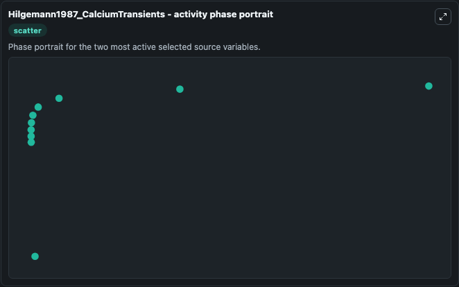

# Hilgemann1987 Calciumtransients

This Biosimulant lab wraps `Hilgemann1987 Calciumtransients` as a runnable systems biology model with a companion visualization module.
This a model from the article: Excitation-contraction coupling and extracellular calcium transients in rabbitatrium: reconstruction of basic cellular mechanisms. It can be used to explore the configured dynamics and compare scenario outcomes across configurations.

## What You'll See

The lab asks: Which physiological state variables carry the strongest baseline response? Source model: Hilgemann1987_CalciumTransients. It runs for 1.0 time units with a communication step of 0.1. The run uses the model defaults declared by the curated SBML wrapper. The generated visualizations focus on V Membrane, ProdFrac, Na I, K I, F Ca, and Ca Up, combining trajectory, endpoint-comparison, and summary-table views from one completed dark-mode run.

In this captured run, **ProdFrac** moved from 0 to 0.6458 across 1.0 simulation windows.


### Output Visualizations



*Summary table for Hilgemann1987 Calciumtransients, reporting the scientific question, observed answer, dominant module, and caveat.*



*Trajectories of V Membrane, ProdFrac, Ca Up, F Ca, K I, and Na I across the 1.0 simulation. In this run **ProdFrac** climbed from 0 to 0.6458 and **V Membrane** fell from -88.000 to -88.606 — the largest movements among the focused observables.*



*Largest-excursion ranking of the focused observables — the absolute movement magnitude during the run. Top 3: **V Membrane** = 63.197, **ProdFrac** = 0.9639, **Ca Up** = 0.4091, with 3 more observables below.*



*Endpoint snapshot of the focused observables — final values from the captured run. Top 3 by value: **K I** = 140.0, **V Membrane** = 88.606, **Na I** = 6.482, with 3 more observables below.*



*Visualization card from the Hilgemann1987 Calciumtransients dark-mode run.*


## Model Context

- Core model: `models/core`
- Visualization model: `models/visualisation`
- Standard: `other`
- Upstream source: `biomodels_ebi:MODEL0848444339`
- License: `CC0`

## Inputs

| Input | Maps To | Default | Notes |
|---|---|---|---|
| Initial V Membrane | `systemsbiology_sbml_hilgemann1987_calciumtransients_model0848444339_model.initial_v_membrane` | | Source state initial condition exposed as a model-specific control because no explicit intervention parameter is identifiable. Maps to SBML symbol `V_membrane`. |
| Initial Prod Frac | `systemsbiology_sbml_hilgemann1987_calciumtransients_model0848444339_model.initial_prod_frac` | | Source state initial condition exposed as a model-specific control because no explicit intervention parameter is identifiable. Maps to SBML symbol `ProdFrac`. |
| Initial Na I | `systemsbiology_sbml_hilgemann1987_calciumtransients_model0848444339_model.initial_na_i` | | Source state initial condition exposed as a model-specific control because no explicit intervention parameter is identifiable. Maps to SBML symbol `Na_i`. |
| Initial Model State K I | `systemsbiology_sbml_hilgemann1987_calciumtransients_model0848444339_model.initial_model_state_k_i` | | Source state initial condition exposed as a model-specific control because no explicit intervention parameter is identifiable. Maps to SBML symbol `K_i`. |
| Initial F Ca | `systemsbiology_sbml_hilgemann1987_calciumtransients_model0848444339_model.initial_f_ca` | | Source state initial condition exposed as a model-specific control because no explicit intervention parameter is identifiable. Maps to SBML symbol `f_Ca`. |
| Initial Ca Up | `systemsbiology_sbml_hilgemann1987_calciumtransients_model0848444339_model.initial_ca_up` | | Source state initial condition exposed as a model-specific control because no explicit intervention parameter is identifiable. Maps to SBML symbol `Ca_up`. |

## Outputs

| Output | Maps To | Role |
|---|---|---|
| `state` | `systemsbiology_sbml_hilgemann1987_calciumtransients_model0848444339_model.state` | Available to the visualization model and downstream workflows. |
| `summary` | `systemsbiology_sbml_hilgemann1987_calciumtransients_model0848444339_model.summary` | Available to the visualization model and downstream workflows. |
| `species_labels` | `systemsbiology_sbml_hilgemann1987_calciumtransients_model0848444339_model.species_labels` | Available to the visualization model and downstream workflows. |
| `v_membrane` | `systemsbiology_sbml_hilgemann1987_calciumtransients_model0848444339_model.v_membrane` | Available to the visualization model and downstream workflows. |
| `prod_frac` | `systemsbiology_sbml_hilgemann1987_calciumtransients_model0848444339_model.prod_frac` | Available to the visualization model and downstream workflows. |
| `na_i` | `systemsbiology_sbml_hilgemann1987_calciumtransients_model0848444339_model.na_i` | Available to the visualization model and downstream workflows. |
| `k_i` | `systemsbiology_sbml_hilgemann1987_calciumtransients_model0848444339_model.k_i` | Available to the visualization model and downstream workflows. |
| `f_ca` | `systemsbiology_sbml_hilgemann1987_calciumtransients_model0848444339_model.f_ca` | Available to the visualization model and downstream workflows. |
| `ca_up` | `systemsbiology_sbml_hilgemann1987_calciumtransients_model0848444339_model.ca_up` | Available to the visualization model and downstream workflows. |

## Runtime

- Duration: `1.0`
- Communication step: `0.1`

## Running Locally

```bash
biosimulant labs serve
```
