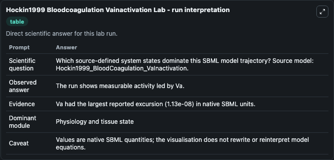
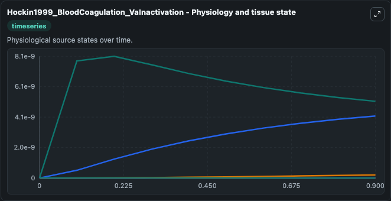
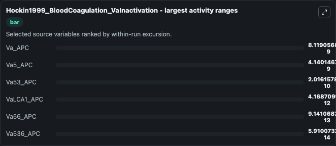
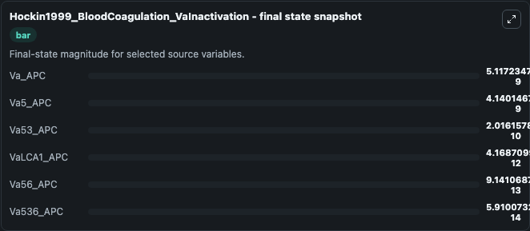
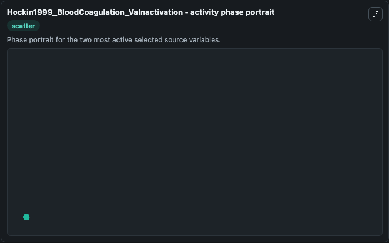

# Hockin1999 Bloodcoagulation Vainactivation

This Biosimulant lab wraps `Hockin1999 Bloodcoagulation Vainactivation` as a runnable systems biology model with a companion visualization module.
Matthew F. It can be used to explore the configured dynamics and compare scenario outcomes across configurations.

## What You'll See

The lab asks: Which source-defined system states dominate this SBML model trajectory? Source model: Hockin1999_BloodCoagulation_VaInactivation. It runs for 1.0 time units with a communication step of 0.1. The run uses the model defaults declared by the curated SBML wrapper. The generated visualizations focus on Va_APC, VaLCA1_APC, Va5_APC, Va56_APC, Va53_APC, and Va536_APC, combining trajectory, endpoint-comparison, and summary-table views from one completed dark-mode run.

In this captured run, **Va_APC** moved from 0 to 5.12e-09 across 1.0 simulation windows.


### Output Visualizations



*Summary table for Hockin1999 Bloodcoagulation Vainactivation, reporting the scientific question, observed answer, dominant module, and caveat.*



*Trajectories of Va_APC, Va5_APC, Va53_APC, VaLCA1_APC, Va56_APC, and Va536_APC across the 1.0 simulation. In this run **Va_APC** climbed from 0 to 5.12e-09 — the largest movements among the focused observables.*



*Largest-excursion ranking of the focused observables — the absolute movement magnitude during the run. Top 3: **Va_APC** = 8.12e-09, **Va5_APC** = 4.14e-09, **Va53_APC** = 2.02e-10, with 3 more observables below.*



*Endpoint snapshot of the focused observables — final values from the captured run. Top 3 by value: **Va_APC** = 5.12e-09, **Va5_APC** = 4.14e-09, **Va53_APC** = 2.02e-10, with 3 more observables below.*



*Visualization card from the Hockin1999 Bloodcoagulation Vainactivation dark-mode run.*


## Model Context

- Core model: `models/core`
- Visualization model: `models/visualisation`
- Standard: `other`
- Upstream source: `biomodels_ebi:BIOMD0000000365`
- License: `CC0`

## Inputs

| Input | Maps To | Default | Notes |
|---|---|---|---|
| Initial Va Apc | `systemsbiology_sbml_hockin1999_bloodcoagulation_vainactivation_biomd0000000365_model.initial_va_apc` | | Source state initial condition exposed as a model-specific control because no explicit intervention parameter is identifiable. Maps to SBML symbol `Va_APC`. |
| Initial Va Lca1 Apc | `systemsbiology_sbml_hockin1999_bloodcoagulation_vainactivation_biomd0000000365_model.initial_va_lca1_apc` | | Source state initial condition exposed as a model-specific control because no explicit intervention parameter is identifiable. Maps to SBML symbol `VaLCA1_APC`. |
| Initial VA5 Apc | `systemsbiology_sbml_hockin1999_bloodcoagulation_vainactivation_biomd0000000365_model.initial_va5_apc` | | Source state initial condition exposed as a model-specific control because no explicit intervention parameter is identifiable. Maps to SBML symbol `Va5_APC`. |
| Initial Va56 Apc | `systemsbiology_sbml_hockin1999_bloodcoagulation_vainactivation_biomd0000000365_model.initial_va56_apc` | | Source state initial condition exposed as a model-specific control because no explicit intervention parameter is identifiable. Maps to SBML symbol `Va56_APC`. |
| Initial Va53 Apc | `systemsbiology_sbml_hockin1999_bloodcoagulation_vainactivation_biomd0000000365_model.initial_va53_apc` | | Source state initial condition exposed as a model-specific control because no explicit intervention parameter is identifiable. Maps to SBML symbol `Va53_APC`. |
| Initial Va536 Apc | `systemsbiology_sbml_hockin1999_bloodcoagulation_vainactivation_biomd0000000365_model.initial_va536_apc` | | Source state initial condition exposed as a model-specific control because no explicit intervention parameter is identifiable. Maps to SBML symbol `Va536_APC`. |

## Outputs

| Output | Maps To | Role |
|---|---|---|
| `state` | `systemsbiology_sbml_hockin1999_bloodcoagulation_vainactivation_biomd0000000365_model.state` | Available to the visualization model and downstream workflows. |
| `summary` | `systemsbiology_sbml_hockin1999_bloodcoagulation_vainactivation_biomd0000000365_model.summary` | Available to the visualization model and downstream workflows. |
| `species_labels` | `systemsbiology_sbml_hockin1999_bloodcoagulation_vainactivation_biomd0000000365_model.species_labels` | Available to the visualization model and downstream workflows. |
| `va_apc` | `systemsbiology_sbml_hockin1999_bloodcoagulation_vainactivation_biomd0000000365_model.va_apc` | Available to the visualization model and downstream workflows. |
| `va_lca1_apc` | `systemsbiology_sbml_hockin1999_bloodcoagulation_vainactivation_biomd0000000365_model.va_lca1_apc` | Available to the visualization model and downstream workflows. |
| `va5_apc` | `systemsbiology_sbml_hockin1999_bloodcoagulation_vainactivation_biomd0000000365_model.va5_apc` | Available to the visualization model and downstream workflows. |
| `va56_apc` | `systemsbiology_sbml_hockin1999_bloodcoagulation_vainactivation_biomd0000000365_model.va56_apc` | Available to the visualization model and downstream workflows. |
| `va53_apc` | `systemsbiology_sbml_hockin1999_bloodcoagulation_vainactivation_biomd0000000365_model.va53_apc` | Available to the visualization model and downstream workflows. |
| `va536_apc` | `systemsbiology_sbml_hockin1999_bloodcoagulation_vainactivation_biomd0000000365_model.va536_apc` | Available to the visualization model and downstream workflows. |

## Runtime

- Duration: `1.0`
- Communication step: `0.1`

## Running Locally

```bash
biosimulant labs serve
```
