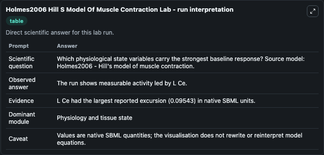
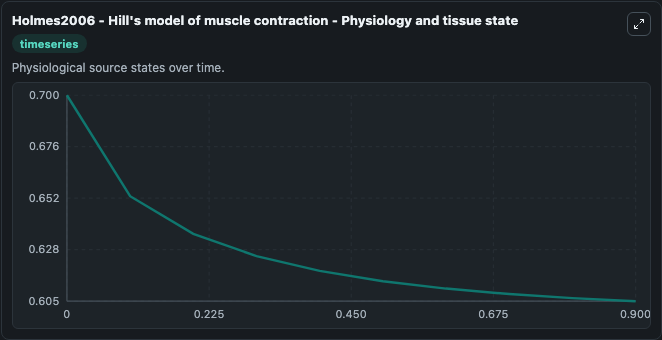
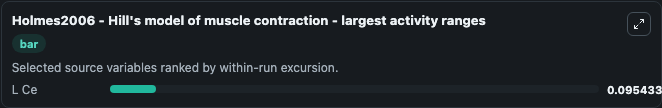
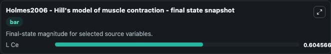

# Holmes2006 Hill S Model Of Muscle Contraction

This Biosimulant lab wraps `Holmes2006 Hill S Model Of Muscle Contraction` as a runnable systems biology model with a companion visualization module.
Holmes2006 - Hill's model of muscle contraction This model is described in the article: Teaching from classic papers: Hill's model of muscle contraction. It can be used to explore the configured dynamics and compare scenario outcomes across configurations.

## What You'll See

The lab asks: Which physiological state variables carry the strongest baseline response? Source model: Holmes2006 - Hill's model of muscle contraction. It runs for 1.0 time units with a communication step of 0.1. The run uses the model defaults declared by the curated SBML wrapper. The generated visualizations focus on L Ce, combining trajectory, endpoint-comparison, and summary-table views from one completed dark-mode run.

In this captured run, **L Ce** moved from 0.7000 to 0.6046 across 1.0 simulation windows.


### Output Visualizations



*Summary table for Holmes2006 Hill S Model Of Muscle Contraction, reporting the scientific question, observed answer, dominant module, and caveat.*



*Trajectories of L Ce across the 1.0 simulation. In this run **L Ce** fell from 0.7000 to 0.6046 — the largest movements among the focused observables.*



*Largest-excursion ranking of the focused observables — the absolute movement magnitude during the run. Top 1: **L Ce** = 0.0954.*



*Endpoint snapshot of the focused observables — final values from the captured run. Top 1 by value: **L Ce** = 0.6046.*


## Model Context

- Core model: `models/core`
- Visualization model: `models/visualisation`
- Standard: `other`
- Upstream source: `biomodels_ebi:BIOMD0000000677`
- License: `CC0`

## Inputs

| Input | Maps To | Default | Notes |
|---|---|---|---|
| Initial L Ce | `systemsbiology_sbml_holmes2006_hill_s_model_of_muscle_contraction_biomd0000000677_model.initial_l_ce` | | Source state initial condition exposed as a model-specific control because no explicit intervention parameter is identifiable. Maps to SBML symbol `L_ce`. |

## Outputs

| Output | Maps To | Role |
|---|---|---|
| `state` | `systemsbiology_sbml_holmes2006_hill_s_model_of_muscle_contraction_biomd0000000677_model.state` | Available to the visualization model and downstream workflows. |
| `summary` | `systemsbiology_sbml_holmes2006_hill_s_model_of_muscle_contraction_biomd0000000677_model.summary` | Available to the visualization model and downstream workflows. |
| `species_labels` | `systemsbiology_sbml_holmes2006_hill_s_model_of_muscle_contraction_biomd0000000677_model.species_labels` | Available to the visualization model and downstream workflows. |
| `l_ce` | `systemsbiology_sbml_holmes2006_hill_s_model_of_muscle_contraction_biomd0000000677_model.l_ce` | Available to the visualization model and downstream workflows. |

## Runtime

- Duration: `1.0`
- Communication step: `0.1`

## Running Locally

```bash
biosimulant labs serve
```
