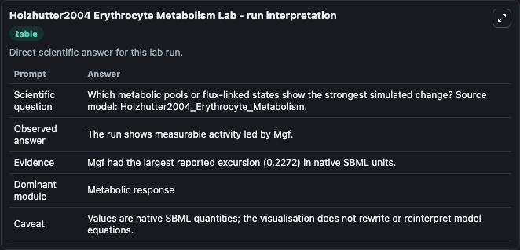
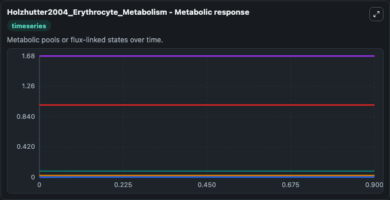
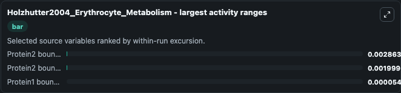
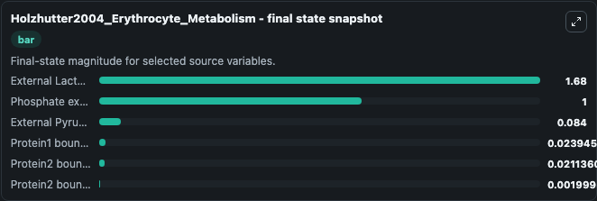
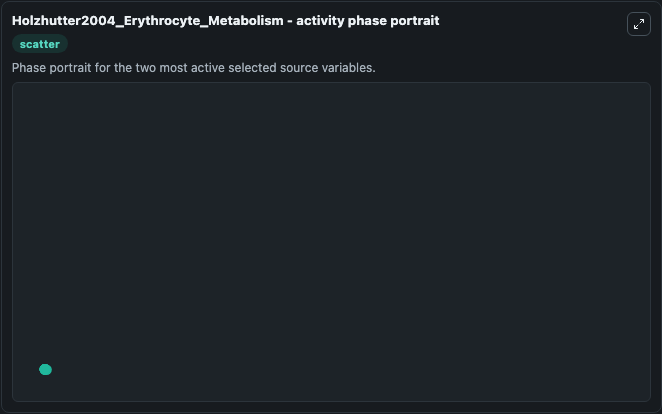

# Holzhutter2004 Erythrocyte Metabolism

This Biosimulant lab wraps `Holzhutter2004 Erythrocyte Metabolism` as a runnable systems biology model with a companion visualization module.
. It can be used to explore the configured dynamics and compare scenario outcomes across configurations.

## What You'll See

The lab asks: Which metabolic pools or flux-linked states show the strongest simulated change? Source model: Holzhutter2004_Erythrocyte_Metabolism. It runs for 1.0 time units with a communication step of 0.1. The run uses the model defaults declared by the curated SBML wrapper. The generated visualizations focus on External Lactate, Phosphate external, External Pyruvate, Protein2 bound NADPH, Protein1 bound NADPH, and Protein2 bound NADP, combining trajectory, endpoint-comparison, and summary-table views from one completed dark-mode run.

In this captured run, **Protein2 bound NADPH** moved from 0.0240 to 0.0211 across 1.0 simulation windows.


### Output Visualizations



*Summary table for Holzhutter2004 Erythrocyte Metabolism, reporting the scientific question, observed answer, dominant module, and caveat.*



*Trajectories of Protein2 bound NADPH, Protein2 bound NADP, Protein1 bound NADPH, External Lactate, Phosphate external, and External Pyruvate across the 1.0 simulation. In this run **Protein2 bound NADP** climbed from 0 to 0.002 and **Protein2 bound NADPH** fell from 0.0240 to 0.0211 — the largest movements among the focused observables.*



*Largest-excursion ranking of the focused observables — the absolute movement magnitude during the run. Top 3: **Protein2 bound NADPH** = 0.00286, **Protein2 bound NADP** = 0.002, **Protein1 bound NADPH** = 5.46e-05.*



*Endpoint snapshot of the focused observables — final values from the captured run. Top 3 by value: **External Lactate** = 1.680, **Phosphate external** = 1.000, **External Pyruvate** = 0.0840, with 3 more observables below.*



*Visualization card from the Holzhutter2004 Erythrocyte Metabolism dark-mode run.*


## Model Context

- Core model: `models/core`
- Visualization model: `models/visualisation`
- Standard: `other`
- Upstream source: `biomodels_ebi:BIOMD0000000070`
- License: `CC0`

## Inputs

| Input | Maps To | Default | Notes |
|---|---|---|---|
| Initial External Lactate | `systemsbiology_sbml_holzhutter2004_erythrocyte_metabolism_biomd0000000070_model.initial_external_lactate` | | Source state initial condition exposed as a model-specific control because no explicit intervention parameter is identifiable. Maps to SBML symbol `Lacex`. |
| Initial Phosphate External | `systemsbiology_sbml_holzhutter2004_erythrocyte_metabolism_biomd0000000070_model.initial_phosphate_external` | | Source state initial condition exposed as a model-specific control because no explicit intervention parameter is identifiable. Maps to SBML symbol `Phiex`. |
| Initial External Pyruvate | `systemsbiology_sbml_holzhutter2004_erythrocyte_metabolism_biomd0000000070_model.initial_external_pyruvate` | | Source state initial condition exposed as a model-specific control because no explicit intervention parameter is identifiable. Maps to SBML symbol `Pyrex`. |
| Initial Protein2 Bound Nadph | `systemsbiology_sbml_holzhutter2004_erythrocyte_metabolism_biomd0000000070_model.initial_protein2_bound_nadph` | | Source state initial condition exposed as a model-specific control because no explicit intervention parameter is identifiable. Maps to SBML symbol `P2NADPH`. |
| Initial Protein1 Bound Nadph | `systemsbiology_sbml_holzhutter2004_erythrocyte_metabolism_biomd0000000070_model.initial_protein1_bound_nadph` | | Source state initial condition exposed as a model-specific control because no explicit intervention parameter is identifiable. Maps to SBML symbol `P1NADPH`. |
| Initial Protein2 Bound Nadp | `systemsbiology_sbml_holzhutter2004_erythrocyte_metabolism_biomd0000000070_model.initial_protein2_bound_nadp` | | Source state initial condition exposed as a model-specific control because no explicit intervention parameter is identifiable. Maps to SBML symbol `P2NADP`. |

## Outputs

| Output | Maps To | Role |
|---|---|---|
| `state` | `systemsbiology_sbml_holzhutter2004_erythrocyte_metabolism_biomd0000000070_model.state` | Available to the visualization model and downstream workflows. |
| `summary` | `systemsbiology_sbml_holzhutter2004_erythrocyte_metabolism_biomd0000000070_model.summary` | Available to the visualization model and downstream workflows. |
| `species_labels` | `systemsbiology_sbml_holzhutter2004_erythrocyte_metabolism_biomd0000000070_model.species_labels` | Available to the visualization model and downstream workflows. |
| `external_lactate` | `systemsbiology_sbml_holzhutter2004_erythrocyte_metabolism_biomd0000000070_model.external_lactate` | Available to the visualization model and downstream workflows. |
| `phosphate_external` | `systemsbiology_sbml_holzhutter2004_erythrocyte_metabolism_biomd0000000070_model.phosphate_external` | Available to the visualization model and downstream workflows. |
| `external_pyruvate` | `systemsbiology_sbml_holzhutter2004_erythrocyte_metabolism_biomd0000000070_model.external_pyruvate` | Available to the visualization model and downstream workflows. |
| `protein2_bound_nadph` | `systemsbiology_sbml_holzhutter2004_erythrocyte_metabolism_biomd0000000070_model.protein2_bound_nadph` | Available to the visualization model and downstream workflows. |
| `protein1_bound_nadph` | `systemsbiology_sbml_holzhutter2004_erythrocyte_metabolism_biomd0000000070_model.protein1_bound_nadph` | Available to the visualization model and downstream workflows. |
| `protein2_bound_nadp` | `systemsbiology_sbml_holzhutter2004_erythrocyte_metabolism_biomd0000000070_model.protein2_bound_nadp` | Available to the visualization model and downstream workflows. |

## Runtime

- Duration: `1.0`
- Communication step: `0.1`

## Running Locally

```bash
biosimulant labs serve
```
