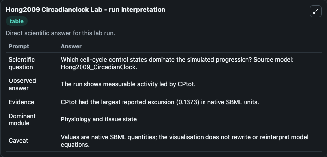
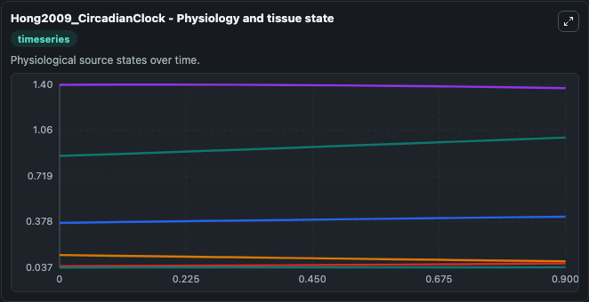
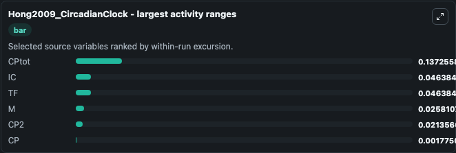
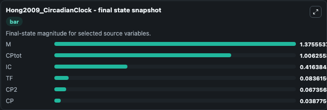
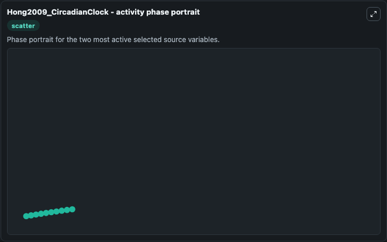

# Hong2009 Circadianclock

This Biosimulant lab wraps `Hong2009 Circadianclock` as a runnable systems biology model with a companion visualization module.
This a model from the article: Minimum criteria for DNA damage-induced phase advances in circadian rhythms. It can be used to explore the configured dynamics and compare scenario outcomes across configurations.

## What You'll See

The lab asks: Which cell-cycle control states dominate the simulated progression? Source model: Hong2009_CircadianClock. It runs for 1.0 time units with a communication step of 0.1. The run uses the model defaults declared by the curated SBML wrapper. The generated visualizations focus on IC, TF, CP2, CP, CPtot, and M, combining trajectory, endpoint-comparison, and summary-table views from one completed dark-mode run.

In this captured run, **CPtot** moved from 0.8690 to 1.006 across 1.0 simulation windows.


### Output Visualizations



*Summary table for Hong2009 Circadianclock, reporting the scientific question, observed answer, dominant module, and caveat.*



*Trajectories of CPtot, IC, TF, M, CP2, and CP across the 1.0 simulation. In this run **CPtot** climbed from 0.8690 to 1.006 and **TF** fell from 0.1300 to 0.0836 — the largest movements among the focused observables.*



*Largest-excursion ranking of the focused observables — the absolute movement magnitude during the run. Top 3: **CPtot** = 0.1373, **IC** = 0.0464, **TF** = 0.0464, with 3 more observables below.*



*Endpoint snapshot of the focused observables — final values from the captured run. Top 3 by value: **M** = 1.376, **CPtot** = 1.006, **IC** = 0.4164, with 3 more observables below.*



*Visualization card from the Hong2009 Circadianclock dark-mode run.*


## Model Context

- Core model: `models/core`
- Visualization model: `models/visualisation`
- Standard: `other`
- Upstream source: `biomodels_ebi:BIOMD0000000216`
- License: `CC0`

## Inputs

| Input | Maps To | Default | Notes |
|---|---|---|---|
| Initial Model State Ic | `systemsbiology_sbml_hong2009_circadianclock_biomd0000000216_model.initial_model_state_ic` | | Source state initial condition exposed as a model-specific control because no explicit intervention parameter is identifiable. Maps to SBML symbol `IC`. |
| Initial Model State Tf | `systemsbiology_sbml_hong2009_circadianclock_biomd0000000216_model.initial_model_state_tf` | | Source state initial condition exposed as a model-specific control because no explicit intervention parameter is identifiable. Maps to SBML symbol `TF`. |
| Initial Model State CP2 | `systemsbiology_sbml_hong2009_circadianclock_biomd0000000216_model.initial_model_state_cp2` | | Source state initial condition exposed as a model-specific control because no explicit intervention parameter is identifiable. Maps to SBML symbol `CP2`. |
| Initial Model State Cp | `systemsbiology_sbml_hong2009_circadianclock_biomd0000000216_model.initial_model_state_cp` | | Source state initial condition exposed as a model-specific control because no explicit intervention parameter is identifiable. Maps to SBML symbol `CP`. |
| Initial C Ptot | `systemsbiology_sbml_hong2009_circadianclock_biomd0000000216_model.initial_c_ptot` | | Source state initial condition exposed as a model-specific control because no explicit intervention parameter is identifiable. Maps to SBML symbol `CPtot`. |
| Initial Model State M | `systemsbiology_sbml_hong2009_circadianclock_biomd0000000216_model.initial_model_state_m` | | Source state initial condition exposed as a model-specific control because no explicit intervention parameter is identifiable. Maps to SBML symbol `M`. |

## Outputs

| Output | Maps To | Role |
|---|---|---|
| `state` | `systemsbiology_sbml_hong2009_circadianclock_biomd0000000216_model.state` | Available to the visualization model and downstream workflows. |
| `summary` | `systemsbiology_sbml_hong2009_circadianclock_biomd0000000216_model.summary` | Available to the visualization model and downstream workflows. |
| `species_labels` | `systemsbiology_sbml_hong2009_circadianclock_biomd0000000216_model.species_labels` | Available to the visualization model and downstream workflows. |
| `model_state_ic` | `systemsbiology_sbml_hong2009_circadianclock_biomd0000000216_model.model_state_ic` | Available to the visualization model and downstream workflows. |
| `model_state_tf` | `systemsbiology_sbml_hong2009_circadianclock_biomd0000000216_model.model_state_tf` | Available to the visualization model and downstream workflows. |
| `cp2` | `systemsbiology_sbml_hong2009_circadianclock_biomd0000000216_model.cp2` | Available to the visualization model and downstream workflows. |
| `model_state_cp` | `systemsbiology_sbml_hong2009_circadianclock_biomd0000000216_model.model_state_cp` | Available to the visualization model and downstream workflows. |
| `c_ptot` | `systemsbiology_sbml_hong2009_circadianclock_biomd0000000216_model.c_ptot` | Available to the visualization model and downstream workflows. |
| `model_state_m` | `systemsbiology_sbml_hong2009_circadianclock_biomd0000000216_model.model_state_m` | Available to the visualization model and downstream workflows. |

## Runtime

- Duration: `1.0`
- Communication step: `0.1`

## Running Locally

```bash
biosimulant labs serve
```
