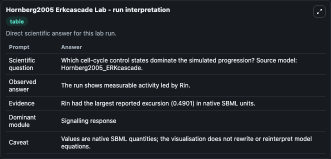
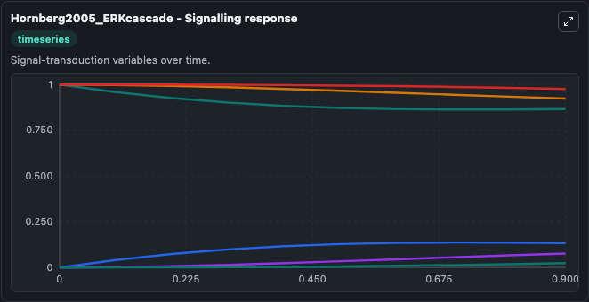
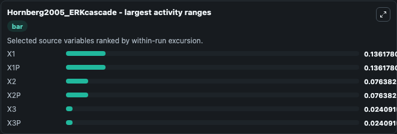
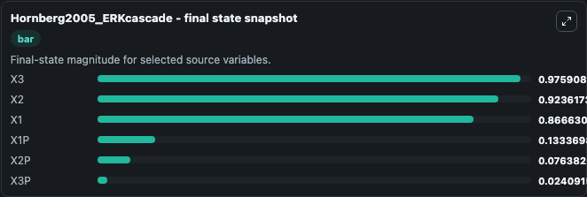
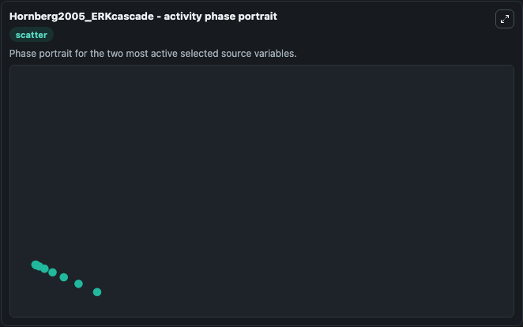

# Hornberg2005 Erkcascade

This Biosimulant lab wraps `Hornberg2005 Erkcascade` as a runnable systems biology model with a companion visualization module.
SBML level 2 code generated for the JWS Online project by Jacky Snoep using PySCeS Run this model online at http://jjj.biochem.sun.ac.za To cite JWS Online please refer to: Olivier, B.G. It can be used to explore the configured dynamics and compare scenario outcomes across configurations.

## What You'll See

The lab asks: Which cell-cycle control states dominate the simulated progression? Source model: Hornberg2005_ERKcascade. It runs for 1.0 time units with a communication step of 0.1. The run uses the model defaults declared by the curated SBML wrapper. The generated visualizations focus on X3, X2, X1, X3P, X2P, and X1P, combining trajectory, endpoint-comparison, and summary-table views from one completed dark-mode run.

In this captured run, **X1** moved from 1.000 to 0.8666 across 1.0 simulation windows.


### Output Visualizations



*Summary table for Hornberg2005 Erkcascade, reporting the scientific question, observed answer, dominant module, and caveat.*



*Trajectories of X1, X1P, X2, X2P, X3, and X3P across the 1.0 simulation. In this run **X1P** climbed from 0 to 0.1334 and **X1** fell from 1.000 to 0.8666 — the largest movements among the focused observables.*



*Largest-excursion ranking of the focused observables — the absolute movement magnitude during the run. Top 3: **X1** = 0.1362, **X1P** = 0.1362, **X2** = 0.0764, with 3 more observables below.*



*Endpoint snapshot of the focused observables — final values from the captured run. Top 3 by value: **X3** = 0.9759, **X2** = 0.9236, **X1** = 0.8666, with 3 more observables below.*



*Visualization card from the Hornberg2005 Erkcascade dark-mode run.*


## Model Context

- Core model: `models/core`
- Visualization model: `models/visualisation`
- Standard: `other`
- Upstream source: `biomodels_ebi:BIOMD0000000084`
- License: `CC0`

## Inputs

| Input | Maps To | Default | Notes |
|---|---|---|---|
| Initial Model State X3 | `systemsbiology_sbml_hornberg2005_erkcascade_biomd0000000084_model.initial_model_state_x3` | | Source state initial condition exposed as a model-specific control because no explicit intervention parameter is identifiable. Maps to SBML symbol `x3`. |
| Initial Model State X2 | `systemsbiology_sbml_hornberg2005_erkcascade_biomd0000000084_model.initial_model_state_x2` | | Source state initial condition exposed as a model-specific control because no explicit intervention parameter is identifiable. Maps to SBML symbol `x2`. |
| Initial Model State X1 | `systemsbiology_sbml_hornberg2005_erkcascade_biomd0000000084_model.initial_model_state_x1` | | Source state initial condition exposed as a model-specific control because no explicit intervention parameter is identifiable. Maps to SBML symbol `x1`. |
| Initial X3 P | `systemsbiology_sbml_hornberg2005_erkcascade_biomd0000000084_model.initial_x3_p` | | Source state initial condition exposed as a model-specific control because no explicit intervention parameter is identifiable. Maps to SBML symbol `x3p`. |
| Initial X2 P | `systemsbiology_sbml_hornberg2005_erkcascade_biomd0000000084_model.initial_x2_p` | | Source state initial condition exposed as a model-specific control because no explicit intervention parameter is identifiable. Maps to SBML symbol `x2p`. |
| Initial X1 P | `systemsbiology_sbml_hornberg2005_erkcascade_biomd0000000084_model.initial_x1_p` | | Source state initial condition exposed as a model-specific control because no explicit intervention parameter is identifiable. Maps to SBML symbol `x1p`. |

## Outputs

| Output | Maps To | Role |
|---|---|---|
| `state` | `systemsbiology_sbml_hornberg2005_erkcascade_biomd0000000084_model.state` | Available to the visualization model and downstream workflows. |
| `summary` | `systemsbiology_sbml_hornberg2005_erkcascade_biomd0000000084_model.summary` | Available to the visualization model and downstream workflows. |
| `species_labels` | `systemsbiology_sbml_hornberg2005_erkcascade_biomd0000000084_model.species_labels` | Available to the visualization model and downstream workflows. |
| `model_state_x3` | `systemsbiology_sbml_hornberg2005_erkcascade_biomd0000000084_model.model_state_x3` | Available to the visualization model and downstream workflows. |
| `model_state_x2` | `systemsbiology_sbml_hornberg2005_erkcascade_biomd0000000084_model.model_state_x2` | Available to the visualization model and downstream workflows. |
| `model_state_x1` | `systemsbiology_sbml_hornberg2005_erkcascade_biomd0000000084_model.model_state_x1` | Available to the visualization model and downstream workflows. |
| `x3_p` | `systemsbiology_sbml_hornberg2005_erkcascade_biomd0000000084_model.x3_p` | Available to the visualization model and downstream workflows. |
| `x2_p` | `systemsbiology_sbml_hornberg2005_erkcascade_biomd0000000084_model.x2_p` | Available to the visualization model and downstream workflows. |
| `x1_p` | `systemsbiology_sbml_hornberg2005_erkcascade_biomd0000000084_model.x1_p` | Available to the visualization model and downstream workflows. |

## Runtime

- Duration: `1.0`
- Communication step: `0.1`

## Running Locally

```bash
biosimulant labs serve
```
