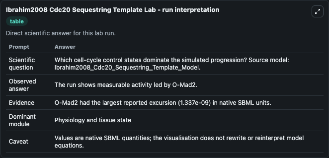
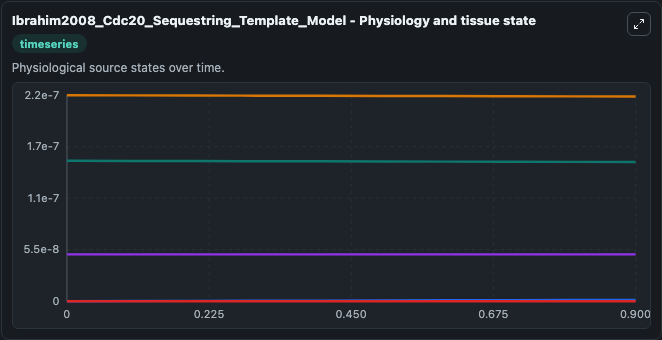
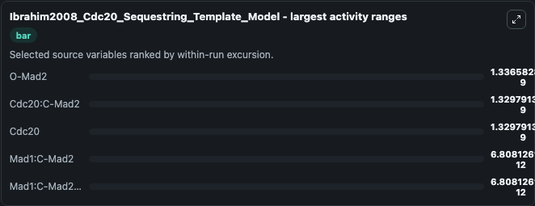
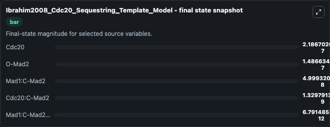
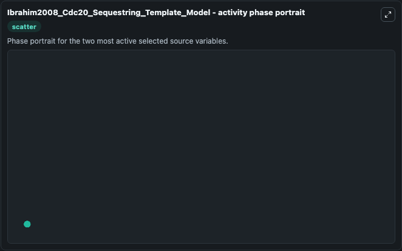

# Ibrahim2008 Cdc20 Sequestring Template

This Biosimulant lab wraps `Ibrahim2008 Cdc20 Sequestring Template` as a runnable systems biology model with a companion visualization module.
Biophysical Chemistry 134 (2008) 93-100 Mad2 binding is not sufficient for complete Cdc20 sequestering in mitotic transition control (an in silico study) Bashar Ibrahim, Peter Dittrich, Stephan Diekma. It can be used to explore the configured dynamics and compare scenario outcomes across configurations.

## What You'll See

The lab asks: Which cell-cycle control states dominate the simulated progression? Source model: Ibrahim2008_Cdc20_Sequestring_Template_Model. It runs for 1.0 time units with a communication step of 0.1. The run uses the model defaults declared by the curated SBML wrapper. The generated visualizations focus on O-Mad2, Mad1:C-Mad2, Mad1:C-Mad2:O-Mad2*, Cdc20:C-Mad2, and Cdc20, combining trajectory, endpoint-comparison, and summary-table views from one completed dark-mode run.

In this captured run, **O-Mad2** moved from 1.5e-07 to 1.49e-07 across 1.0 simulation windows.


### Output Visualizations



*Summary table for Ibrahim2008 Cdc20 Sequestring Template, reporting the scientific question, observed answer, dominant module, and caveat.*



*Trajectories of O-Mad2, Cdc20:C-Mad2, Cdc20, Mad1:C-Mad2, and Mad1:C-Mad2:O-Mad2* across the 1.0 simulation. In this run **Cdc20:C-Mad2** climbed from 0 to 1.33e-09 and **O-Mad2** fell from 1.5e-07 to 1.49e-07 — the largest movements among the focused observables.*



*Largest-excursion ranking of the focused observables — the absolute movement magnitude during the run. Top 3: **O-Mad2** = 1.34e-09, **Cdc20:C-Mad2** = 1.33e-09, **Cdc20** = 1.33e-09, with 2 more observables below.*



*Endpoint snapshot of the focused observables — final values from the captured run. Top 3 by value: **Cdc20** = 2.19e-07, **O-Mad2** = 1.49e-07, **Mad1:C-Mad2** = 5e-08, with 2 more observables below.*



*Visualization card from the Ibrahim2008 Cdc20 Sequestring Template dark-mode run.*


## Model Context

- Core model: `models/core`
- Visualization model: `models/visualisation`
- Standard: `other`
- Upstream source: `biomodels_ebi:BIOMD0000000194`
- License: `CC0`

## Inputs

| Input | Maps To | Default | Notes |
|---|---|---|---|
| Initial O Mad2 | `systemsbiology_sbml_ibrahim2008_cdc20_sequestring_template_model_biomd0000000194_model.initial_o_mad2` | | Source state initial condition exposed as a model-specific control because no explicit intervention parameter is identifiable. Maps to SBML symbol `OMad2`. |
| Initial Mad1 C Mad2 | `systemsbiology_sbml_ibrahim2008_cdc20_sequestring_template_model_biomd0000000194_model.initial_mad1_c_mad2` | | Source state initial condition exposed as a model-specific control because no explicit intervention parameter is identifiable. Maps to SBML symbol `Mad1_CMad2`. |
| Initial Mad1 C Mad2 O Mad2 | `systemsbiology_sbml_ibrahim2008_cdc20_sequestring_template_model_biomd0000000194_model.initial_mad1_c_mad2_o_mad2` | | Source state initial condition exposed as a model-specific control because no explicit intervention parameter is identifiable. Maps to SBML symbol `Mad1_CMad2_OMad2`. |
| Initial Cdc20 C Mad2 | `systemsbiology_sbml_ibrahim2008_cdc20_sequestring_template_model_biomd0000000194_model.initial_cdc20_c_mad2` | | Source state initial condition exposed as a model-specific control because no explicit intervention parameter is identifiable. Maps to SBML symbol `Cdc20_CMad2`. |
| Initial Cdc20 | `systemsbiology_sbml_ibrahim2008_cdc20_sequestring_template_model_biomd0000000194_model.initial_cdc20` | | Source state initial condition exposed as a model-specific control because no explicit intervention parameter is identifiable. Maps to SBML symbol `Cdc20`. |

## Outputs

| Output | Maps To | Role |
|---|---|---|
| `state` | `systemsbiology_sbml_ibrahim2008_cdc20_sequestring_template_model_biomd0000000194_model.state` | Available to the visualization model and downstream workflows. |
| `summary` | `systemsbiology_sbml_ibrahim2008_cdc20_sequestring_template_model_biomd0000000194_model.summary` | Available to the visualization model and downstream workflows. |
| `species_labels` | `systemsbiology_sbml_ibrahim2008_cdc20_sequestring_template_model_biomd0000000194_model.species_labels` | Available to the visualization model and downstream workflows. |
| `o_mad2` | `systemsbiology_sbml_ibrahim2008_cdc20_sequestring_template_model_biomd0000000194_model.o_mad2` | Available to the visualization model and downstream workflows. |
| `mad1_c_mad2` | `systemsbiology_sbml_ibrahim2008_cdc20_sequestring_template_model_biomd0000000194_model.mad1_c_mad2` | Available to the visualization model and downstream workflows. |
| `mad1_c_mad2_o_mad2` | `systemsbiology_sbml_ibrahim2008_cdc20_sequestring_template_model_biomd0000000194_model.mad1_c_mad2_o_mad2` | Available to the visualization model and downstream workflows. |
| `cdc20_c_mad2` | `systemsbiology_sbml_ibrahim2008_cdc20_sequestring_template_model_biomd0000000194_model.cdc20_c_mad2` | Available to the visualization model and downstream workflows. |
| `cdc20` | `systemsbiology_sbml_ibrahim2008_cdc20_sequestring_template_model_biomd0000000194_model.cdc20` | Available to the visualization model and downstream workflows. |

## Runtime

- Duration: `1.0`
- Communication step: `0.1`

## Running Locally

```bash
biosimulant labs serve
```
