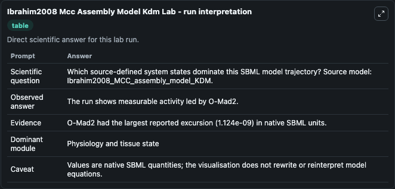
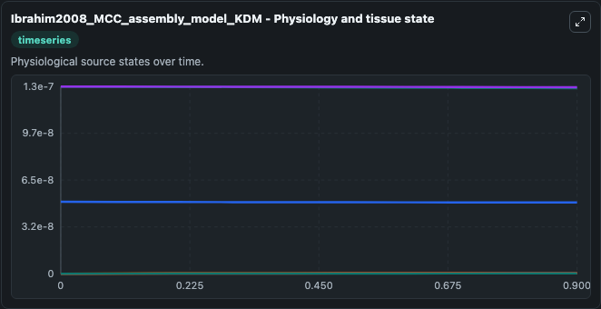
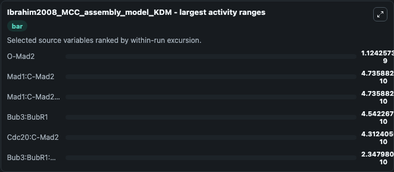
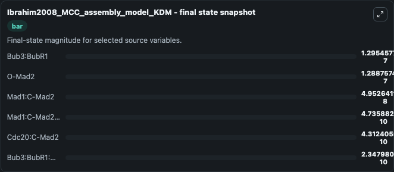
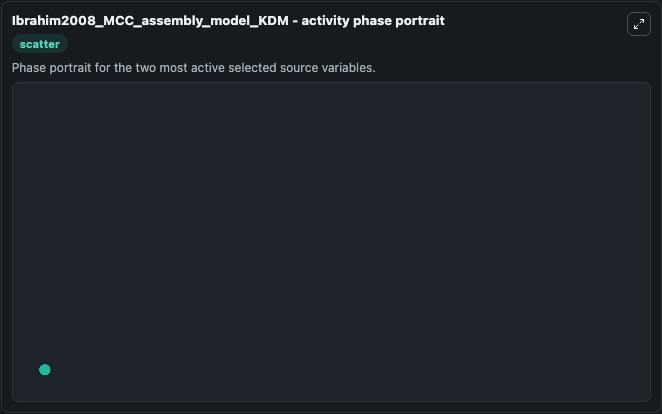

# Ibrahim2008 Mcc Assembly Model Kdm

This Biosimulant lab wraps `Ibrahim2008 Mcc Assembly Model Kdm` as a runnable systems biology model with a companion visualization module.
BioSystems (2007), doi:10.1016/j.biosystems.2008.06.007 In-silico study of kinetochore control, amplification, and inhibition effects in MCC assembly Bashar Ibrahim, Eberhard Schmitt, Peter Dittrich,. It can be used to explore the configured dynamics and compare scenario outcomes across configurations.

## What You'll See

The lab asks: Which source-defined system states dominate this SBML model trajectory? Source model: Ibrahim2008_MCC_assembly_model_KDM. It runs for 1.0 time units with a communication step of 0.1. The run uses the model defaults declared by the curated SBML wrapper. The generated visualizations focus on O-Mad2, Bub3:BubR1, Mad1:C-Mad2, Mad1:C-Mad2:O-Mad2*, Cdc20:C-Mad2, and Bub3:BubR1:Cdc20, combining trajectory, endpoint-comparison, and summary-table views from one completed dark-mode run.

In this captured run, **O-Mad2** moved from 1.3e-07 to 1.29e-07 across 1.0 simulation windows.


### Output Visualizations



*Summary table for Ibrahim2008 Mcc Assembly Model Kdm, reporting the scientific question, observed answer, dominant module, and caveat.*



*Trajectories of O-Mad2, Mad1:C-Mad2, Mad1:C-Mad2:O-Mad2*, Bub3:BubR1, Cdc20:C-Mad2, and Bub3:BubR1:Cdc20 across the 1.0 simulation. In this run **Mad1:C-Mad2:O-Mad2*** climbed from 0 to 4.74e-10 and **O-Mad2** fell from 1.3e-07 to 1.29e-07 — the largest movements among the focused observables.*



*Largest-excursion ranking of the focused observables — the absolute movement magnitude during the run. Top 3: **O-Mad2** = 1.12e-09, **Mad1:C-Mad2** = 4.74e-10, **Mad1:C-Mad2:O-Mad2*** = 4.74e-10, with 3 more observables below.*



*Endpoint snapshot of the focused observables — final values from the captured run. Top 3 by value: **Bub3:BubR1** = 1.3e-07, **O-Mad2** = 1.29e-07, **Mad1:C-Mad2** = 4.95e-08, with 3 more observables below.*



*Visualization card from the Ibrahim2008 Mcc Assembly Model Kdm dark-mode run.*


## Model Context

- Core model: `models/core`
- Visualization model: `models/visualisation`
- Standard: `other`
- Upstream source: `biomodels_ebi:BIOMD0000000193`
- License: `CC0`

## Inputs

| Input | Maps To | Default | Notes |
|---|---|---|---|
| Initial O Mad2 | `systemsbiology_sbml_ibrahim2008_mcc_assembly_model_kdm_biomd0000000193_model.initial_o_mad2` | | Source state initial condition exposed as a model-specific control because no explicit intervention parameter is identifiable. Maps to SBML symbol `OMad2`. |
| Initial Bub3 Bub R1 | `systemsbiology_sbml_ibrahim2008_mcc_assembly_model_kdm_biomd0000000193_model.initial_bub3_bub_r1` | | Source state initial condition exposed as a model-specific control because no explicit intervention parameter is identifiable. Maps to SBML symbol `Bub3_BubR1`. |
| Initial Mad1 C Mad2 | `systemsbiology_sbml_ibrahim2008_mcc_assembly_model_kdm_biomd0000000193_model.initial_mad1_c_mad2` | | Source state initial condition exposed as a model-specific control because no explicit intervention parameter is identifiable. Maps to SBML symbol `Mad1_CMad2`. |
| Initial Mad1 C Mad2 O Mad2 | `systemsbiology_sbml_ibrahim2008_mcc_assembly_model_kdm_biomd0000000193_model.initial_mad1_c_mad2_o_mad2` | | Source state initial condition exposed as a model-specific control because no explicit intervention parameter is identifiable. Maps to SBML symbol `Mad1_CMad2_OMad2`. |
| Initial Cdc20 C Mad2 | `systemsbiology_sbml_ibrahim2008_mcc_assembly_model_kdm_biomd0000000193_model.initial_cdc20_c_mad2` | | Source state initial condition exposed as a model-specific control because no explicit intervention parameter is identifiable. Maps to SBML symbol `Cdc20_CMad2`. |
| Initial Bub3 Bub R1 Cdc20 | `systemsbiology_sbml_ibrahim2008_mcc_assembly_model_kdm_biomd0000000193_model.initial_bub3_bub_r1_cdc20` | | Source state initial condition exposed as a model-specific control because no explicit intervention parameter is identifiable. Maps to SBML symbol `Bub3_BubR1_Cdc20`. |

## Outputs

| Output | Maps To | Role |
|---|---|---|
| `state` | `systemsbiology_sbml_ibrahim2008_mcc_assembly_model_kdm_biomd0000000193_model.state` | Available to the visualization model and downstream workflows. |
| `summary` | `systemsbiology_sbml_ibrahim2008_mcc_assembly_model_kdm_biomd0000000193_model.summary` | Available to the visualization model and downstream workflows. |
| `species_labels` | `systemsbiology_sbml_ibrahim2008_mcc_assembly_model_kdm_biomd0000000193_model.species_labels` | Available to the visualization model and downstream workflows. |
| `o_mad2` | `systemsbiology_sbml_ibrahim2008_mcc_assembly_model_kdm_biomd0000000193_model.o_mad2` | Available to the visualization model and downstream workflows. |
| `bub3_bub_r1` | `systemsbiology_sbml_ibrahim2008_mcc_assembly_model_kdm_biomd0000000193_model.bub3_bub_r1` | Available to the visualization model and downstream workflows. |
| `mad1_c_mad2` | `systemsbiology_sbml_ibrahim2008_mcc_assembly_model_kdm_biomd0000000193_model.mad1_c_mad2` | Available to the visualization model and downstream workflows. |
| `mad1_c_mad2_o_mad2` | `systemsbiology_sbml_ibrahim2008_mcc_assembly_model_kdm_biomd0000000193_model.mad1_c_mad2_o_mad2` | Available to the visualization model and downstream workflows. |
| `cdc20_c_mad2` | `systemsbiology_sbml_ibrahim2008_mcc_assembly_model_kdm_biomd0000000193_model.cdc20_c_mad2` | Available to the visualization model and downstream workflows. |
| `bub3_bub_r1_cdc20` | `systemsbiology_sbml_ibrahim2008_mcc_assembly_model_kdm_biomd0000000193_model.bub3_bub_r1_cdc20` | Available to the visualization model and downstream workflows. |

## Runtime

- Duration: `1.0`
- Communication step: `0.1`

## Running Locally

```bash
biosimulant labs serve
```
