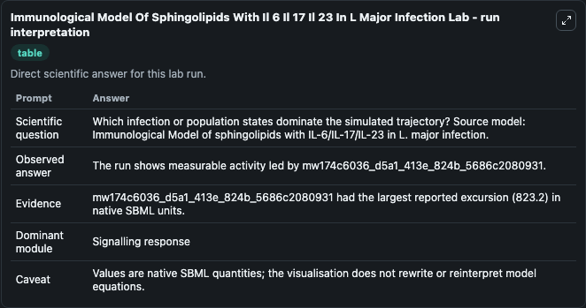
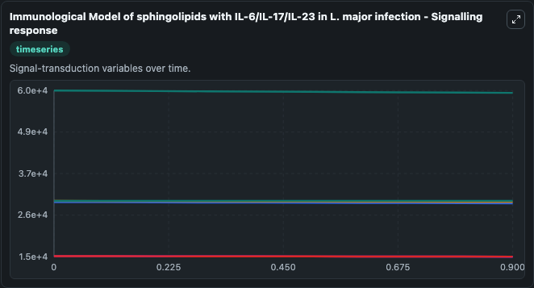
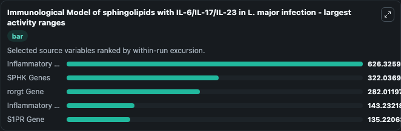
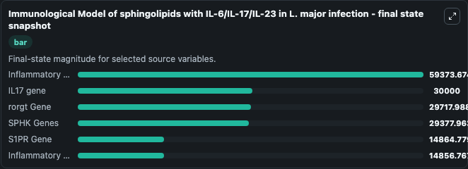
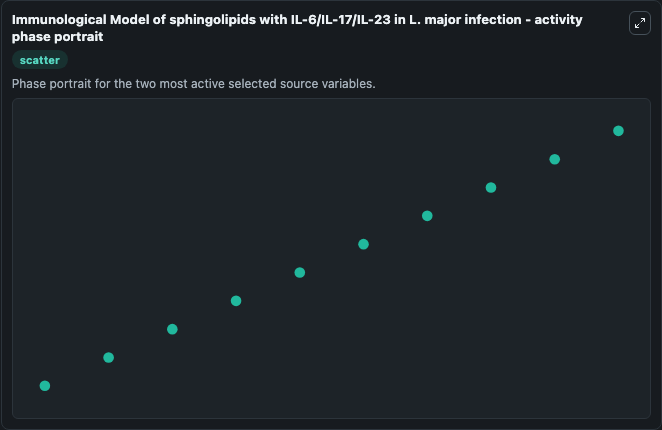

# Immunological Model Of Sphingolipids With Il 6 Il 17 Il 23 In L Major Infection

This Biosimulant lab wraps `Immunological Model Of Sphingolipids With Il 6 Il 17 Il 23 In L Major Infection` as a runnable systems biology model with a companion visualization module.
In diseased state, we demonstrated that increase in production of sphingosine-1-phosphate and overexpression of IL-6,lL-17 and IL-23 with SATB1 leads to disease progression. It can be used to explore the configured dynamics and compare scenario outcomes across configurations.

## What You'll See

The lab asks: Which infection or population states dominate the simulated trajectory? Source model: Immunological Model of sphingolipids with IL-6/IL-17/IL-23 in L. major infection. It runs for 1.0 time units with a communication step of 0.1. The run uses the model defaults declared by the curated SBML wrapper. The generated visualizations focus on Inflammatory cytokine genes, rorgt Gene, IL17 gene, SPHK Genes, S1PR Gene, and Inflammatory Cytokine Genes, combining trajectory, endpoint-comparison, and summary-table views from one completed dark-mode run.

In this captured run, **Inflammatory cytokine genes** moved from 6e+04 to 5.94e+04 across 1.0 simulation windows.


### Output Visualizations



*Summary table for Immunological Model Of Sphingolipids With Il 6 Il 17 Il 23 In L Major Infection, reporting the scientific question, observed answer, dominant module, and caveat.*



*Trajectories of Inflammatory cytokine genes, SPHK Genes, rorgt Gene, Inflammatory Cytokine Genes, S1PR Gene, and IL17 gene across the 1.0 simulation. In this run **Inflammatory cytokine genes** fell from 6e+04 to 5.94e+04 — the largest movements among the focused observables.*



*Largest-excursion ranking of the focused observables — the absolute movement magnitude during the run. Top 3: **Inflammatory cytokine genes** = 626.3, **SPHK Genes** = 322.0, **rorgt Gene** = 282.0, with 2 more observables below.*



*Endpoint snapshot of the focused observables — final values from the captured run. Top 3 by value: **Inflammatory cytokine genes** = 5.94e+04, **IL17 gene** = 3e+04, **rorgt Gene** = 2.97e+04, with 3 more observables below.*



*Visualization card from the Immunological Model Of Sphingolipids With Il 6 Il 17 Il 23 In L Major Infection dark-mode run.*


## Model Context

- Core model: `models/core`
- Visualization model: `models/visualisation`
- Standard: `other`
- Upstream source: `biomodels_ebi:MODEL2301110001`
- License: `CC0`

## Inputs

| Input | Maps To | Default | Notes |
|---|---|---|---|
| Initial Inflammatory Cytokine Genes | `systemsbiology_sbml_immunological_model_of_sphingolipids_with_il_6_i_model2301110001_model.initial_inflammatory_cytokine_genes` | | Source state initial condition exposed as a model-specific control because no explicit intervention parameter is identifiable. Maps to SBML symbol `mw206507a8_49d3_4b89_8767_b96e224682c5`. |
| Initial Rorgt Gene | `systemsbiology_sbml_immunological_model_of_sphingolipids_with_il_6_i_model2301110001_model.initial_rorgt_gene` | | Source state initial condition exposed as a model-specific control because no explicit intervention parameter is identifiable. Maps to SBML symbol `mw9d11e8ee_71f2_4317_9941_56b7d2e06360`. |
| Initial Il17 Gene | `systemsbiology_sbml_immunological_model_of_sphingolipids_with_il_6_i_model2301110001_model.initial_il17_gene` | | Source state initial condition exposed as a model-specific control because no explicit intervention parameter is identifiable. Maps to SBML symbol `mw216e700c_7d7b_4257_979b_ce4f450c69eb`. |
| Initial Sphk Genes | `systemsbiology_sbml_immunological_model_of_sphingolipids_with_il_6_i_model2301110001_model.initial_sphk_genes` | | Source state initial condition exposed as a model-specific control because no explicit intervention parameter is identifiable. Maps to SBML symbol `mwb54ed2c0_8c56_445c_87dc_3297495bcb51`. |
| Initial S1 Pr Gene | `systemsbiology_sbml_immunological_model_of_sphingolipids_with_il_6_i_model2301110001_model.initial_s1_pr_gene` | | Source state initial condition exposed as a model-specific control because no explicit intervention parameter is identifiable. Maps to SBML symbol `mw5b840e2d_377b_422a_9e21_3233425a594b`. |
| Initial Inflammatory Cytokine Genes 2 | `systemsbiology_sbml_immunological_model_of_sphingolipids_with_il_6_i_model2301110001_model.initial_inflammatory_cytokine_genes_2` | | Source state initial condition exposed as a model-specific control because no explicit intervention parameter is identifiable. Maps to SBML symbol `mwff98169b_8370_40b4_8ae6_91da20b7a11b`. |

## Outputs

| Output | Maps To | Role |
|---|---|---|
| `state` | `systemsbiology_sbml_immunological_model_of_sphingolipids_with_il_6_i_model2301110001_model.state` | Available to the visualization model and downstream workflows. |
| `summary` | `systemsbiology_sbml_immunological_model_of_sphingolipids_with_il_6_i_model2301110001_model.summary` | Available to the visualization model and downstream workflows. |
| `species_labels` | `systemsbiology_sbml_immunological_model_of_sphingolipids_with_il_6_i_model2301110001_model.species_labels` | Available to the visualization model and downstream workflows. |
| `inflammatory_cytokine_genes` | `systemsbiology_sbml_immunological_model_of_sphingolipids_with_il_6_i_model2301110001_model.inflammatory_cytokine_genes` | Available to the visualization model and downstream workflows. |
| `rorgt_gene` | `systemsbiology_sbml_immunological_model_of_sphingolipids_with_il_6_i_model2301110001_model.rorgt_gene` | Available to the visualization model and downstream workflows. |
| `il17_gene` | `systemsbiology_sbml_immunological_model_of_sphingolipids_with_il_6_i_model2301110001_model.il17_gene` | Available to the visualization model and downstream workflows. |
| `sphk_genes` | `systemsbiology_sbml_immunological_model_of_sphingolipids_with_il_6_i_model2301110001_model.sphk_genes` | Available to the visualization model and downstream workflows. |
| `s1_pr_gene` | `systemsbiology_sbml_immunological_model_of_sphingolipids_with_il_6_i_model2301110001_model.s1_pr_gene` | Available to the visualization model and downstream workflows. |
| `inflammatory_cytokine_genes_2` | `systemsbiology_sbml_immunological_model_of_sphingolipids_with_il_6_i_model2301110001_model.inflammatory_cytokine_genes_2` | Available to the visualization model and downstream workflows. |

## Runtime

- Duration: `1.0`
- Communication step: `0.1`

## Running Locally

```bash
biosimulant labs serve
```
