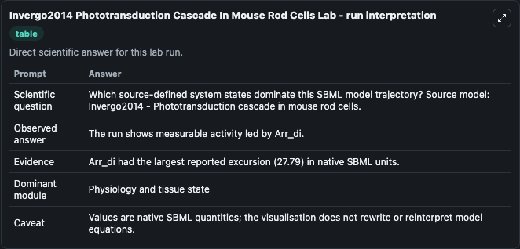
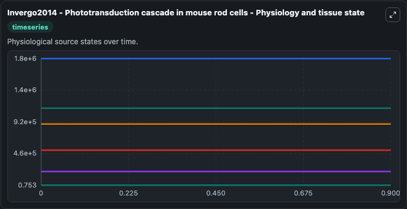
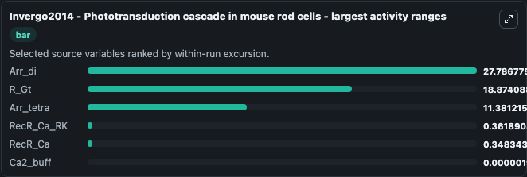
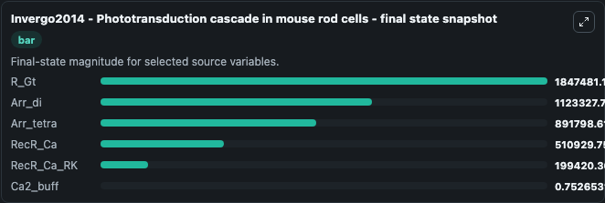
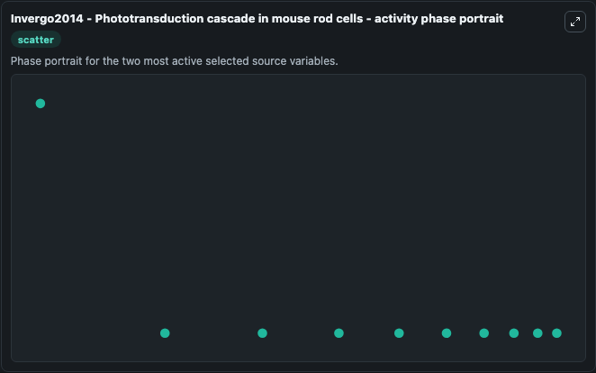

# Invergo2014 Phototransduction Cascade In Mouse Rod Cells

This Biosimulant lab wraps `Invergo2014 Phototransduction Cascade In Mouse Rod Cells` as a runnable systems biology model with a companion visualization module.
Invergo2014 - Phototransduction cascade inmouse rod cells This model is described in the article: A comprehensive model of the phototransduction cascade in mouse rod cells. It can be used to explore the configured dynamics and compare scenario outcomes across configurations.

## What You'll See

The lab asks: Which source-defined system states dominate this SBML model trajectory? Source model: Invergo2014 - Phototransduction cascade in mouse rod cells. It runs for 1.0 time units with a communication step of 0.1. The run uses the model defaults declared by the curated SBML wrapper. The generated visualizations focus on R_Gt, Arr_di, Arr_tetra, RecR_Ca, RecR_Ca_RK, and Ca2_buff, combining trajectory, endpoint-comparison, and summary-table views from one completed dark-mode run.

In this captured run, **Arr_di** moved from 1.12e+06 to 1.12e+06 across 1.0 simulation windows.


### Output Visualizations



*Summary table for Invergo2014 Phototransduction Cascade In Mouse Rod Cells, reporting the scientific question, observed answer, dominant module, and caveat.*



*Trajectories of Arr_di, R_Gt, Arr_tetra, RecR_Ca_RK, RecR_Ca, and Ca2_buff across the 1.0 simulation. In this run **Arr_di** climbed from 1.12e+06 to 1.12e+06 and **R_Gt** fell from 1.85e+06 to 1.85e+06 — the largest movements among the focused observables.*



*Largest-excursion ranking of the focused observables — the absolute movement magnitude during the run. Top 3: **Arr_di** = 27.787, **R_Gt** = 18.874, **Arr_tetra** = 11.381, with 3 more observables below.*



*Endpoint snapshot of the focused observables — final values from the captured run. Top 3 by value: **R_Gt** = 1.85e+06, **Arr_di** = 1.12e+06, **Arr_tetra** = 8.92e+05, with 3 more observables below.*



*Visualization card from the Invergo2014 Phototransduction Cascade In Mouse Rod Cells dark-mode run.*


## Model Context

- Core model: `models/core`
- Visualization model: `models/visualisation`
- Standard: `other`
- Upstream source: `biomodels_ebi:BIOMD0000000578`
- License: `CC0`

## Inputs

| Input | Maps To | Default | Notes |
|---|---|---|---|
| Otherstimulus | `systemsbiology_sbml_invergo2014_phototransduction_cascade_in_mouse_r_biomd0000000578_model.otherstimulus` | | Source parameter exposed because its SBML label indicates a boundary, stimulus, dose, ligand, protocol, substrate, or environmental control. Maps to SBML symbol `otherstimulus`. |

## Outputs

| Output | Maps To | Role |
|---|---|---|
| `state` | `systemsbiology_sbml_invergo2014_phototransduction_cascade_in_mouse_r_biomd0000000578_model.state` | Available to the visualization model and downstream workflows. |
| `summary` | `systemsbiology_sbml_invergo2014_phototransduction_cascade_in_mouse_r_biomd0000000578_model.summary` | Available to the visualization model and downstream workflows. |
| `species_labels` | `systemsbiology_sbml_invergo2014_phototransduction_cascade_in_mouse_r_biomd0000000578_model.species_labels` | Available to the visualization model and downstream workflows. |
| `r_gt` | `systemsbiology_sbml_invergo2014_phototransduction_cascade_in_mouse_r_biomd0000000578_model.r_gt` | Available to the visualization model and downstream workflows. |
| `arr_di` | `systemsbiology_sbml_invergo2014_phototransduction_cascade_in_mouse_r_biomd0000000578_model.arr_di` | Available to the visualization model and downstream workflows. |
| `arr_tetra` | `systemsbiology_sbml_invergo2014_phototransduction_cascade_in_mouse_r_biomd0000000578_model.arr_tetra` | Available to the visualization model and downstream workflows. |
| `rec_r_ca` | `systemsbiology_sbml_invergo2014_phototransduction_cascade_in_mouse_r_biomd0000000578_model.rec_r_ca` | Available to the visualization model and downstream workflows. |
| `rec_r_ca_rk` | `systemsbiology_sbml_invergo2014_phototransduction_cascade_in_mouse_r_biomd0000000578_model.rec_r_ca_rk` | Available to the visualization model and downstream workflows. |
| `ca2_buff` | `systemsbiology_sbml_invergo2014_phototransduction_cascade_in_mouse_r_biomd0000000578_model.ca2_buff` | Available to the visualization model and downstream workflows. |

## Runtime

- Duration: `1.0`
- Communication step: `0.1`

## Running Locally

```bash
biosimulant labs serve
```
