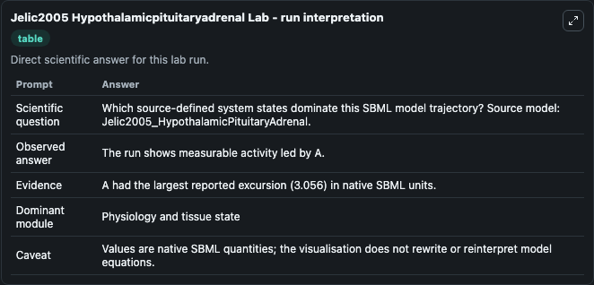
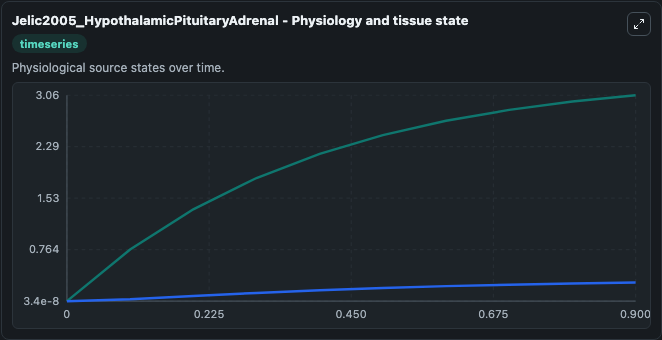
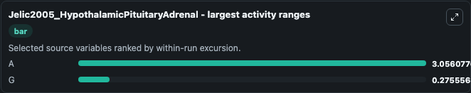
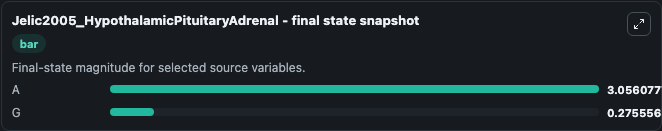
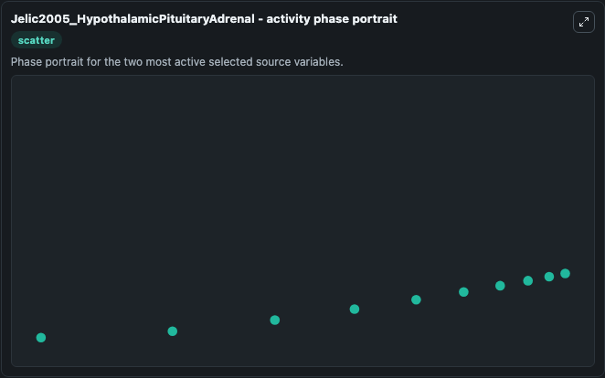

# Jelic2005 Hypothalamicpituitaryadrenal

This Biosimulant lab wraps `Jelic2005 Hypothalamicpituitaryadrenal` as a runnable systems biology model with a companion visualization module.
This a model from the article: Mathematical modeling of the hypothalamic-pituitary-adrenal system activity. It can be used to explore the configured dynamics and compare scenario outcomes across configurations.

## What You'll See

The lab asks: Which source-defined system states dominate this SBML model trajectory? Source model: Jelic2005_HypothalamicPituitaryAdrenal. It runs for 1.0 time units with a communication step of 0.1. The run uses the model defaults declared by the curated SBML wrapper. The generated visualizations focus on G, and A, combining trajectory, endpoint-comparison, and summary-table views from one completed dark-mode run.

In this captured run, **A** moved from 7.68e-08 to 3.056 across 1.0 simulation windows.


### Output Visualizations



*Summary table for Jelic2005 Hypothalamicpituitaryadrenal, reporting the scientific question, observed answer, dominant module, and caveat.*



*Trajectories of A, and G across the 1.0 simulation. In this run **A** climbed from 7.68e-08 to 3.056 — the largest movements among the focused observables.*



*Largest-excursion ranking of the focused observables — the absolute movement magnitude during the run. Top 2: **A** = 3.056, **G** = 0.2756.*



*Endpoint snapshot of the focused observables — final values from the captured run. Top 2 by value: **A** = 3.056, **G** = 0.2756.*



*Visualization card from the Jelic2005 Hypothalamicpituitaryadrenal dark-mode run.*


## Model Context

- Core model: `models/core`
- Visualization model: `models/visualisation`
- Standard: `other`
- Upstream source: `biomodels_ebi:MODEL1006230013`
- License: `CC0`

## Inputs

| Input | Maps To | Default | Notes |
|---|---|---|---|
| Initial Model State G | `systemsbiology_sbml_jelic2005_hypothalamicpituitaryadrenal_model1006230013_model.initial_model_state_g` | | Source state initial condition exposed as a model-specific control because no explicit intervention parameter is identifiable. Maps to SBML symbol `g`. |
| Initial Model State A | `systemsbiology_sbml_jelic2005_hypothalamicpituitaryadrenal_model1006230013_model.initial_model_state_a` | | Source state initial condition exposed as a model-specific control because no explicit intervention parameter is identifiable. Maps to SBML symbol `a`. |

## Outputs

| Output | Maps To | Role |
|---|---|---|
| `state` | `systemsbiology_sbml_jelic2005_hypothalamicpituitaryadrenal_model1006230013_model.state` | Available to the visualization model and downstream workflows. |
| `summary` | `systemsbiology_sbml_jelic2005_hypothalamicpituitaryadrenal_model1006230013_model.summary` | Available to the visualization model and downstream workflows. |
| `species_labels` | `systemsbiology_sbml_jelic2005_hypothalamicpituitaryadrenal_model1006230013_model.species_labels` | Available to the visualization model and downstream workflows. |
| `model_state_g` | `systemsbiology_sbml_jelic2005_hypothalamicpituitaryadrenal_model1006230013_model.model_state_g` | Available to the visualization model and downstream workflows. |
| `model_state_a` | `systemsbiology_sbml_jelic2005_hypothalamicpituitaryadrenal_model1006230013_model.model_state_a` | Available to the visualization model and downstream workflows. |

## Runtime

- Duration: `1.0`
- Communication step: `0.1`

## Running Locally

```bash
biosimulant labs serve
```
