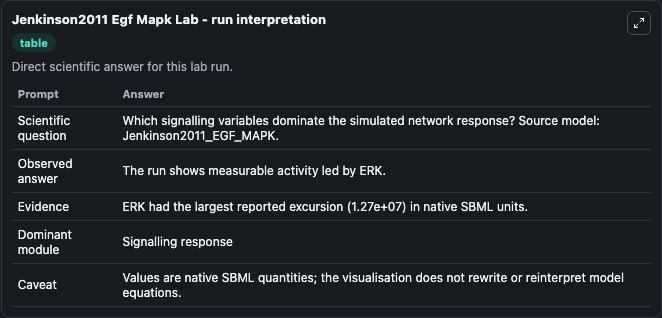
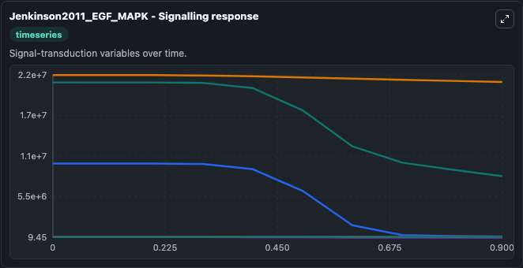
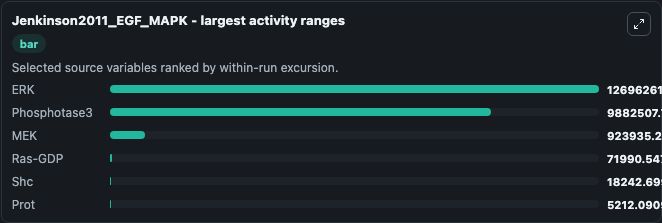
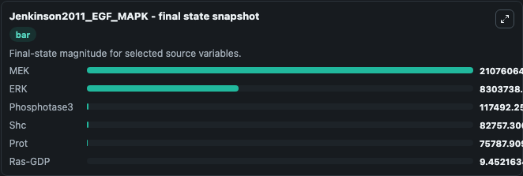
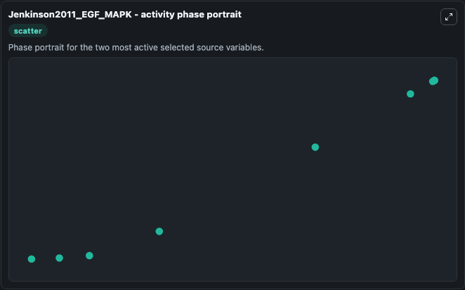

# Jenkinson2011 Egf Mapk

This Biosimulant lab wraps `Jenkinson2011 Egf Mapk` as a runnable systems biology model with a companion visualization module.
This is a model described in the article: Thermodynamically Consistent Model Calibration in Chemical Kinetics. It can be used to explore the configured dynamics and compare scenario outcomes across configurations.

## What You'll See

The lab asks: Which signalling variables dominate the simulated network response? Source model: Jenkinson2011_EGF_MAPK. It runs for 1.0 time units with a communication step of 0.1. The run uses the model defaults declared by the curated SBML wrapper. The generated visualizations focus on MEK, ERK, Phosphotase3, Shc, Prot, and Ras-GDP, combining trajectory, endpoint-comparison, and summary-table views from one completed dark-mode run.

In this captured run, **ERK** moved from 2.1e+07 to 8.3e+06 across 1.0 simulation windows.


### Output Visualizations



*Summary table for Jenkinson2011 Egf Mapk, reporting the scientific question, observed answer, dominant module, and caveat.*



*Trajectories of ERK, Phosphotase3, MEK, Ras-GDP, Shc, and Prot across the 1.0 simulation. In this run **ERK** fell from 2.1e+07 to 8.3e+06 — the largest movements among the focused observables.*



*Largest-excursion ranking of the focused observables — the absolute movement magnitude during the run. Top 3: **ERK** = 1.27e+07, **Phosphotase3** = 9.88e+06, **MEK** = 9.24e+05, with 3 more observables below.*



*Endpoint snapshot of the focused observables — final values from the captured run. Top 3 by value: **MEK** = 2.11e+07, **ERK** = 8.3e+06, **Phosphotase3** = 1.17e+05, with 3 more observables below.*



*Visualization card from the Jenkinson2011 Egf Mapk dark-mode run.*


## Model Context

- Core model: `models/core`
- Visualization model: `models/visualisation`
- Standard: `other`
- Upstream source: `biomodels_ebi:BIOMD0000000399`
- License: `CC0`

## Inputs

| Input | Maps To | Default | Notes |
|---|---|---|---|
| Initial Model State Mek | `systemsbiology_sbml_jenkinson2011_egf_mapk_biomd0000000399_model.initial_model_state_mek` | | Source state initial condition exposed as a model-specific control because no explicit intervention parameter is identifiable. Maps to SBML symbol `x47`. |
| Initial Model State ERK | `systemsbiology_sbml_jenkinson2011_egf_mapk_biomd0000000399_model.initial_model_state_erk` | | Source state initial condition exposed as a model-specific control because no explicit intervention parameter is identifiable. Maps to SBML symbol `x55`. |
| Initial Phosphotase3 | `systemsbiology_sbml_jenkinson2011_egf_mapk_biomd0000000399_model.initial_phosphotase3` | | Source state initial condition exposed as a model-specific control because no explicit intervention parameter is identifiable. Maps to SBML symbol `x60`. |
| Initial Model State Shc | `systemsbiology_sbml_jenkinson2011_egf_mapk_biomd0000000399_model.initial_model_state_shc` | | Source state initial condition exposed as a model-specific control because no explicit intervention parameter is identifiable. Maps to SBML symbol `x31`. |
| Initial Prot | `systemsbiology_sbml_jenkinson2011_egf_mapk_biomd0000000399_model.initial_prot` | | Source state initial condition exposed as a model-specific control because no explicit intervention parameter is identifiable. Maps to SBML symbol `x12`. |
| Initial RAS Gdp | `systemsbiology_sbml_jenkinson2011_egf_mapk_biomd0000000399_model.initial_ras_gdp` | | Source state initial condition exposed as a model-specific control because no explicit intervention parameter is identifiable. Maps to SBML symbol `x26`. |

## Outputs

| Output | Maps To | Role |
|---|---|---|
| `state` | `systemsbiology_sbml_jenkinson2011_egf_mapk_biomd0000000399_model.state` | Available to the visualization model and downstream workflows. |
| `summary` | `systemsbiology_sbml_jenkinson2011_egf_mapk_biomd0000000399_model.summary` | Available to the visualization model and downstream workflows. |
| `species_labels` | `systemsbiology_sbml_jenkinson2011_egf_mapk_biomd0000000399_model.species_labels` | Available to the visualization model and downstream workflows. |
| `mek` | `systemsbiology_sbml_jenkinson2011_egf_mapk_biomd0000000399_model.mek` | Available to the visualization model and downstream workflows. |
| `erk` | `systemsbiology_sbml_jenkinson2011_egf_mapk_biomd0000000399_model.erk` | Available to the visualization model and downstream workflows. |
| `phosphotase3` | `systemsbiology_sbml_jenkinson2011_egf_mapk_biomd0000000399_model.phosphotase3` | Available to the visualization model and downstream workflows. |
| `shc` | `systemsbiology_sbml_jenkinson2011_egf_mapk_biomd0000000399_model.shc` | Available to the visualization model and downstream workflows. |
| `prot` | `systemsbiology_sbml_jenkinson2011_egf_mapk_biomd0000000399_model.prot` | Available to the visualization model and downstream workflows. |
| `ras_gdp` | `systemsbiology_sbml_jenkinson2011_egf_mapk_biomd0000000399_model.ras_gdp` | Available to the visualization model and downstream workflows. |

## Runtime

- Duration: `1.0`
- Communication step: `0.1`

## Running Locally

```bash
biosimulant labs serve
```
