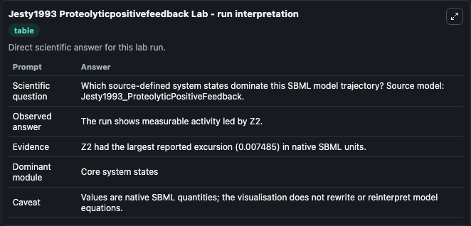
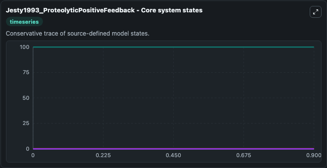
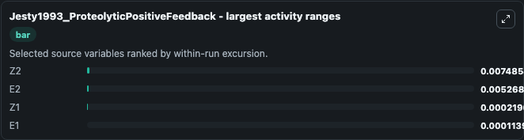
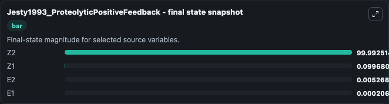
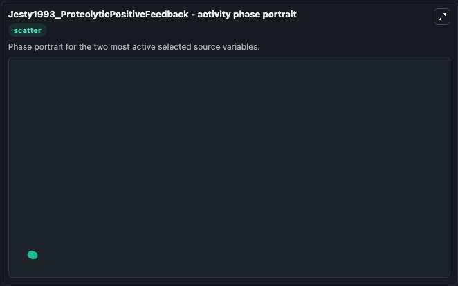

# Jesty1993 Proteolyticpositivefeedback

This Biosimulant lab wraps `Jesty1993 Proteolyticpositivefeedback` as a runnable systems biology model with a companion visualization module.
This model originates from BioModels Database: A Database of Annotated Published Models (http://www.ebi.ac.uk/biomodels/). It can be used to explore the configured dynamics and compare scenario outcomes across configurations.

## What You'll See

The lab asks: Which source-defined system states dominate this SBML model trajectory? Source model: Jesty1993_ProteolyticPositiveFeedback. It runs for 1.0 time units with a communication step of 0.1. The run uses the model defaults declared by the curated SBML wrapper. The generated visualizations focus on Z2, Z1, E2, and E1, combining trajectory, endpoint-comparison, and summary-table views from one completed dark-mode run.

In this captured run, **Z2** moved from 100.0 to 99.993 across 1.0 simulation windows.


### Output Visualizations



*Summary table for Jesty1993 Proteolyticpositivefeedback, reporting the scientific question, observed answer, dominant module, and caveat.*



*Trajectories of Z2, E2, Z1, and E1 across the 1.0 simulation. In this run **E2** climbed from 0 to 0.00527 and **Z2** fell from 100.0 to 99.993 — the largest movements among the focused observables.*



*Largest-excursion ranking of the focused observables — the absolute movement magnitude during the run. Top 3: **Z2** = 0.00749, **E2** = 0.00527, **Z1** = 0.000219, with 1 more observable below.*



*Endpoint snapshot of the focused observables — final values from the captured run. Top 3 by value: **Z2** = 99.993, **Z1** = 0.0997, **E2** = 0.00527, with 1 more observable below.*



*Visualization card from the Jesty1993 Proteolyticpositivefeedback dark-mode run.*


## Model Context

- Core model: `models/core`
- Visualization model: `models/visualisation`
- Standard: `other`
- Upstream source: `biomodels_ebi:MODEL1108260010`
- License: `CC0`

## Inputs

| Input | Maps To | Default | Notes |
|---|---|---|---|
| Initial Model State Z2 | `systemsbiology_sbml_jesty1993_proteolyticpositivefeedback_model1108260010_model.initial_model_state_z2` | | Source state initial condition exposed as a model-specific control because no explicit intervention parameter is identifiable. Maps to SBML symbol `Z2`. |
| Initial Model State Z1 | `systemsbiology_sbml_jesty1993_proteolyticpositivefeedback_model1108260010_model.initial_model_state_z1` | | Source state initial condition exposed as a model-specific control because no explicit intervention parameter is identifiable. Maps to SBML symbol `Z1`. |
| Initial Model State E2 | `systemsbiology_sbml_jesty1993_proteolyticpositivefeedback_model1108260010_model.initial_model_state_e2` | | Source state initial condition exposed as a model-specific control because no explicit intervention parameter is identifiable. Maps to SBML symbol `E2`. |
| Initial Model State E1 | `systemsbiology_sbml_jesty1993_proteolyticpositivefeedback_model1108260010_model.initial_model_state_e1` | | Source state initial condition exposed as a model-specific control because no explicit intervention parameter is identifiable. Maps to SBML symbol `E1`. |

## Outputs

| Output | Maps To | Role |
|---|---|---|
| `state` | `systemsbiology_sbml_jesty1993_proteolyticpositivefeedback_model1108260010_model.state` | Available to the visualization model and downstream workflows. |
| `summary` | `systemsbiology_sbml_jesty1993_proteolyticpositivefeedback_model1108260010_model.summary` | Available to the visualization model and downstream workflows. |
| `species_labels` | `systemsbiology_sbml_jesty1993_proteolyticpositivefeedback_model1108260010_model.species_labels` | Available to the visualization model and downstream workflows. |
| `model_state_z2` | `systemsbiology_sbml_jesty1993_proteolyticpositivefeedback_model1108260010_model.model_state_z2` | Available to the visualization model and downstream workflows. |
| `model_state_z1` | `systemsbiology_sbml_jesty1993_proteolyticpositivefeedback_model1108260010_model.model_state_z1` | Available to the visualization model and downstream workflows. |
| `model_state_e2` | `systemsbiology_sbml_jesty1993_proteolyticpositivefeedback_model1108260010_model.model_state_e2` | Available to the visualization model and downstream workflows. |
| `model_state_e1` | `systemsbiology_sbml_jesty1993_proteolyticpositivefeedback_model1108260010_model.model_state_e1` | Available to the visualization model and downstream workflows. |

## Runtime

- Duration: `1.0`
- Communication step: `0.1`

## Running Locally

```bash
biosimulant labs serve
```
