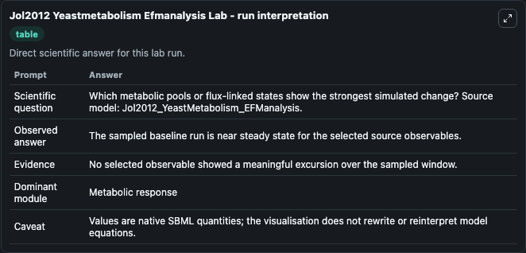
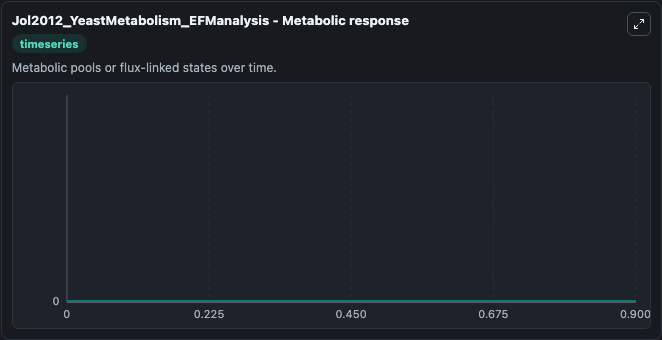

# Jol2012 Yeastmetabolism Efmanalysis

This Biosimulant lab wraps `Jol2012 Yeastmetabolism Efmanalysis` as a runnable systems biology model with a companion visualization module.
To the extent possible under law, all copyright and related or neighbouring rights to this encoded model have been dedicated to the public domain worldwide. It can be used to explore the configured dynamics and compare scenario outcomes across configurations.

## What You'll See

The lab asks: Which metabolic pools or flux-linked states show the strongest simulated change? Source model: Jol2012_YeastMetabolism_EFManalysis. It runs for 1.0 time units with a communication step of 0.1. The run uses the model defaults declared by the curated SBML wrapper. The generated visualizations focus on zymst[c], xu5p-D[c], val-L[c], ump[c], tyr-L[c], and trp-L[c], combining trajectory, endpoint-comparison, and summary-table views from one completed dark-mode run.

In this captured run, **zymst[c]** moved from 0 to 0 across 1.0 simulation windows.


### Output Visualizations



*Summary table for Jol2012 Yeastmetabolism Efmanalysis, reporting the scientific question, observed answer, dominant module, and caveat.*



*Trajectories of zymst[c], xu5p-D[c], val-L[c], ump[c], tyr-L[c], and trp-L[c] across the 1.0 simulation. In this run zymst[c], xu5p-D[c], val-L[c], ump[c] stayed near their initial values — no observable moved appreciably.*


## Model Context

- Core model: `models/core`
- Visualization model: `models/visualisation`
- Standard: `other`
- Upstream source: `biomodels_ebi:MODEL1201230000`
- License: `CC0`

## Inputs

| Input | Maps To | Default | Notes |
|---|---|---|---|
| Initial Zymst C | `systemsbiology_sbml_jol2012_yeastmetabolism_efmanalysis_model1201230000_model.initial_zymst_c` | | Source state initial condition exposed as a model-specific control because no explicit intervention parameter is identifiable. Maps to SBML symbol `M_zymst_c`. |
| Initial Xu5p D C | `systemsbiology_sbml_jol2012_yeastmetabolism_efmanalysis_model1201230000_model.initial_xu5p_d_c` | | Source state initial condition exposed as a model-specific control because no explicit intervention parameter is identifiable. Maps to SBML symbol `M_xu5p_DASH_D_c`. |
| Initial Val L C | `systemsbiology_sbml_jol2012_yeastmetabolism_efmanalysis_model1201230000_model.initial_val_l_c` | | Source state initial condition exposed as a model-specific control because no explicit intervention parameter is identifiable. Maps to SBML symbol `M_val_DASH_L_c`. |
| Initial Ump C | `systemsbiology_sbml_jol2012_yeastmetabolism_efmanalysis_model1201230000_model.initial_ump_c` | | Source state initial condition exposed as a model-specific control because no explicit intervention parameter is identifiable. Maps to SBML symbol `M_ump_c`. |
| Initial Tyr L C | `systemsbiology_sbml_jol2012_yeastmetabolism_efmanalysis_model1201230000_model.initial_tyr_l_c` | | Source state initial condition exposed as a model-specific control because no explicit intervention parameter is identifiable. Maps to SBML symbol `M_tyr_DASH_L_c`. |
| Initial Trp L C | `systemsbiology_sbml_jol2012_yeastmetabolism_efmanalysis_model1201230000_model.initial_trp_l_c` | | Source state initial condition exposed as a model-specific control because no explicit intervention parameter is identifiable. Maps to SBML symbol `M_trp_DASH_L_c`. |

## Outputs

| Output | Maps To | Role |
|---|---|---|
| `state` | `systemsbiology_sbml_jol2012_yeastmetabolism_efmanalysis_model1201230000_model.state` | Available to the visualization model and downstream workflows. |
| `summary` | `systemsbiology_sbml_jol2012_yeastmetabolism_efmanalysis_model1201230000_model.summary` | Available to the visualization model and downstream workflows. |
| `species_labels` | `systemsbiology_sbml_jol2012_yeastmetabolism_efmanalysis_model1201230000_model.species_labels` | Available to the visualization model and downstream workflows. |
| `zymst_c` | `systemsbiology_sbml_jol2012_yeastmetabolism_efmanalysis_model1201230000_model.zymst_c` | Available to the visualization model and downstream workflows. |
| `xu5p_d_c` | `systemsbiology_sbml_jol2012_yeastmetabolism_efmanalysis_model1201230000_model.xu5p_d_c` | Available to the visualization model and downstream workflows. |
| `val_l_c` | `systemsbiology_sbml_jol2012_yeastmetabolism_efmanalysis_model1201230000_model.val_l_c` | Available to the visualization model and downstream workflows. |
| `ump_c` | `systemsbiology_sbml_jol2012_yeastmetabolism_efmanalysis_model1201230000_model.ump_c` | Available to the visualization model and downstream workflows. |
| `tyr_l_c` | `systemsbiology_sbml_jol2012_yeastmetabolism_efmanalysis_model1201230000_model.tyr_l_c` | Available to the visualization model and downstream workflows. |
| `trp_l_c` | `systemsbiology_sbml_jol2012_yeastmetabolism_efmanalysis_model1201230000_model.trp_l_c` | Available to the visualization model and downstream workflows. |

## Runtime

- Duration: `1.0`
- Communication step: `0.1`

## Running Locally

```bash
biosimulant labs serve
```
