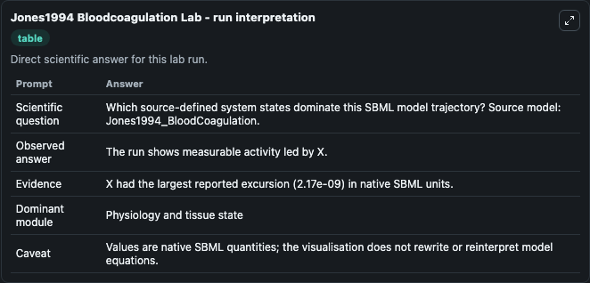
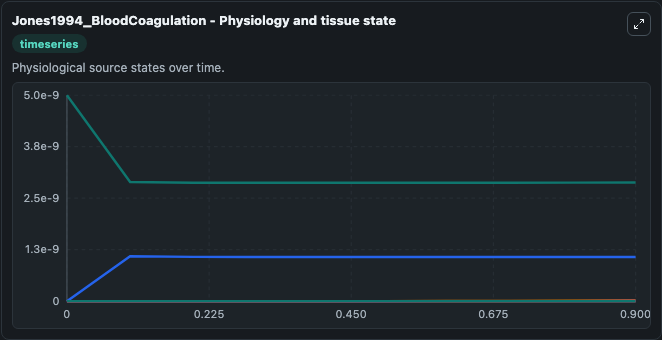
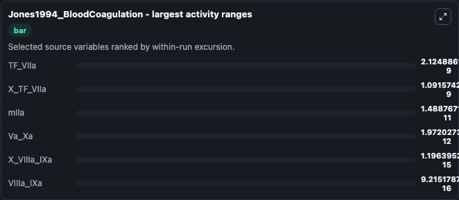
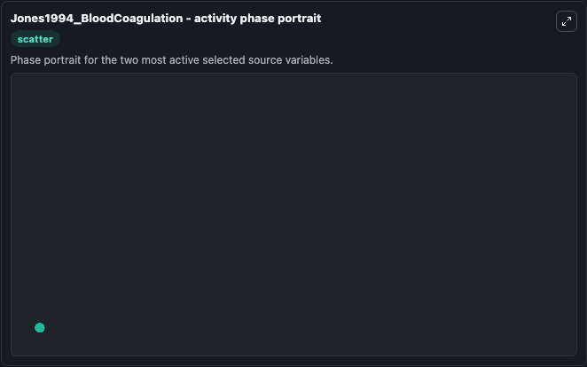

# Jones1994 Bloodcoagulation

This Biosimulant lab wraps `Jones1994 Bloodcoagulation` as a runnable systems biology model with a companion visualization module.
Jones1994_BloodCoagulation This model is built based on theexperimental findings described in Lawson et al., 1994(PMID:8083241) This model is described in the article: A model for the tissue factor pa. It can be used to explore the configured dynamics and compare scenario outcomes across configurations.

## What You'll See

The lab asks: Which source-defined system states dominate this SBML model trajectory? Source model: Jones1994_BloodCoagulation. It runs for 1.0 time units with a communication step of 0.1. The run uses the model defaults declared by the curated SBML wrapper. The generated visualizations focus on TF_VIIa, mIIa, X_VIIIa_IXa, X_TF_VIIa, Va_Xa, and VIIIa_IXa, combining trajectory, endpoint-comparison, and summary-table views from one completed dark-mode run.

In this captured run, **TF_VIIa** moved from 5e-09 to 2.88e-09 across 1.0 simulation windows.


### Output Visualizations



*Summary table for Jones1994 Bloodcoagulation, reporting the scientific question, observed answer, dominant module, and caveat.*



*Trajectories of TF_VIIa, X_TF_VIIa, mIIa, Va_Xa, X_VIIIa_IXa, and VIIIa_IXa across the 1.0 simulation. In this run **X_TF_VIIa** climbed from 0 to 1.07e-09 and **TF_VIIa** fell from 5e-09 to 2.88e-09 — the largest movements among the focused observables.*



*Largest-excursion ranking of the focused observables — the absolute movement magnitude during the run. Top 3: **TF_VIIa** = 2.12e-09, **X_TF_VIIa** = 1.09e-09, **mIIa** = 1.49e-11, with 3 more observables below.*


*Endpoint snapshot of the focused observables — final values from the captured run. Top 3 by value: **TF_VIIa** = 2.88e-09, **X_TF_VIIa** = 1.07e-09, **mIIa** = 1.49e-11, with 3 more observables below.*



*Visualization card from the Jones1994 Bloodcoagulation dark-mode run.*


## Model Context

- Core model: `models/core`
- Visualization model: `models/visualisation`
- Standard: `other`
- Upstream source: `biomodels_ebi:BIOMD0000000336`
- License: `CC0`

## Inputs

| Input | Maps To | Default | Notes |
|---|---|---|---|
| Initial Tf Vi Ia | `systemsbiology_sbml_jones1994_bloodcoagulation_biomd0000000336_model.initial_tf_vi_ia` | | Source state initial condition exposed as a model-specific control because no explicit intervention parameter is identifiable. Maps to SBML symbol `TF_VIIa`. |
| Initial M I Ia | `systemsbiology_sbml_jones1994_bloodcoagulation_biomd0000000336_model.initial_m_i_ia` | | Source state initial condition exposed as a model-specific control because no explicit intervention parameter is identifiable. Maps to SBML symbol `mIIa`. |
| Initial X Vii Ia I Xa | `systemsbiology_sbml_jones1994_bloodcoagulation_biomd0000000336_model.initial_x_vii_ia_i_xa` | | Source state initial condition exposed as a model-specific control because no explicit intervention parameter is identifiable. Maps to SBML symbol `X_VIIIa_IXa`. |
| Initial X Tf Vi Ia | `systemsbiology_sbml_jones1994_bloodcoagulation_biomd0000000336_model.initial_x_tf_vi_ia` | | Source state initial condition exposed as a model-specific control because no explicit intervention parameter is identifiable. Maps to SBML symbol `X_TF_VIIa`. |
| Initial Va Xa | `systemsbiology_sbml_jones1994_bloodcoagulation_biomd0000000336_model.initial_va_xa` | | Source state initial condition exposed as a model-specific control because no explicit intervention parameter is identifiable. Maps to SBML symbol `Va_Xa`. |
| Initial Vii Ia I Xa | `systemsbiology_sbml_jones1994_bloodcoagulation_biomd0000000336_model.initial_vii_ia_i_xa` | | Source state initial condition exposed as a model-specific control because no explicit intervention parameter is identifiable. Maps to SBML symbol `VIIIa_IXa`. |

## Outputs

| Output | Maps To | Role |
|---|---|---|
| `state` | `systemsbiology_sbml_jones1994_bloodcoagulation_biomd0000000336_model.state` | Available to the visualization model and downstream workflows. |
| `summary` | `systemsbiology_sbml_jones1994_bloodcoagulation_biomd0000000336_model.summary` | Available to the visualization model and downstream workflows. |
| `species_labels` | `systemsbiology_sbml_jones1994_bloodcoagulation_biomd0000000336_model.species_labels` | Available to the visualization model and downstream workflows. |
| `tf_vi_ia` | `systemsbiology_sbml_jones1994_bloodcoagulation_biomd0000000336_model.tf_vi_ia` | Available to the visualization model and downstream workflows. |
| `m_i_ia` | `systemsbiology_sbml_jones1994_bloodcoagulation_biomd0000000336_model.m_i_ia` | Available to the visualization model and downstream workflows. |
| `x_vii_ia_i_xa` | `systemsbiology_sbml_jones1994_bloodcoagulation_biomd0000000336_model.x_vii_ia_i_xa` | Available to the visualization model and downstream workflows. |
| `x_tf_vi_ia` | `systemsbiology_sbml_jones1994_bloodcoagulation_biomd0000000336_model.x_tf_vi_ia` | Available to the visualization model and downstream workflows. |
| `va_xa` | `systemsbiology_sbml_jones1994_bloodcoagulation_biomd0000000336_model.va_xa` | Available to the visualization model and downstream workflows. |
| `vii_ia_i_xa` | `systemsbiology_sbml_jones1994_bloodcoagulation_biomd0000000336_model.vii_ia_i_xa` | Available to the visualization model and downstream workflows. |

## Runtime

- Duration: `1.0`
- Communication step: `0.1`

## Running Locally

```bash
biosimulant labs serve
```
