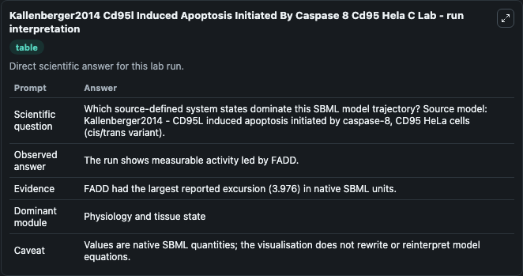
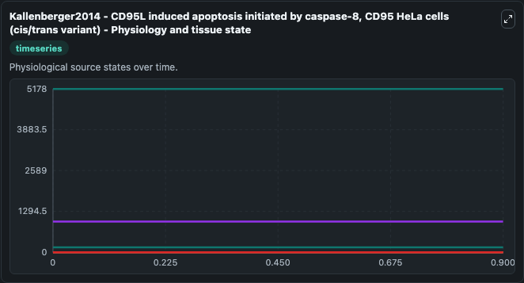
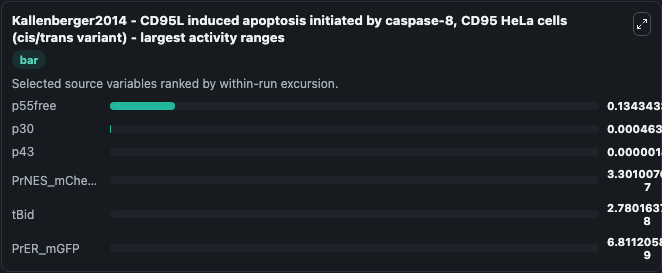
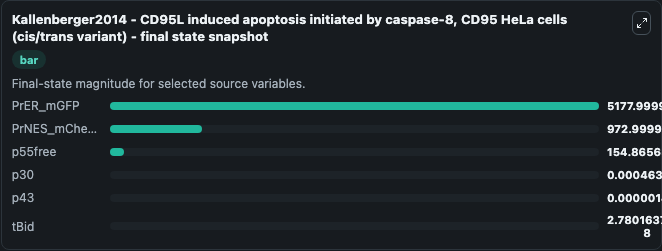
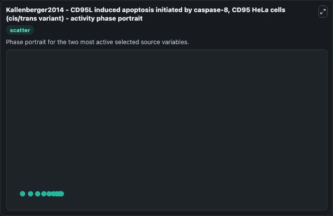

# Kallenberger2014 Cd95l Induced Apoptosis Initiated By Caspase 8 Cd95 Hela C (BIOMD0000000523)

This Biosimulant lab wraps `BIOMD0000000523 Kallenberger2014 Cd95l Induced Apoptosis Initiated By Caspase 8 Cd95 Hela C` as a runnable systems biology model with a companion visualization module.
Kallenberger2014 - CD95L induced apoptosis initiated by caspase-8, CD95 HeLa cells (cis/trans variant) The paper describes a new approach that combines single cell and population data in the same mode. It can be used to explore the configured dynamics and compare scenario outcomes across configurations.

## What You'll See

The lab asks: Which source-defined system states dominate this SBML model trajectory? Source model: Kallenberger2014 - CD95L induced apoptosis initiated by caspase-8, CD95 HeLa cells (cis/trans variant). It runs for 1.0 time units with a communication step of 0.1. The run uses the model defaults declared by the curated SBML wrapper. The generated visualizations focus on PrER_mGFP, PrNES_mCherry, p55free, tBid, p43, and p30, combining trajectory, endpoint-comparison, and summary-table views from one completed dark-mode run.

In this captured run, **p55free** moved from 155.0 to 154.9 across 1.0 simulation windows.


### Output Visualizations



*Summary table for Kallenberger2014 Cd95l Induced Apoptosis Initiated By Caspase 8 Cd95 Hela C, reporting the scientific question, observed answer, dominant module, and caveat.*



*Trajectories of p55free, p30, p43, PrNES_mCherry, tBid, and PrER_mGFP across the 1.0 simulation. In this run **p30** climbed from 0 to 0.000464 and **p55free** fell from 155.0 to 154.9 — the largest movements among the focused observables.*



*Largest-excursion ranking of the focused observables — the absolute movement magnitude during the run. Top 3: **p55free** = 0.1343, **p30** = 0.000464, **p43** = 1.46e-06, with 3 more observables below.*



*Endpoint snapshot of the focused observables — final values from the captured run. Top 3 by value: **PrER_mGFP** = 5178.0, **PrNES_mCherry** = 973.0, **p55free** = 154.9, with 3 more observables below.*



*Visualization card from the Kallenberger2014 Cd95l Induced Apoptosis Initiated By Caspase 8 Cd95 Hela C dark-mode run.*


## Model Context

- Core model: `models/core`
- Visualization model: `models/visualisation`
- Standard: `other`
- Upstream source: `biomodels_ebi:BIOMD0000000523`
- License: `CC0`

## Inputs

| Input | Maps To | Default | Notes |
|---|---|---|---|
| Initial Pr Er M Gfp | `systemsbiology_sbml_kallenberger2014_cd95l_induced_apoptosis_initiat_biomd0000000523_model.initial_pr_er_m_gfp` | | Source state initial condition exposed as a model-specific control because no explicit intervention parameter is identifiable. Maps to SBML symbol `PrER_mGFP`. |
| Initial Pr Nes M Cherry | `systemsbiology_sbml_kallenberger2014_cd95l_induced_apoptosis_initiat_biomd0000000523_model.initial_pr_nes_m_cherry` | | Source state initial condition exposed as a model-specific control because no explicit intervention parameter is identifiable. Maps to SBML symbol `PrNES_mCherry`. |
| Initial P55free | `systemsbiology_sbml_kallenberger2014_cd95l_induced_apoptosis_initiat_biomd0000000523_model.initial_p55free` | | Source state initial condition exposed as a model-specific control because no explicit intervention parameter is identifiable. Maps to SBML symbol `p55free`. |
| Initial T Bid | `systemsbiology_sbml_kallenberger2014_cd95l_induced_apoptosis_initiat_biomd0000000523_model.initial_t_bid` | | Source state initial condition exposed as a model-specific control because no explicit intervention parameter is identifiable. Maps to SBML symbol `tBid`. |
| Initial Model State P43 | `systemsbiology_sbml_kallenberger2014_cd95l_induced_apoptosis_initiat_biomd0000000523_model.initial_model_state_p43` | | Source state initial condition exposed as a model-specific control because no explicit intervention parameter is identifiable. Maps to SBML symbol `p43`. |
| Initial Model State P30 | `systemsbiology_sbml_kallenberger2014_cd95l_induced_apoptosis_initiat_biomd0000000523_model.initial_model_state_p30` | | Source state initial condition exposed as a model-specific control because no explicit intervention parameter is identifiable. Maps to SBML symbol `p30`. |

## Outputs

| Output | Maps To | Role |
|---|---|---|
| `state` | `systemsbiology_sbml_kallenberger2014_cd95l_induced_apoptosis_initiat_biomd0000000523_model.state` | Available to the visualization model and downstream workflows. |
| `summary` | `systemsbiology_sbml_kallenberger2014_cd95l_induced_apoptosis_initiat_biomd0000000523_model.summary` | Available to the visualization model and downstream workflows. |
| `species_labels` | `systemsbiology_sbml_kallenberger2014_cd95l_induced_apoptosis_initiat_biomd0000000523_model.species_labels` | Available to the visualization model and downstream workflows. |
| `pr_er_m_gfp` | `systemsbiology_sbml_kallenberger2014_cd95l_induced_apoptosis_initiat_biomd0000000523_model.pr_er_m_gfp` | Available to the visualization model and downstream workflows. |
| `pr_nes_m_cherry` | `systemsbiology_sbml_kallenberger2014_cd95l_induced_apoptosis_initiat_biomd0000000523_model.pr_nes_m_cherry` | Available to the visualization model and downstream workflows. |
| `p55free` | `systemsbiology_sbml_kallenberger2014_cd95l_induced_apoptosis_initiat_biomd0000000523_model.p55free` | Available to the visualization model and downstream workflows. |
| `t_bid` | `systemsbiology_sbml_kallenberger2014_cd95l_induced_apoptosis_initiat_biomd0000000523_model.t_bid` | Available to the visualization model and downstream workflows. |
| `p43` | `systemsbiology_sbml_kallenberger2014_cd95l_induced_apoptosis_initiat_biomd0000000523_model.p43` | Available to the visualization model and downstream workflows. |
| `p30` | `systemsbiology_sbml_kallenberger2014_cd95l_induced_apoptosis_initiat_biomd0000000523_model.p30` | Available to the visualization model and downstream workflows. |

## Runtime

- Duration: `1.0`
- Communication step: `0.1`

## Running Locally

```bash
biosimulant labs serve
```
