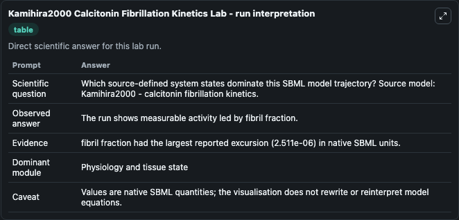
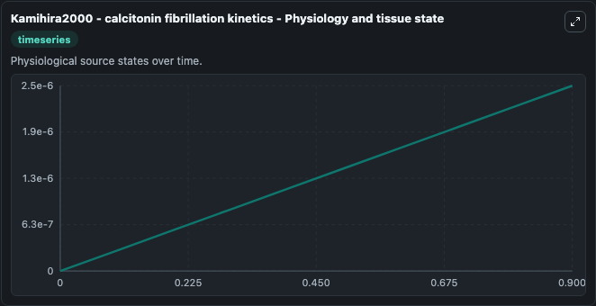
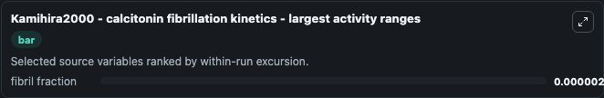
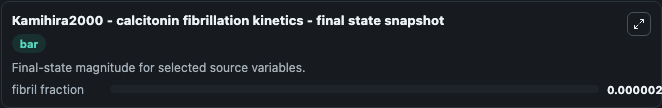

# Kamihira2000 Calcitonin Fibrillation Kinetics

This Biosimulant lab wraps `Kamihira2000 Calcitonin Fibrillation Kinetics` as a runnable systems biology model with a companion visualization module.
Kamihira2000 - calcitonin fibrillation kinetics This model studies the kinetics of human calcitonin fibrillation described as a two-step process. It can be used to explore the configured dynamics and compare scenario outcomes across configurations.

## What You'll See

The lab asks: Which source-defined system states dominate this SBML model trajectory? Source model: Kamihira2000 - calcitonin fibrillation kinetics. It runs for 1.0 time units with a communication step of 0.1. The run uses the model defaults declared by the curated SBML wrapper. The generated visualizations focus on fibril fraction, combining trajectory, endpoint-comparison, and summary-table views from one completed dark-mode run.

In this captured run, **fibril fraction** moved from 0 to 2.51e-06 across 1.0 simulation windows.


### Output Visualizations



*Summary table for Kamihira2000 Calcitonin Fibrillation Kinetics, reporting the scientific question, observed answer, dominant module, and caveat.*



*Trajectories of fibril fraction across the 1.0 simulation. In this run **fibril fraction** climbed from 0 to 2.51e-06 — the largest movements among the focused observables.*



*Largest-excursion ranking of the focused observables — the absolute movement magnitude during the run. Top 1: **fibril fraction** = 2.51e-06.*



*Endpoint snapshot of the focused observables — final values from the captured run. Top 1 by value: **fibril fraction** = 2.51e-06.*


## Model Context

- Core model: `models/core`
- Visualization model: `models/visualisation`
- Standard: `other`
- Upstream source: `biomodels_ebi:BIOMD0000000614`
- License: `CC0`

## Inputs

| Input | Maps To | Default | Notes |
|---|---|---|---|
| Initial Fibril Fraction | `systemsbiology_sbml_kamihira2000_calcitonin_fibrillation_kinetics_biomd0000000614_model.initial_fibril_fraction` | | Source state initial condition exposed as a model-specific control because no explicit intervention parameter is identifiable. Maps to SBML symbol `f`. |

## Outputs

| Output | Maps To | Role |
|---|---|---|
| `state` | `systemsbiology_sbml_kamihira2000_calcitonin_fibrillation_kinetics_biomd0000000614_model.state` | Available to the visualization model and downstream workflows. |
| `summary` | `systemsbiology_sbml_kamihira2000_calcitonin_fibrillation_kinetics_biomd0000000614_model.summary` | Available to the visualization model and downstream workflows. |
| `species_labels` | `systemsbiology_sbml_kamihira2000_calcitonin_fibrillation_kinetics_biomd0000000614_model.species_labels` | Available to the visualization model and downstream workflows. |
| `fibril_fraction` | `systemsbiology_sbml_kamihira2000_calcitonin_fibrillation_kinetics_biomd0000000614_model.fibril_fraction` | Available to the visualization model and downstream workflows. |

## Runtime

- Duration: `1.0`
- Communication step: `0.1`

## Running Locally

```bash
biosimulant labs serve
```
