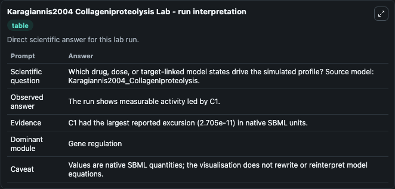
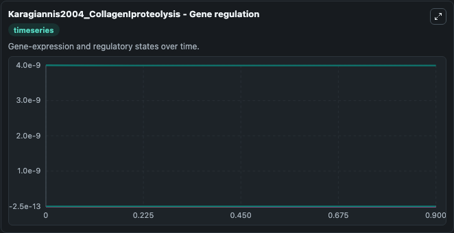
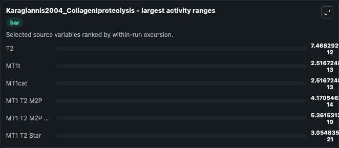
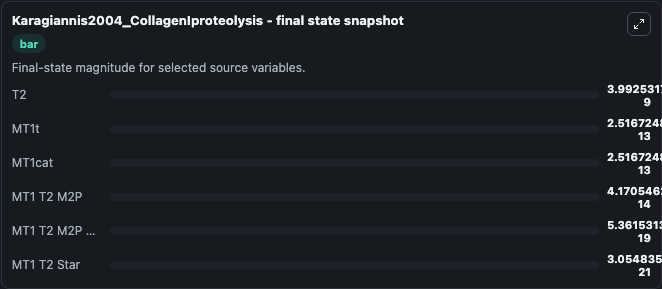
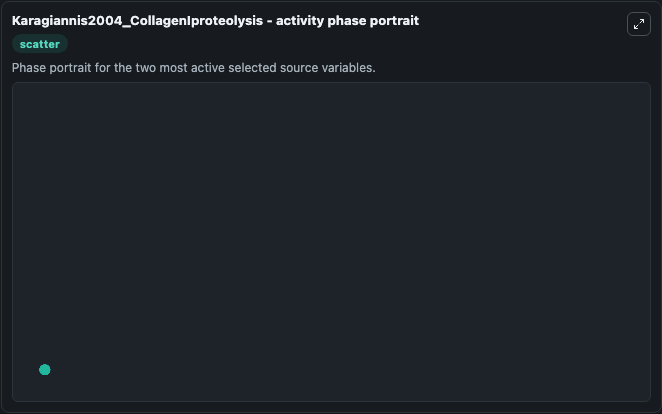

# Karagiannis2004 Collageniproteolysis

This Biosimulant lab wraps `Karagiannis2004 Collageniproteolysis` as a runnable systems biology model with a companion visualization module.
This a model from the article: A theoretical model of type I collagen proteolysis by matrix metalloproteinase(MMP) 2 and membrane type 1 MMP in the presence of tissue inhibitor ofmetalloproteinase 2. It can be used to explore the configured dynamics and compare scenario outcomes across configurations.

## What You'll See

The lab asks: Which drug, dose, or target-linked model states drive the simulated profile? Source model: Karagiannis2004_CollagenIproteolysis. It runs for 1.0 time units with a communication step of 0.1. The run uses the model defaults declared by the curated SBML wrapper. The generated visualizations focus on T2, MT1t, MT1cat, MT1 T2 Star, MT1 T2 M2P MT1, and MT1 T2 M2P, combining trajectory, endpoint-comparison, and summary-table views from one completed dark-mode run.

In this captured run, **T2** moved from 4e-09 to 3.99e-09 across 1.0 simulation windows.


### Output Visualizations



*Summary table for Karagiannis2004 Collageniproteolysis, reporting the scientific question, observed answer, dominant module, and caveat.*



*Trajectories of T2, MT1t, MT1cat, MT1 T2 M2P, MT1 T2 M2P MT1, and MT1 T2 Star across the 1.0 simulation. In this run **T2** fell from 4e-09 to 3.99e-09 — the largest movements among the focused observables.*



*Largest-excursion ranking of the focused observables — the absolute movement magnitude during the run. Top 3: **T2** = 7.47e-12, **MT1t** = 2.52e-13, **MT1cat** = 2.52e-13, with 3 more observables below.*



*Endpoint snapshot of the focused observables — final values from the captured run. Top 3 by value: **T2** = 3.99e-09, **MT1t** = 2.52e-13, **MT1cat** = 2.52e-13, with 3 more observables below.*



*Visualization card from the Karagiannis2004 Collageniproteolysis dark-mode run.*


## Model Context

- Core model: `models/core`
- Visualization model: `models/visualisation`
- Standard: `other`
- Upstream source: `biomodels_ebi:MODEL0911270007`
- License: `CC0`

## Inputs

| Input | Maps To | Default | Notes |
|---|---|---|---|
| Initial Model State T2 | `systemsbiology_sbml_karagiannis2004_collageniproteolysis_model0911270007_model.initial_model_state_t2` | | Source state initial condition exposed as a model-specific control because no explicit intervention parameter is identifiable. Maps to SBML symbol `T2`. |
| Initial Mt1t | `systemsbiology_sbml_karagiannis2004_collageniproteolysis_model0911270007_model.initial_mt1t` | | Source state initial condition exposed as a model-specific control because no explicit intervention parameter is identifiable. Maps to SBML symbol `MT1t`. |
| Initial Mt1cat | `systemsbiology_sbml_karagiannis2004_collageniproteolysis_model0911270007_model.initial_mt1cat` | | Source state initial condition exposed as a model-specific control because no explicit intervention parameter is identifiable. Maps to SBML symbol `MT1cat`. |
| Initial MT1 T2 Star | `systemsbiology_sbml_karagiannis2004_collageniproteolysis_model0911270007_model.initial_mt1_t2_star` | | Source state initial condition exposed as a model-specific control because no explicit intervention parameter is identifiable. Maps to SBML symbol `MT1_T2_star`. |
| Initial MT1 T2 M2 P MT1 | `systemsbiology_sbml_karagiannis2004_collageniproteolysis_model0911270007_model.initial_mt1_t2_m2_p_mt1` | | Source state initial condition exposed as a model-specific control because no explicit intervention parameter is identifiable. Maps to SBML symbol `MT1_T2_M2p_MT1`. |
| Initial MT1 T2 M2 P | `systemsbiology_sbml_karagiannis2004_collageniproteolysis_model0911270007_model.initial_mt1_t2_m2_p` | | Source state initial condition exposed as a model-specific control because no explicit intervention parameter is identifiable. Maps to SBML symbol `MT1_T2_M2p`. |

## Outputs

| Output | Maps To | Role |
|---|---|---|
| `state` | `systemsbiology_sbml_karagiannis2004_collageniproteolysis_model0911270007_model.state` | Available to the visualization model and downstream workflows. |
| `summary` | `systemsbiology_sbml_karagiannis2004_collageniproteolysis_model0911270007_model.summary` | Available to the visualization model and downstream workflows. |
| `species_labels` | `systemsbiology_sbml_karagiannis2004_collageniproteolysis_model0911270007_model.species_labels` | Available to the visualization model and downstream workflows. |
| `model_state_t2` | `systemsbiology_sbml_karagiannis2004_collageniproteolysis_model0911270007_model.model_state_t2` | Available to the visualization model and downstream workflows. |
| `mt1t` | `systemsbiology_sbml_karagiannis2004_collageniproteolysis_model0911270007_model.mt1t` | Available to the visualization model and downstream workflows. |
| `mt1cat` | `systemsbiology_sbml_karagiannis2004_collageniproteolysis_model0911270007_model.mt1cat` | Available to the visualization model and downstream workflows. |
| `mt1_t2_star` | `systemsbiology_sbml_karagiannis2004_collageniproteolysis_model0911270007_model.mt1_t2_star` | Available to the visualization model and downstream workflows. |
| `mt1_t2_m2_p_mt1` | `systemsbiology_sbml_karagiannis2004_collageniproteolysis_model0911270007_model.mt1_t2_m2_p_mt1` | Available to the visualization model and downstream workflows. |
| `mt1_t2_m2_p` | `systemsbiology_sbml_karagiannis2004_collageniproteolysis_model0911270007_model.mt1_t2_m2_p` | Available to the visualization model and downstream workflows. |

## Runtime

- Duration: `1.0`
- Communication step: `0.1`

## Running Locally

```bash
biosimulant labs serve
```
