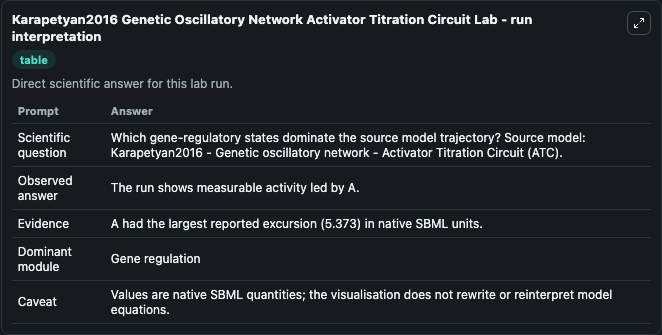
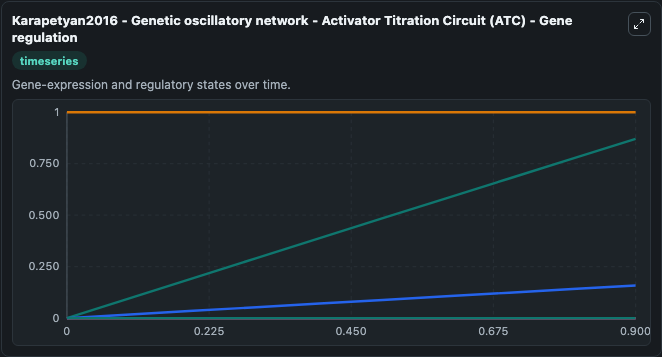
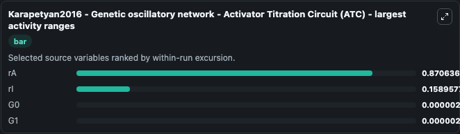
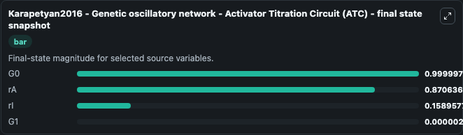
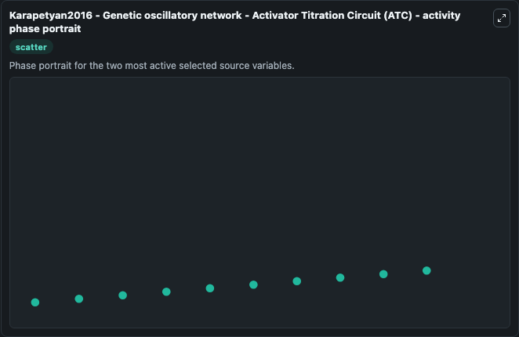

# Karapetyan2016 Genetic Oscillatory Network Activator Titration Circuit

This Biosimulant lab wraps `Karapetyan2016 Genetic Oscillatory Network Activator Titration Circuit` as a runnable systems biology model with a companion visualization module.
Karapetyan2016 - Genetic oscillatory network - Activator Titration Circuit (ATC) This model is described in the article: Role of DNA binding sites and slow unbinding kinetics in titration-based oscill. It can be used to explore the configured dynamics and compare scenario outcomes across configurations.

## What You'll See

The lab asks: Which gene-regulatory states dominate the source model trajectory? Source model: Karapetyan2016 - Genetic oscillatory network - Activator Titration Circuit (ATC). It runs for 1.0 time units with a communication step of 0.1. The run uses the model defaults declared by the curated SBML wrapper. The generated visualizations focus on rI, rA, G0, G3, G2, and G1, combining trajectory, endpoint-comparison, and summary-table views from one completed dark-mode run.

In this captured run, **rA** moved from 0 to 0.8706 across 1.0 simulation windows.


### Output Visualizations



*Summary table for Karapetyan2016 Genetic Oscillatory Network Activator Titration Circuit, reporting the scientific question, observed answer, dominant module, and caveat.*



*Trajectories of rA, rI, G0, G1, G3, and G2 across the 1.0 simulation. In this run **rA** climbed from 0 to 0.8706 and **G0** fell from 1.000 to 1.0000 — the largest movements among the focused observables.*



*Largest-excursion ranking of the focused observables — the absolute movement magnitude during the run. Top 3: **rA** = 0.8706, **rI** = 0.1590, **G0** = 2.74e-06, with 1 more observable below.*



*Endpoint snapshot of the focused observables — final values from the captured run. Top 3 by value: **G0** = 1.0000, **rA** = 0.8706, **rI** = 0.1590, with 1 more observable below.*



*Visualization card from the Karapetyan2016 Genetic Oscillatory Network Activator Titration Circuit dark-mode run.*


## Model Context

- Core model: `models/core`
- Visualization model: `models/visualisation`
- Standard: `other`
- Upstream source: `biomodels_ebi:BIOMD0000000586`
- License: `CC0`

## Inputs

| Input | Maps To | Default | Notes |
|---|---|---|---|
| Initial Model State R I | `systemsbiology_sbml_karapetyan2016_genetic_oscillatory_network_activ_biomd0000000586_model.initial_model_state_r_i` | | Source state initial condition exposed as a model-specific control because no explicit intervention parameter is identifiable. Maps to SBML symbol `rI`. |
| Initial Model State R A | `systemsbiology_sbml_karapetyan2016_genetic_oscillatory_network_activ_biomd0000000586_model.initial_model_state_r_a` | | Source state initial condition exposed as a model-specific control because no explicit intervention parameter is identifiable. Maps to SBML symbol `rA`. |
| Initial Model State G0 | `systemsbiology_sbml_karapetyan2016_genetic_oscillatory_network_activ_biomd0000000586_model.initial_model_state_g0` | | Source state initial condition exposed as a model-specific control because no explicit intervention parameter is identifiable. Maps to SBML symbol `G0`. |
| Initial Model State G3 | `systemsbiology_sbml_karapetyan2016_genetic_oscillatory_network_activ_biomd0000000586_model.initial_model_state_g3` | | Source state initial condition exposed as a model-specific control because no explicit intervention parameter is identifiable. Maps to SBML symbol `G3`. |
| Initial Model State G2 | `systemsbiology_sbml_karapetyan2016_genetic_oscillatory_network_activ_biomd0000000586_model.initial_model_state_g2` | | Source state initial condition exposed as a model-specific control because no explicit intervention parameter is identifiable. Maps to SBML symbol `G2`. |
| Initial Model State G1 | `systemsbiology_sbml_karapetyan2016_genetic_oscillatory_network_activ_biomd0000000586_model.initial_model_state_g1` | | Source state initial condition exposed as a model-specific control because no explicit intervention parameter is identifiable. Maps to SBML symbol `G1`. |

## Outputs

| Output | Maps To | Role |
|---|---|---|
| `state` | `systemsbiology_sbml_karapetyan2016_genetic_oscillatory_network_activ_biomd0000000586_model.state` | Available to the visualization model and downstream workflows. |
| `summary` | `systemsbiology_sbml_karapetyan2016_genetic_oscillatory_network_activ_biomd0000000586_model.summary` | Available to the visualization model and downstream workflows. |
| `species_labels` | `systemsbiology_sbml_karapetyan2016_genetic_oscillatory_network_activ_biomd0000000586_model.species_labels` | Available to the visualization model and downstream workflows. |
| `r_i` | `systemsbiology_sbml_karapetyan2016_genetic_oscillatory_network_activ_biomd0000000586_model.r_i` | Available to the visualization model and downstream workflows. |
| `r_a` | `systemsbiology_sbml_karapetyan2016_genetic_oscillatory_network_activ_biomd0000000586_model.r_a` | Available to the visualization model and downstream workflows. |
| `model_state_g0` | `systemsbiology_sbml_karapetyan2016_genetic_oscillatory_network_activ_biomd0000000586_model.model_state_g0` | Available to the visualization model and downstream workflows. |
| `model_state_g3` | `systemsbiology_sbml_karapetyan2016_genetic_oscillatory_network_activ_biomd0000000586_model.model_state_g3` | Available to the visualization model and downstream workflows. |
| `model_state_g2` | `systemsbiology_sbml_karapetyan2016_genetic_oscillatory_network_activ_biomd0000000586_model.model_state_g2` | Available to the visualization model and downstream workflows. |
| `model_state_g1` | `systemsbiology_sbml_karapetyan2016_genetic_oscillatory_network_activ_biomd0000000586_model.model_state_g1` | Available to the visualization model and downstream workflows. |

## Runtime

- Duration: `1.0`
- Communication step: `0.1`

## Running Locally

```bash
biosimulant labs serve
```
