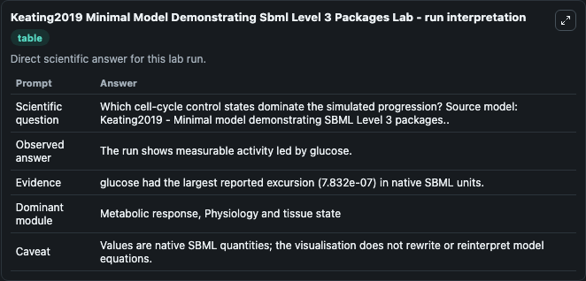
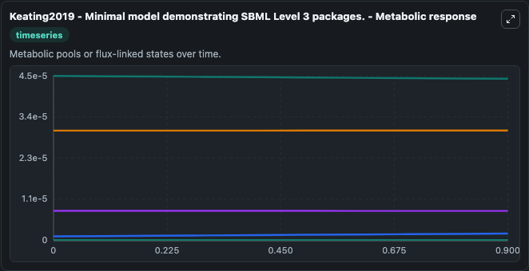
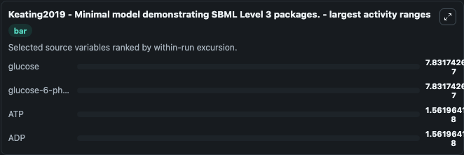
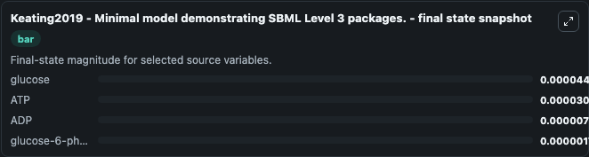
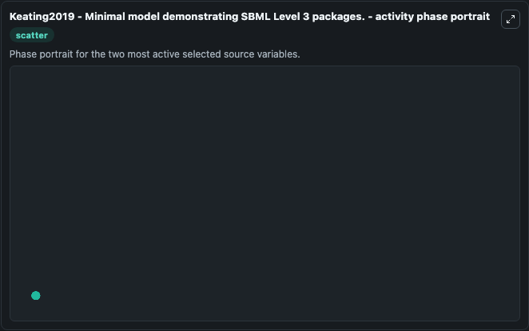

# Keating2019 Minimal Model Demonstrating Sbml Level 3 Packages

This Biosimulant lab wraps `Keating2019 Minimal Model Demonstrating Sbml Level 3 Packages` as a runnable systems biology model with a companion visualization module.
Minimal model demonstrating SBML Level 3 packages. It can be used to explore the configured dynamics and compare scenario outcomes across configurations.

## What You'll See

The lab asks: Which cell-cycle control states dominate the simulated progression? Source model: Keating2019 - Minimal model demonstrating SBML Level 3 packages.. It runs for 1.0 time units with a communication step of 0.1. The run uses the model defaults declared by the curated SBML wrapper. The generated visualizations focus on glucose, glucose-6-phosphate, ATP, ADP, P, and H+, combining trajectory, endpoint-comparison, and summary-table views from one completed dark-mode run.

In this captured run, **glucose** moved from 4.5e-05 to 4.42e-05 across 1.0 simulation windows.


### Output Visualizations



*Summary table for Keating2019 Minimal Model Demonstrating Sbml Level 3 Packages, reporting the scientific question, observed answer, dominant module, and caveat.*



*Trajectories of glucose, glucose-6-phosphate, ATP, ADP, P, and H+ across the 1.0 simulation. In this run **glucose-6-phosphate** climbed from 1e-06 to 1.78e-06 and **glucose** fell from 4.5e-05 to 4.42e-05 — the largest movements among the focused observables.*



*Largest-excursion ranking of the focused observables — the absolute movement magnitude during the run. Top 3: **glucose** = 7.83e-07, **glucose-6-phosphate** = 7.83e-07, **ATP** = 1.56e-08, with 1 more observable below.*



*Trajectories of glucose, glucose-6-phosphate, ATP, ADP, P, and H+ across the 1.0 simulation. In this run **glucose-6-phosphate** climbed from 1e-06 to 1.78e-06 and **glucose** fell from 4.5e-05 to 4.42e-05 — the largest movements among the focused observables.*



*Visualization card from the Keating2019 Minimal Model Demonstrating Sbml Level 3 Packages dark-mode run.*


## Model Context

- Core model: `models/core`
- Visualization model: `models/visualisation`
- Standard: `other`
- Upstream source: `biomodels_ebi:MODEL1904090001`
- License: `CC0`

## Inputs

| Input | Maps To | Default | Notes |
|---|---|---|---|
| Initial Glucose | `systemsbiology_sbml_keating2019_minimal_model_demonstrating_sbml_lev_model1904090001_model.initial_glucose` | | Source state initial condition exposed as a model-specific control because no explicit intervention parameter is identifiable. Maps to SBML symbol `glc`. |
| Initial Glucose 6 Phosphate | `systemsbiology_sbml_keating2019_minimal_model_demonstrating_sbml_lev_model1904090001_model.initial_glucose_6_phosphate` | | Source state initial condition exposed as a model-specific control because no explicit intervention parameter is identifiable. Maps to SBML symbol `g6p`. |
| Initial Model State ATP | `systemsbiology_sbml_keating2019_minimal_model_demonstrating_sbml_lev_model1904090001_model.initial_model_state_atp` | | Source state initial condition exposed as a model-specific control because no explicit intervention parameter is identifiable. Maps to SBML symbol `atp`. |
| Initial Model State ADP | `systemsbiology_sbml_keating2019_minimal_model_demonstrating_sbml_lev_model1904090001_model.initial_model_state_adp` | | Source state initial condition exposed as a model-specific control because no explicit intervention parameter is identifiable. Maps to SBML symbol `adp`. |
| Initial Model State P | `systemsbiology_sbml_keating2019_minimal_model_demonstrating_sbml_lev_model1904090001_model.initial_model_state_p` | | Source state initial condition exposed as a model-specific control because no explicit intervention parameter is identifiable. Maps to SBML symbol `phos`. |
| Initial Model State H | `systemsbiology_sbml_keating2019_minimal_model_demonstrating_sbml_lev_model1904090001_model.initial_model_state_h` | | Source state initial condition exposed as a model-specific control because no explicit intervention parameter is identifiable. Maps to SBML symbol `hydron`. |

## Outputs

| Output | Maps To | Role |
|---|---|---|
| `state` | `systemsbiology_sbml_keating2019_minimal_model_demonstrating_sbml_lev_model1904090001_model.state` | Available to the visualization model and downstream workflows. |
| `summary` | `systemsbiology_sbml_keating2019_minimal_model_demonstrating_sbml_lev_model1904090001_model.summary` | Available to the visualization model and downstream workflows. |
| `species_labels` | `systemsbiology_sbml_keating2019_minimal_model_demonstrating_sbml_lev_model1904090001_model.species_labels` | Available to the visualization model and downstream workflows. |
| `glucose` | `systemsbiology_sbml_keating2019_minimal_model_demonstrating_sbml_lev_model1904090001_model.glucose` | Available to the visualization model and downstream workflows. |
| `glucose_6_phosphate` | `systemsbiology_sbml_keating2019_minimal_model_demonstrating_sbml_lev_model1904090001_model.glucose_6_phosphate` | Available to the visualization model and downstream workflows. |
| `atp` | `systemsbiology_sbml_keating2019_minimal_model_demonstrating_sbml_lev_model1904090001_model.atp` | Available to the visualization model and downstream workflows. |
| `adp` | `systemsbiology_sbml_keating2019_minimal_model_demonstrating_sbml_lev_model1904090001_model.adp` | Available to the visualization model and downstream workflows. |
| `model_state_p` | `systemsbiology_sbml_keating2019_minimal_model_demonstrating_sbml_lev_model1904090001_model.model_state_p` | Available to the visualization model and downstream workflows. |
| `model_state_h` | `systemsbiology_sbml_keating2019_minimal_model_demonstrating_sbml_lev_model1904090001_model.model_state_h` | Available to the visualization model and downstream workflows. |

## Runtime

- Duration: `1.0`
- Communication step: `0.1`

## Running Locally

```bash
biosimulant labs serve
```
