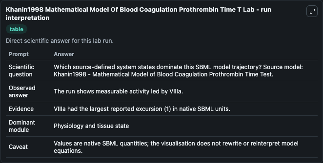
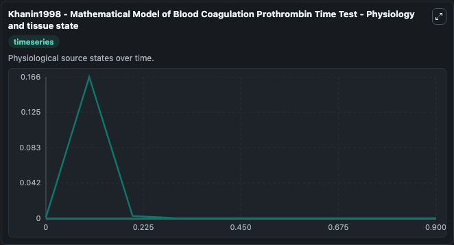
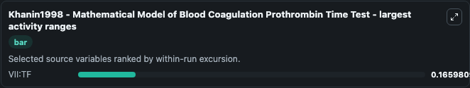
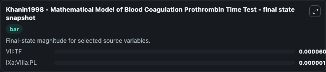

# Khanin1998 Mathematical Model Of Blood Coagulation Prothrombin Time T

This Biosimulant lab wraps `Khanin1998 Mathematical Model Of Blood Coagulation Prothrombin Time T` as a runnable systems biology model with a companion visualization module.
Blood coagulation model for prothrombin time test. It can be used to explore the configured dynamics and compare scenario outcomes across configurations.

## What You'll See

The lab asks: Which source-defined system states dominate this SBML model trajectory? Source model: Khanin1998 - Mathematical Model of Blood Coagulation Prothrombin Time Test. It runs for 1.0 time units with a communication step of 0.1. The run uses the model defaults declared by the curated SBML wrapper. The generated visualizations focus on VII:TF, IXa:VIIIa:PL, Xa:Va:PL, Xa:TFPI, Xa:ATIII, and Va:Xa, combining trajectory, endpoint-comparison, and summary-table views from one completed dark-mode run.

In this captured run, **VII:TF** moved from 0.001 to 6.03e-05 across 1.0 simulation windows.


### Output Visualizations



*Summary table for Khanin1998 Mathematical Model Of Blood Coagulation Prothrombin Time T, reporting the scientific question, observed answer, dominant module, and caveat.*



*Trajectories of VII:TF, IXa:VIIIa:PL, Xa:Va:PL, Xa:TFPI, Xa:ATIII, and Va:Xa across the 1.0 simulation. In this run **VII:TF** fell from 0.001 to 6.03e-05 — the largest movements among the focused observables.*



*Largest-excursion ranking of the focused observables — the absolute movement magnitude during the run. Top 1: **VII:TF** = 0.1660.*



*Endpoint snapshot of the focused observables — final values from the captured run. Top 2 by value: **VII:TF** = 6.03e-05, **IXa:VIIIa:PL** = 1e-06.*


## Model Context

- Core model: `models/core`
- Visualization model: `models/visualisation`
- Standard: `other`
- Upstream source: `biomodels_ebi:MODEL1806120001`
- License: `CC0`

## Inputs

| Input | Maps To | Default | Notes |
|---|---|---|---|
| Initial Vii Tf | `systemsbiology_sbml_khanin1998_mathematical_model_of_blood_coagulati_model1806120001_model.initial_vii_tf` | | Source state initial condition exposed as a model-specific control because no explicit intervention parameter is identifiable. Maps to SBML symbol `VII_TF`. |
| Initial I Xa Vii Ia Pl | `systemsbiology_sbml_khanin1998_mathematical_model_of_blood_coagulati_model1806120001_model.initial_i_xa_vii_ia_pl` | | Source state initial condition exposed as a model-specific control because no explicit intervention parameter is identifiable. Maps to SBML symbol `IXa_VIIIa_PL`. |
| Initial Xa Va Pl | `systemsbiology_sbml_khanin1998_mathematical_model_of_blood_coagulati_model1806120001_model.initial_xa_va_pl` | | Source state initial condition exposed as a model-specific control because no explicit intervention parameter is identifiable. Maps to SBML symbol `Xa_Va_PL`. |
| Initial Xa Tfpi | `systemsbiology_sbml_khanin1998_mathematical_model_of_blood_coagulati_model1806120001_model.initial_xa_tfpi` | | Source state initial condition exposed as a model-specific control because no explicit intervention parameter is identifiable. Maps to SBML symbol `Xa_TFPI`. |
| Initial Xa Atiii | `systemsbiology_sbml_khanin1998_mathematical_model_of_blood_coagulati_model1806120001_model.initial_xa_atiii` | | Source state initial condition exposed as a model-specific control because no explicit intervention parameter is identifiable. Maps to SBML symbol `Xa_ATIII`. |
| Initial Va Xa | `systemsbiology_sbml_khanin1998_mathematical_model_of_blood_coagulati_model1806120001_model.initial_va_xa` | | Source state initial condition exposed as a model-specific control because no explicit intervention parameter is identifiable. Maps to SBML symbol `Va_Xa`. |

## Outputs

| Output | Maps To | Role |
|---|---|---|
| `state` | `systemsbiology_sbml_khanin1998_mathematical_model_of_blood_coagulati_model1806120001_model.state` | Available to the visualization model and downstream workflows. |
| `summary` | `systemsbiology_sbml_khanin1998_mathematical_model_of_blood_coagulati_model1806120001_model.summary` | Available to the visualization model and downstream workflows. |
| `species_labels` | `systemsbiology_sbml_khanin1998_mathematical_model_of_blood_coagulati_model1806120001_model.species_labels` | Available to the visualization model and downstream workflows. |
| `vii_tf` | `systemsbiology_sbml_khanin1998_mathematical_model_of_blood_coagulati_model1806120001_model.vii_tf` | Available to the visualization model and downstream workflows. |
| `i_xa_vii_ia_pl` | `systemsbiology_sbml_khanin1998_mathematical_model_of_blood_coagulati_model1806120001_model.i_xa_vii_ia_pl` | Available to the visualization model and downstream workflows. |
| `xa_va_pl` | `systemsbiology_sbml_khanin1998_mathematical_model_of_blood_coagulati_model1806120001_model.xa_va_pl` | Available to the visualization model and downstream workflows. |
| `xa_tfpi` | `systemsbiology_sbml_khanin1998_mathematical_model_of_blood_coagulati_model1806120001_model.xa_tfpi` | Available to the visualization model and downstream workflows. |
| `xa_atiii` | `systemsbiology_sbml_khanin1998_mathematical_model_of_blood_coagulati_model1806120001_model.xa_atiii` | Available to the visualization model and downstream workflows. |
| `va_xa` | `systemsbiology_sbml_khanin1998_mathematical_model_of_blood_coagulati_model1806120001_model.va_xa` | Available to the visualization model and downstream workflows. |

## Runtime

- Duration: `1.0`
- Communication step: `0.1`

## Running Locally

```bash
biosimulant labs serve
```
