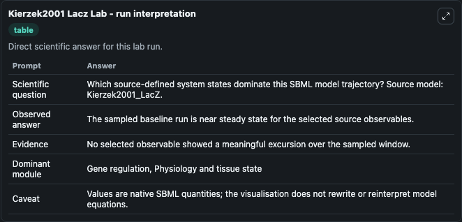
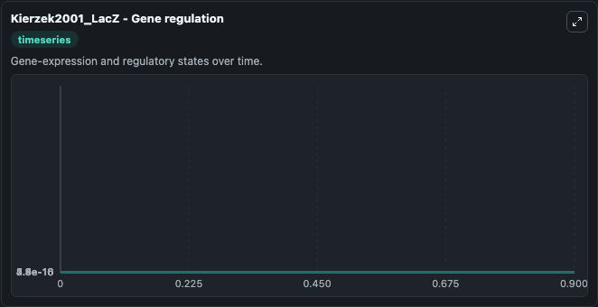
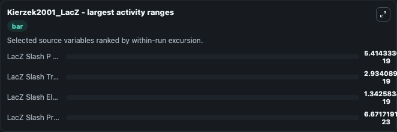
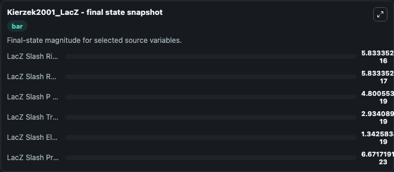
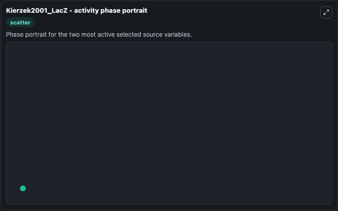

# Kierzek2001 Lacz

This Biosimulant lab wraps `Kierzek2001 Lacz` as a runnable systems biology model with a companion visualization module.
An approximation to the referenced publication. It can be used to explore the configured dynamics and compare scenario outcomes across configurations.

## What You'll See

The lab asks: Which source-defined system states dominate this SBML model trajectory? Source model: Kierzek2001_LacZ. It runs for 1.0 time units with a communication step of 0.1. The run uses the model defaults declared by the curated SBML wrapper. The generated visualizations focus on LacZ Slash RNAP, LacZ Slash TrRNAP, LacZ Slash Protein, LacZ Slash P RNAP, LacZ Slash ElRNAP, and LacZ Slash Ribosome, combining trajectory, endpoint-comparison, and summary-table views from one completed dark-mode run.

In this captured run, **LacZ Slash P RNAP** moved from 0 to 4.8e-19 across 1.0 simulation windows.


### Output Visualizations



*Summary table for Kierzek2001 Lacz, reporting the scientific question, observed answer, dominant module, and caveat.*



*Trajectories of LacZ Slash P RNAP, LacZ Slash TrRNAP, LacZ Slash ElRNAP, LacZ Slash Protein, LacZ Slash RNAP, and LacZ Slash Ribosome across the 1.0 simulation. In this run **LacZ Slash P RNAP** climbed from 0 to 4.8e-19 — the largest movements among the focused observables.*



*Largest-excursion ranking of the focused observables — the absolute movement magnitude during the run. Top 3: **LacZ Slash P RNAP** = 5.41e-19, **LacZ Slash TrRNAP** = 2.93e-19, **LacZ Slash ElRNAP** = 1.34e-19, with 1 more observable below.*



*Endpoint snapshot of the focused observables — final values from the captured run. Top 3 by value: **LacZ Slash Ribosome** = 5.83e-16, **LacZ Slash RNAP** = 5.83e-17, **LacZ Slash P RNAP** = 4.8e-19, with 3 more observables below.*



*Visualization card from the Kierzek2001 Lacz dark-mode run.*


## Model Context

- Core model: `models/core`
- Visualization model: `models/visualisation`
- Standard: `other`
- Upstream source: `biomodels_ebi:MODEL4821294342`
- License: `CC0`

## Inputs

| Input | Maps To | Default | Notes |
|---|---|---|---|
| Initial Lac Z Slash Rnap | `systemsbiology_sbml_kierzek2001_lacz_model4821294342_model.initial_lac_z_slash_rnap` | | Source state initial condition exposed as a model-specific control because no explicit intervention parameter is identifiable. Maps to SBML symbol `LacZ_slash_RNAP`. |
| Initial Lac Z Slash Tr Rnap | `systemsbiology_sbml_kierzek2001_lacz_model4821294342_model.initial_lac_z_slash_tr_rnap` | | Source state initial condition exposed as a model-specific control because no explicit intervention parameter is identifiable. Maps to SBML symbol `LacZ_slash_TrRNAP`. |
| Initial Lac Z Slash Protein | `systemsbiology_sbml_kierzek2001_lacz_model4821294342_model.initial_lac_z_slash_protein` | | Source state initial condition exposed as a model-specific control because no explicit intervention parameter is identifiable. Maps to SBML symbol `LacZ_slash_Protein`. |
| Initial Lac Z Slash P Rnap | `systemsbiology_sbml_kierzek2001_lacz_model4821294342_model.initial_lac_z_slash_p_rnap` | | Source state initial condition exposed as a model-specific control because no explicit intervention parameter is identifiable. Maps to SBML symbol `LacZ_slash_P_RNAP`. |
| Initial Lac Z Slash El Rnap | `systemsbiology_sbml_kierzek2001_lacz_model4821294342_model.initial_lac_z_slash_el_rnap` | | Source state initial condition exposed as a model-specific control because no explicit intervention parameter is identifiable. Maps to SBML symbol `LacZ_slash_ElRNAP`. |
| Initial Lac Z Slash Ribosome | `systemsbiology_sbml_kierzek2001_lacz_model4821294342_model.initial_lac_z_slash_ribosome` | | Source state initial condition exposed as a model-specific control because no explicit intervention parameter is identifiable. Maps to SBML symbol `LacZ_slash_Ribosome`. |

## Outputs

| Output | Maps To | Role |
|---|---|---|
| `state` | `systemsbiology_sbml_kierzek2001_lacz_model4821294342_model.state` | Available to the visualization model and downstream workflows. |
| `summary` | `systemsbiology_sbml_kierzek2001_lacz_model4821294342_model.summary` | Available to the visualization model and downstream workflows. |
| `species_labels` | `systemsbiology_sbml_kierzek2001_lacz_model4821294342_model.species_labels` | Available to the visualization model and downstream workflows. |
| `lac_z_slash_rnap` | `systemsbiology_sbml_kierzek2001_lacz_model4821294342_model.lac_z_slash_rnap` | Available to the visualization model and downstream workflows. |
| `lac_z_slash_tr_rnap` | `systemsbiology_sbml_kierzek2001_lacz_model4821294342_model.lac_z_slash_tr_rnap` | Available to the visualization model and downstream workflows. |
| `lac_z_slash_protein` | `systemsbiology_sbml_kierzek2001_lacz_model4821294342_model.lac_z_slash_protein` | Available to the visualization model and downstream workflows. |
| `lac_z_slash_p_rnap` | `systemsbiology_sbml_kierzek2001_lacz_model4821294342_model.lac_z_slash_p_rnap` | Available to the visualization model and downstream workflows. |
| `lac_z_slash_el_rnap` | `systemsbiology_sbml_kierzek2001_lacz_model4821294342_model.lac_z_slash_el_rnap` | Available to the visualization model and downstream workflows. |
| `lac_z_slash_ribosome` | `systemsbiology_sbml_kierzek2001_lacz_model4821294342_model.lac_z_slash_ribosome` | Available to the visualization model and downstream workflows. |

## Runtime

- Duration: `1.0`
- Communication step: `0.1`

## Running Locally

```bash
biosimulant labs serve
```
