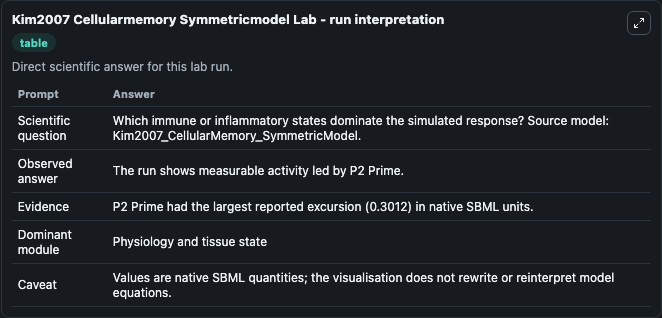
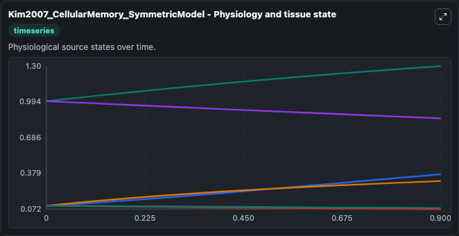
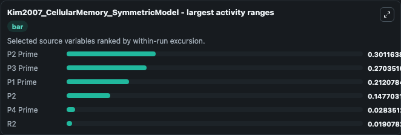
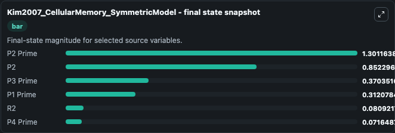
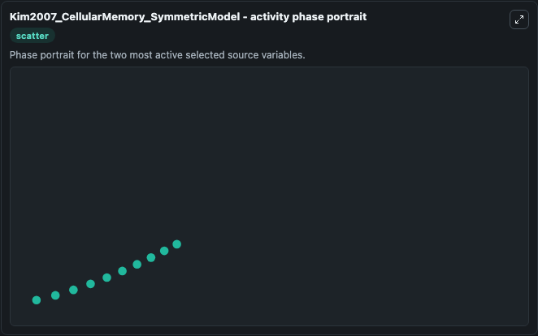

# Kim2007 Cellularmemory Symmetricmodel

This Biosimulant lab wraps `Kim2007 Cellularmemory Symmetricmodel` as a runnable systems biology model with a companion visualization module.
This model is from the article: Interlinked mutual inhibitory positive feedbacks induce robust cellular memory effects. It can be used to explore the configured dynamics and compare scenario outcomes across configurations.

## What You'll See

The lab asks: Which immune or inflammatory states dominate the simulated response? Source model: Kim2007_CellularMemory_SymmetricModel. It runs for 1.0 time units with a communication step of 0.1. The run uses the model defaults declared by the curated SBML wrapper. The generated visualizations focus on P2 Prime, P2, R2, P4 Prime, P3 Prime, and P1 Prime, combining trajectory, endpoint-comparison, and summary-table views from one completed dark-mode run.

In this captured run, **P2 Prime** moved from 1.000 to 1.301 across 1.0 simulation windows.


### Output Visualizations



*Summary table for Kim2007 Cellularmemory Symmetricmodel, reporting the scientific question, observed answer, dominant module, and caveat.*



*Trajectories of P2 Prime, P3 Prime, P1 Prime, P2, P4 Prime, and R2 across the 1.0 simulation. In this run **P2 Prime** climbed from 1.000 to 1.301 and **P2** fell from 1.000 to 0.8523 — the largest movements among the focused observables.*



*Largest-excursion ranking of the focused observables — the absolute movement magnitude during the run. Top 3: **P2 Prime** = 0.3012, **P3 Prime** = 0.2704, **P1 Prime** = 0.2121, with 3 more observables below.*



*Endpoint snapshot of the focused observables — final values from the captured run. Top 3 by value: **P2 Prime** = 1.301, **P2** = 0.8523, **P3 Prime** = 0.3704, with 3 more observables below.*



*Visualization card from the Kim2007 Cellularmemory Symmetricmodel dark-mode run.*


## Model Context

- Core model: `models/core`
- Visualization model: `models/visualisation`
- Standard: `other`
- Upstream source: `biomodels_ebi:BIOMD0000000180`
- License: `CC0`

## Inputs

| Input | Maps To | Default | Notes |
|---|---|---|---|
| Initial P2 Prime | `systemsbiology_sbml_kim2007_cellularmemory_symmetricmodel_biomd0000000180_model.initial_p2_prime` | | Source state initial condition exposed as a model-specific control because no explicit intervention parameter is identifiable. Maps to SBML symbol `P2_prime`. |
| Initial Model State P2 | `systemsbiology_sbml_kim2007_cellularmemory_symmetricmodel_biomd0000000180_model.initial_model_state_p2` | | Source state initial condition exposed as a model-specific control because no explicit intervention parameter is identifiable. Maps to SBML symbol `P2`. |
| Initial Model State R2 | `systemsbiology_sbml_kim2007_cellularmemory_symmetricmodel_biomd0000000180_model.initial_model_state_r2` | | Source state initial condition exposed as a model-specific control because no explicit intervention parameter is identifiable. Maps to SBML symbol `R2`. |
| Initial P4 Prime | `systemsbiology_sbml_kim2007_cellularmemory_symmetricmodel_biomd0000000180_model.initial_p4_prime` | | Source state initial condition exposed as a model-specific control because no explicit intervention parameter is identifiable. Maps to SBML symbol `P4_prime`. |
| Initial P3 Prime | `systemsbiology_sbml_kim2007_cellularmemory_symmetricmodel_biomd0000000180_model.initial_p3_prime` | | Source state initial condition exposed as a model-specific control because no explicit intervention parameter is identifiable. Maps to SBML symbol `P3_prime`. |
| Initial P1 Prime | `systemsbiology_sbml_kim2007_cellularmemory_symmetricmodel_biomd0000000180_model.initial_p1_prime` | | Source state initial condition exposed as a model-specific control because no explicit intervention parameter is identifiable. Maps to SBML symbol `P1_prime`. |

## Outputs

| Output | Maps To | Role |
|---|---|---|
| `state` | `systemsbiology_sbml_kim2007_cellularmemory_symmetricmodel_biomd0000000180_model.state` | Available to the visualization model and downstream workflows. |
| `summary` | `systemsbiology_sbml_kim2007_cellularmemory_symmetricmodel_biomd0000000180_model.summary` | Available to the visualization model and downstream workflows. |
| `species_labels` | `systemsbiology_sbml_kim2007_cellularmemory_symmetricmodel_biomd0000000180_model.species_labels` | Available to the visualization model and downstream workflows. |
| `p2_prime` | `systemsbiology_sbml_kim2007_cellularmemory_symmetricmodel_biomd0000000180_model.p2_prime` | Available to the visualization model and downstream workflows. |
| `model_state_p2` | `systemsbiology_sbml_kim2007_cellularmemory_symmetricmodel_biomd0000000180_model.model_state_p2` | Available to the visualization model and downstream workflows. |
| `model_state_r2` | `systemsbiology_sbml_kim2007_cellularmemory_symmetricmodel_biomd0000000180_model.model_state_r2` | Available to the visualization model and downstream workflows. |
| `p4_prime` | `systemsbiology_sbml_kim2007_cellularmemory_symmetricmodel_biomd0000000180_model.p4_prime` | Available to the visualization model and downstream workflows. |
| `p3_prime` | `systemsbiology_sbml_kim2007_cellularmemory_symmetricmodel_biomd0000000180_model.p3_prime` | Available to the visualization model and downstream workflows. |
| `p1_prime` | `systemsbiology_sbml_kim2007_cellularmemory_symmetricmodel_biomd0000000180_model.p1_prime` | Available to the visualization model and downstream workflows. |

## Runtime

- Duration: `1.0`
- Communication step: `0.1`

## Running Locally

```bash
biosimulant labs serve
```
