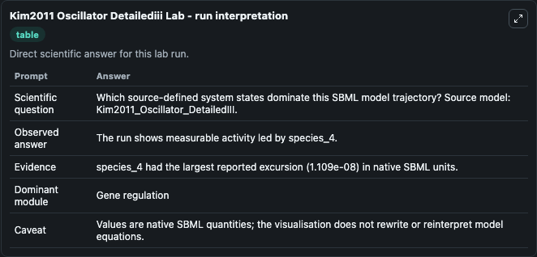
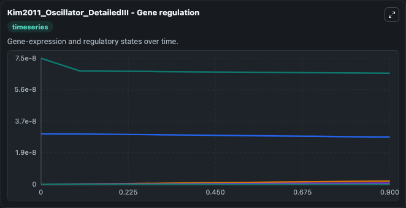
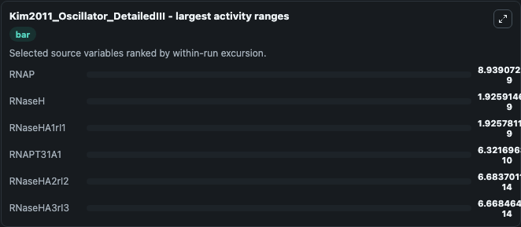
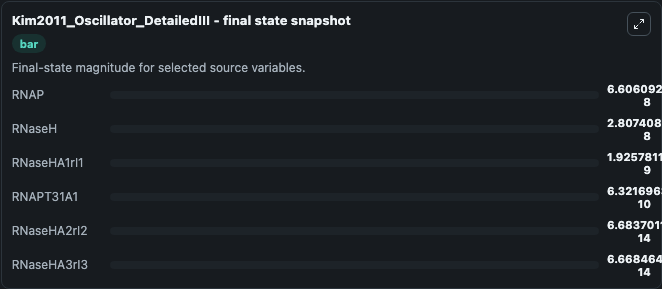
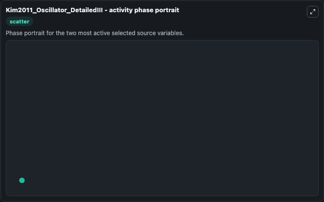

# Kim2011 Oscillator Detailediii

This Biosimulant lab wraps `Kim2011 Oscillator Detailediii` as a runnable systems biology model with a companion visualization module.
This model originates from BioModels Database: A Database of Annotated Published Models (http://www.ebi.ac.uk/biomodels/). It can be used to explore the configured dynamics and compare scenario outcomes across configurations.

## What You'll See

The lab asks: Which source-defined system states dominate this SBML model trajectory? Source model: Kim2011_Oscillator_DetailedIII. It runs for 1.0 time units with a communication step of 0.1. The run uses the model defaults declared by the curated SBML wrapper. The generated visualizations focus on RNAP, RNaseH, RNaseHA3rI3, RNaseHA2rI2, RNaseHA1rI1, and RNAPT31A1, combining trajectory, endpoint-comparison, and summary-table views from one completed dark-mode run.

In this captured run, **RNAP** moved from 7.5e-08 to 6.61e-08 across 1.0 simulation windows.


### Output Visualizations



*Summary table for Kim2011 Oscillator Detailediii, reporting the scientific question, observed answer, dominant module, and caveat.*



*Trajectories of RNAP, RNaseH, RNaseHA1rI1, RNAPT31A1, RNaseHA2rI2, and RNaseHA3rI3 across the 1.0 simulation. In this run **RNaseHA1rI1** climbed from 0 to 1.93e-09 and **RNAP** fell from 7.5e-08 to 6.61e-08 — the largest movements among the focused observables.*



*Largest-excursion ranking of the focused observables — the absolute movement magnitude during the run. Top 3: **RNAP** = 8.94e-09, **RNaseH** = 1.93e-09, **RNaseHA1rI1** = 1.93e-09, with 3 more observables below.*



*Endpoint snapshot of the focused observables — final values from the captured run. Top 3 by value: **RNAP** = 6.61e-08, **RNaseH** = 2.81e-08, **RNaseHA1rI1** = 1.93e-09, with 3 more observables below.*



*Visualization card from the Kim2011 Oscillator Detailediii dark-mode run.*


## Model Context

- Core model: `models/core`
- Visualization model: `models/visualisation`
- Standard: `other`
- Upstream source: `biomodels_ebi:MODEL1012090004`
- License: `CC0`

## Inputs

| Input | Maps To | Default | Notes |
|---|---|---|---|
| Initial Rnap | `systemsbiology_sbml_kim2011_oscillator_detailediii_model1012090004_model.initial_rnap` | | Source state initial condition exposed as a model-specific control because no explicit intervention parameter is identifiable. Maps to SBML symbol `species_13`. |
| Initial R Nase H | `systemsbiology_sbml_kim2011_oscillator_detailediii_model1012090004_model.initial_r_nase_h` | | Source state initial condition exposed as a model-specific control because no explicit intervention parameter is identifiable. Maps to SBML symbol `species_14`. |
| Initial R Nase Ha3r I3 | `systemsbiology_sbml_kim2011_oscillator_detailediii_model1012090004_model.initial_r_nase_ha3r_i3` | | Source state initial condition exposed as a model-specific control because no explicit intervention parameter is identifiable. Maps to SBML symbol `species_26`. |
| Initial R Nase Ha2r I2 | `systemsbiology_sbml_kim2011_oscillator_detailediii_model1012090004_model.initial_r_nase_ha2r_i2` | | Source state initial condition exposed as a model-specific control because no explicit intervention parameter is identifiable. Maps to SBML symbol `species_20`. |
| Initial R Nase Ha1r I1 | `systemsbiology_sbml_kim2011_oscillator_detailediii_model1012090004_model.initial_r_nase_ha1r_i1` | | Source state initial condition exposed as a model-specific control because no explicit intervention parameter is identifiable. Maps to SBML symbol `species_19`. |
| Initial Rnapt31 A1 | `systemsbiology_sbml_kim2011_oscillator_detailediii_model1012090004_model.initial_rnapt31_a1` | | Source state initial condition exposed as a model-specific control because no explicit intervention parameter is identifiable. Maps to SBML symbol `species_23`. |

## Outputs

| Output | Maps To | Role |
|---|---|---|
| `state` | `systemsbiology_sbml_kim2011_oscillator_detailediii_model1012090004_model.state` | Available to the visualization model and downstream workflows. |
| `summary` | `systemsbiology_sbml_kim2011_oscillator_detailediii_model1012090004_model.summary` | Available to the visualization model and downstream workflows. |
| `species_labels` | `systemsbiology_sbml_kim2011_oscillator_detailediii_model1012090004_model.species_labels` | Available to the visualization model and downstream workflows. |
| `rnap` | `systemsbiology_sbml_kim2011_oscillator_detailediii_model1012090004_model.rnap` | Available to the visualization model and downstream workflows. |
| `r_nase_h` | `systemsbiology_sbml_kim2011_oscillator_detailediii_model1012090004_model.r_nase_h` | Available to the visualization model and downstream workflows. |
| `r_nase_ha3r_i3` | `systemsbiology_sbml_kim2011_oscillator_detailediii_model1012090004_model.r_nase_ha3r_i3` | Available to the visualization model and downstream workflows. |
| `r_nase_ha2r_i2` | `systemsbiology_sbml_kim2011_oscillator_detailediii_model1012090004_model.r_nase_ha2r_i2` | Available to the visualization model and downstream workflows. |
| `r_nase_ha1r_i1` | `systemsbiology_sbml_kim2011_oscillator_detailediii_model1012090004_model.r_nase_ha1r_i1` | Available to the visualization model and downstream workflows. |
| `rnapt31_a1` | `systemsbiology_sbml_kim2011_oscillator_detailediii_model1012090004_model.rnapt31_a1` | Available to the visualization model and downstream workflows. |

## Runtime

- Duration: `1.0`
- Communication step: `0.1`

## Running Locally

```bash
biosimulant labs serve
```
