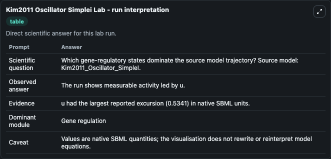
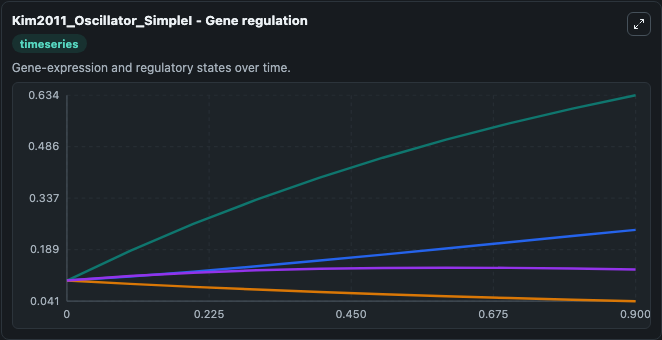
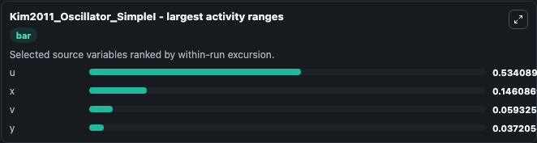
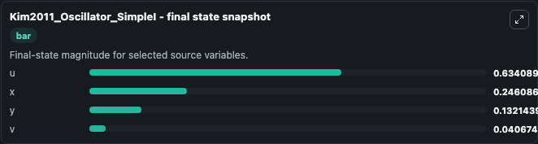
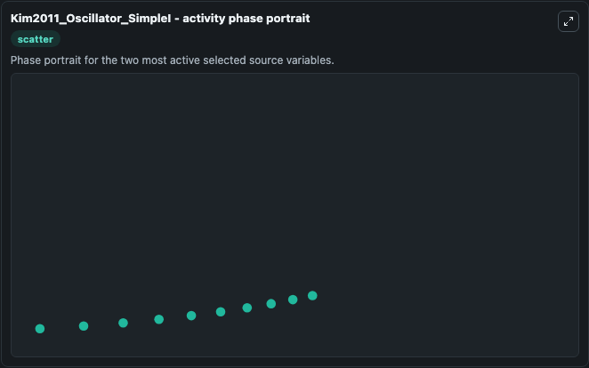

# Kim2011 Oscillator Simplei

This Biosimulant lab wraps `Kim2011 Oscillator Simplei` as a runnable systems biology model with a companion visualization module.
This a model from the article: Synthetic in vitro transcriptional oscillators. It can be used to explore the configured dynamics and compare scenario outcomes across configurations.

## What You'll See

The lab asks: Which gene-regulatory states dominate the source model trajectory? Source model: Kim2011_Oscillator_SimpleI. It runs for 1.0 time units with a communication step of 0.1. The run uses the model defaults declared by the curated SBML wrapper. The generated visualizations focus on y, x, v, and u, combining trajectory, endpoint-comparison, and summary-table views from one completed dark-mode run.

In this captured run, **u** moved from 0.1000 to 0.6341 across 1.0 simulation windows.


### Output Visualizations



*Summary table for Kim2011 Oscillator Simplei, reporting the scientific question, observed answer, dominant module, and caveat.*



*Trajectories of u, x, v, and y across the 1.0 simulation. In this run **u** climbed from 0.1000 to 0.6341 and **v** fell from 0.1000 to 0.0407 — the largest movements among the focused observables.*



*Largest-excursion ranking of the focused observables — the absolute movement magnitude during the run. Top 3: **u** = 0.5341, **x** = 0.1461, **v** = 0.0593, with 1 more observable below.*



*Endpoint snapshot of the focused observables — final values from the captured run. Top 3 by value: **u** = 0.6341, **x** = 0.2461, **y** = 0.1321, with 1 more observable below.*



*Visualization card from the Kim2011 Oscillator Simplei dark-mode run.*


## Model Context

- Core model: `models/core`
- Visualization model: `models/visualisation`
- Standard: `other`
- Upstream source: `biomodels_ebi:BIOMD0000000322`
- License: `CC0`

## Inputs

| Input | Maps To | Default | Notes |
|---|---|---|---|
| Initial Model State Y | `systemsbiology_sbml_kim2011_oscillator_simplei_biomd0000000322_model.initial_model_state_y` | | Source state initial condition exposed as a model-specific control because no explicit intervention parameter is identifiable. Maps to SBML symbol `species_2`. |
| Initial Model State X | `systemsbiology_sbml_kim2011_oscillator_simplei_biomd0000000322_model.initial_model_state_x` | | Source state initial condition exposed as a model-specific control because no explicit intervention parameter is identifiable. Maps to SBML symbol `species_1`. |
| Initial Model State V | `systemsbiology_sbml_kim2011_oscillator_simplei_biomd0000000322_model.initial_model_state_v` | | Source state initial condition exposed as a model-specific control because no explicit intervention parameter is identifiable. Maps to SBML symbol `species_4`. |
| Initial Model State U | `systemsbiology_sbml_kim2011_oscillator_simplei_biomd0000000322_model.initial_model_state_u` | | Source state initial condition exposed as a model-specific control because no explicit intervention parameter is identifiable. Maps to SBML symbol `species_3`. |

## Outputs

| Output | Maps To | Role |
|---|---|---|
| `state` | `systemsbiology_sbml_kim2011_oscillator_simplei_biomd0000000322_model.state` | Available to the visualization model and downstream workflows. |
| `summary` | `systemsbiology_sbml_kim2011_oscillator_simplei_biomd0000000322_model.summary` | Available to the visualization model and downstream workflows. |
| `species_labels` | `systemsbiology_sbml_kim2011_oscillator_simplei_biomd0000000322_model.species_labels` | Available to the visualization model and downstream workflows. |
| `model_state_y` | `systemsbiology_sbml_kim2011_oscillator_simplei_biomd0000000322_model.model_state_y` | Available to the visualization model and downstream workflows. |
| `model_state_x` | `systemsbiology_sbml_kim2011_oscillator_simplei_biomd0000000322_model.model_state_x` | Available to the visualization model and downstream workflows. |
| `model_state_v` | `systemsbiology_sbml_kim2011_oscillator_simplei_biomd0000000322_model.model_state_v` | Available to the visualization model and downstream workflows. |
| `model_state_u` | `systemsbiology_sbml_kim2011_oscillator_simplei_biomd0000000322_model.model_state_u` | Available to the visualization model and downstream workflows. |

## Runtime

- Duration: `1.0`
- Communication step: `0.1`

## Running Locally

```bash
biosimulant labs serve
```
