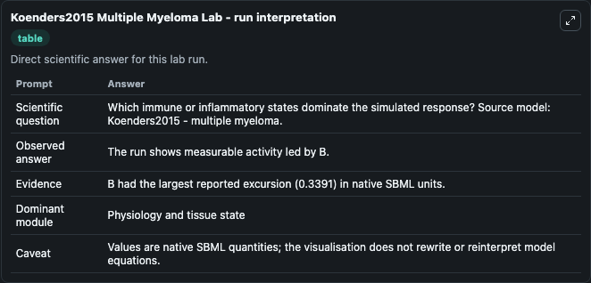
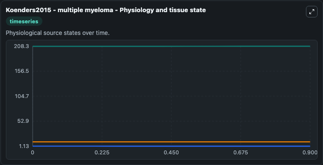
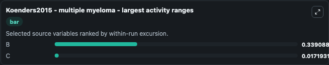
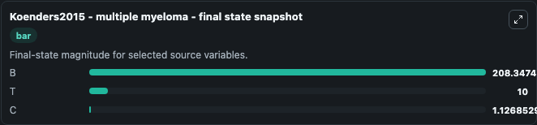
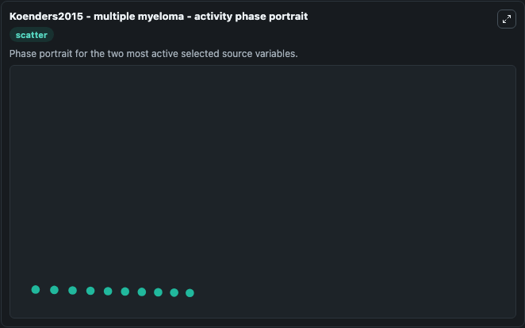

# Koenders2015 Multiple Myeloma

This Biosimulant lab wraps `Koenders2015 Multiple Myeloma` as a runnable systems biology model with a companion visualization module.
The paper describes a model of multiple myeloma. It can be used to explore the configured dynamics and compare scenario outcomes across configurations.

## What You'll See

The lab asks: Which immune or inflammatory states dominate the simulated response? Source model: Koenders2015 - multiple myeloma. It runs for 1.0 time units with a communication step of 0.1. The run uses the model defaults declared by the curated SBML wrapper. The generated visualizations focus on B, T, and C, combining trajectory, endpoint-comparison, and summary-table views from one completed dark-mode run.

In this captured run, **B** moved from 208.0 to 208.3 across 1.0 simulation windows.


### Output Visualizations



*Summary table for Koenders2015 Multiple Myeloma, reporting the scientific question, observed answer, dominant module, and caveat.*



*Trajectories of B, C, and T across the 1.0 simulation. In this run **B** climbed from 208.0 to 208.3 and **C** fell from 1.144 to 1.127 — the largest movements among the focused observables.*



*Largest-excursion ranking of the focused observables — the absolute movement magnitude during the run. Top 2: **B** = 0.3391, **C** = 0.0172.*



*Endpoint snapshot of the focused observables — final values from the captured run. Top 3 by value: **B** = 208.3, **T** = 10.000, **C** = 1.127.*



*Visualization card from the Koenders2015 Multiple Myeloma dark-mode run.*


## Model Context

- Core model: `models/core`
- Visualization model: `models/visualisation`
- Standard: `other`
- Upstream source: `biomodels_ebi:BIOMD0000000804`
- License: `CC0`

## Inputs

| Input | Maps To | Default | Notes |
|---|---|---|---|
| Initial Model State B | `systemsbiology_sbml_koenders2015_multiple_myeloma_biomd0000000804_model.initial_model_state_b` | | Source state initial condition exposed as a model-specific control because no explicit intervention parameter is identifiable. Maps to SBML symbol `B`. |
| Initial Model State T | `systemsbiology_sbml_koenders2015_multiple_myeloma_biomd0000000804_model.initial_model_state_t` | | Source state initial condition exposed as a model-specific control because no explicit intervention parameter is identifiable. Maps to SBML symbol `T`. |
| Initial Model State C | `systemsbiology_sbml_koenders2015_multiple_myeloma_biomd0000000804_model.initial_model_state_c` | | Source state initial condition exposed as a model-specific control because no explicit intervention parameter is identifiable. Maps to SBML symbol `C`. |

## Outputs

| Output | Maps To | Role |
|---|---|---|
| `state` | `systemsbiology_sbml_koenders2015_multiple_myeloma_biomd0000000804_model.state` | Available to the visualization model and downstream workflows. |
| `summary` | `systemsbiology_sbml_koenders2015_multiple_myeloma_biomd0000000804_model.summary` | Available to the visualization model and downstream workflows. |
| `species_labels` | `systemsbiology_sbml_koenders2015_multiple_myeloma_biomd0000000804_model.species_labels` | Available to the visualization model and downstream workflows. |
| `model_state_b` | `systemsbiology_sbml_koenders2015_multiple_myeloma_biomd0000000804_model.model_state_b` | Available to the visualization model and downstream workflows. |
| `model_state_t` | `systemsbiology_sbml_koenders2015_multiple_myeloma_biomd0000000804_model.model_state_t` | Available to the visualization model and downstream workflows. |
| `model_state_c` | `systemsbiology_sbml_koenders2015_multiple_myeloma_biomd0000000804_model.model_state_c` | Available to the visualization model and downstream workflows. |

## Runtime

- Duration: `1.0`
- Communication step: `0.1`

## Running Locally

```bash
biosimulant labs serve
```
