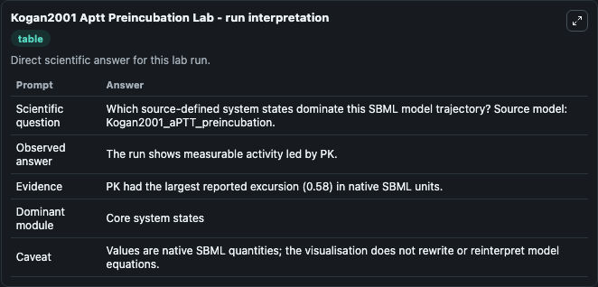
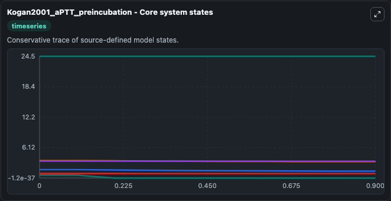
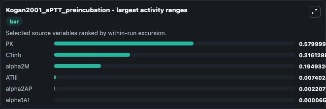
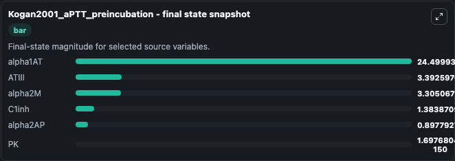
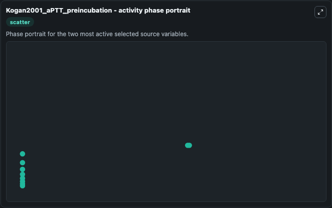

# Kogan2001 Aptt Preincubation

This Biosimulant lab wraps `Kogan2001 Aptt Preincubation` as a runnable systems biology model with a companion visualization module.
This model originates from BioModels Database: A Database of Annotated Published Models (http://www.ebi.ac.uk/biomodels/). It can be used to explore the configured dynamics and compare scenario outcomes across configurations.

## What You'll See

The lab asks: Which source-defined system states dominate this SBML model trajectory? Source model: Kogan2001_aPTT_preincubation. It runs for 1.0 time units with a communication step of 0.1. The run uses the model defaults declared by the curated SBML wrapper. The generated visualizations focus on alpha1AT, alpha2M, ATIII, C1inh, alpha2AP, and PK, combining trajectory, endpoint-comparison, and summary-table views from one completed dark-mode run.

In this captured run, **PK** moved from 0.5800 to -1.7e-150 across 1.0 simulation windows.


### Output Visualizations



*Summary table for Kogan2001 Aptt Preincubation, reporting the scientific question, observed answer, dominant module, and caveat.*



*Trajectories of PK, C1inh, alpha2M, ATIII, alpha2AP, and alpha1AT across the 1.0 simulation. In this run **PK** fell from 0.5800 to -1.7e-150 — the largest movements among the focused observables.*



*Largest-excursion ranking of the focused observables — the absolute movement magnitude during the run. Top 3: **PK** = 0.5800, **C1inh** = 0.3161, **alpha2M** = 0.1949, with 3 more observables below.*



*Endpoint snapshot of the focused observables — final values from the captured run. Top 3 by value: **alpha1AT** = 24.500, **ATIII** = 3.393, **alpha2M** = 3.305, with 3 more observables below.*



*Visualization card from the Kogan2001 Aptt Preincubation dark-mode run.*


## Model Context

- Core model: `models/core`
- Visualization model: `models/visualisation`
- Standard: `other`
- Upstream source: `biomodels_ebi:MODEL1109160000`
- License: `CC0`

## Inputs

| Input | Maps To | Default | Notes |
|---|---|---|---|
| Initial Alpha1 At | `systemsbiology_sbml_kogan2001_aptt_preincubation_model1109160000_model.initial_alpha1_at` | | Source state initial condition exposed as a model-specific control because no explicit intervention parameter is identifiable. Maps to SBML symbol `species_4`. |
| Initial Alpha2 M | `systemsbiology_sbml_kogan2001_aptt_preincubation_model1109160000_model.initial_alpha2_m` | | Source state initial condition exposed as a model-specific control because no explicit intervention parameter is identifiable. Maps to SBML symbol `species_5`. |
| Initial Atiii | `systemsbiology_sbml_kogan2001_aptt_preincubation_model1109160000_model.initial_atiii` | | Source state initial condition exposed as a model-specific control because no explicit intervention parameter is identifiable. Maps to SBML symbol `species_3`. |
| Initial C1inh | `systemsbiology_sbml_kogan2001_aptt_preincubation_model1109160000_model.initial_c1inh` | | Source state initial condition exposed as a model-specific control because no explicit intervention parameter is identifiable. Maps to SBML symbol `species_6`. |
| Initial Alpha2 Ap | `systemsbiology_sbml_kogan2001_aptt_preincubation_model1109160000_model.initial_alpha2_ap` | | Source state initial condition exposed as a model-specific control because no explicit intervention parameter is identifiable. Maps to SBML symbol `species_11`. |
| Initial Model State Pk | `systemsbiology_sbml_kogan2001_aptt_preincubation_model1109160000_model.initial_model_state_pk` | | Source state initial condition exposed as a model-specific control because no explicit intervention parameter is identifiable. Maps to SBML symbol `species_29`. |

## Outputs

| Output | Maps To | Role |
|---|---|---|
| `state` | `systemsbiology_sbml_kogan2001_aptt_preincubation_model1109160000_model.state` | Available to the visualization model and downstream workflows. |
| `summary` | `systemsbiology_sbml_kogan2001_aptt_preincubation_model1109160000_model.summary` | Available to the visualization model and downstream workflows. |
| `species_labels` | `systemsbiology_sbml_kogan2001_aptt_preincubation_model1109160000_model.species_labels` | Available to the visualization model and downstream workflows. |
| `alpha1_at` | `systemsbiology_sbml_kogan2001_aptt_preincubation_model1109160000_model.alpha1_at` | Available to the visualization model and downstream workflows. |
| `alpha2_m` | `systemsbiology_sbml_kogan2001_aptt_preincubation_model1109160000_model.alpha2_m` | Available to the visualization model and downstream workflows. |
| `atiii` | `systemsbiology_sbml_kogan2001_aptt_preincubation_model1109160000_model.atiii` | Available to the visualization model and downstream workflows. |
| `c1inh` | `systemsbiology_sbml_kogan2001_aptt_preincubation_model1109160000_model.c1inh` | Available to the visualization model and downstream workflows. |
| `alpha2_ap` | `systemsbiology_sbml_kogan2001_aptt_preincubation_model1109160000_model.alpha2_ap` | Available to the visualization model and downstream workflows. |
| `model_state_pk` | `systemsbiology_sbml_kogan2001_aptt_preincubation_model1109160000_model.model_state_pk` | Available to the visualization model and downstream workflows. |

## Runtime

- Duration: `1.0`
- Communication step: `0.1`

## Running Locally

```bash
biosimulant labs serve
```
