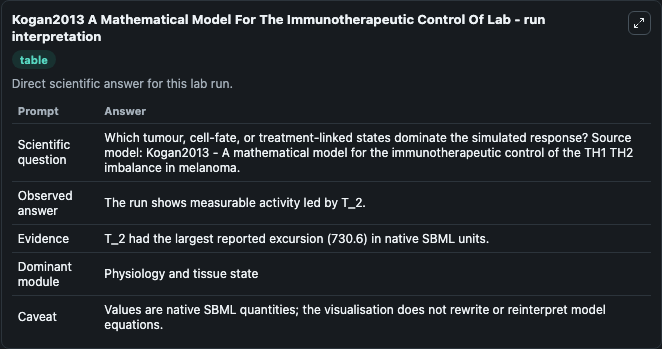
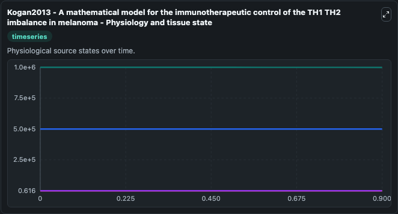
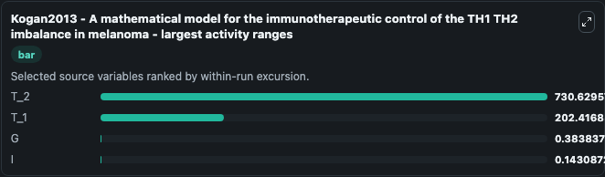
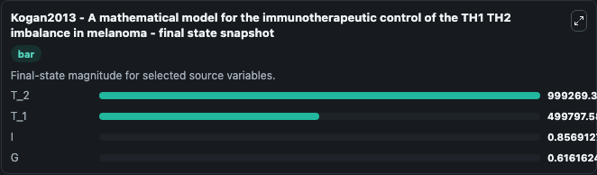
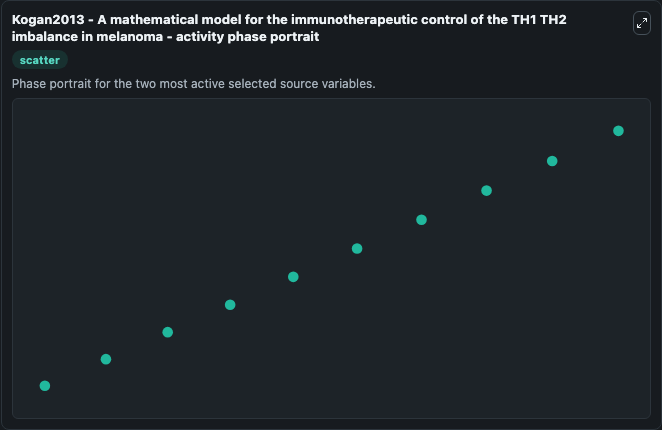

# Kogan2013 A Mathematical Model For The Immunotherapeutic Control Of

This Biosimulant lab wraps `Kogan2013 A Mathematical Model For The Immunotherapeutic Control Of` as a runnable systems biology model with a companion visualization module.
This is a mathematical model describing the imbalance between T helper (Th1/Th2) cell types in melanome patients, together with its regulation via IL-12 treatment. It can be used to explore the configured dynamics and compare scenario outcomes across configurations.

## What You'll See

The lab asks: Which tumour, cell-fate, or treatment-linked states dominate the simulated response? Source model: Kogan2013 - A mathematical model for the immunotherapeutic control of the TH1 TH2 imbalance in melanoma. It runs for 1.0 time units with a communication step of 0.1. The run uses the model defaults declared by the curated SBML wrapper. The generated visualizations focus on T_2, T_1, I, and G, combining trajectory, endpoint-comparison, and summary-table views from one completed dark-mode run.

In this captured run, **T_2** moved from 1e+06 to 9.99e+05 across 1.0 simulation windows.


### Output Visualizations



*Summary table for Kogan2013 A Mathematical Model For The Immunotherapeutic Control Of, reporting the scientific question, observed answer, dominant module, and caveat.*



*Trajectories of T_2, T_1, G, and I across the 1.0 simulation. In this run **T_2** fell from 1e+06 to 9.99e+05 — the largest movements among the focused observables.*



*Largest-excursion ranking of the focused observables — the absolute movement magnitude during the run. Top 3: **T_2** = 730.6, **T_1** = 202.4, **G** = 0.3838, with 1 more observable below.*



*Endpoint snapshot of the focused observables — final values from the captured run. Top 3 by value: **T_2** = 9.99e+05, **T_1** = 5e+05, **I** = 0.8569, with 1 more observable below.*



*Visualization card from the Kogan2013 A Mathematical Model For The Immunotherapeutic Control Of dark-mode run.*


## Model Context

- Core model: `models/core`
- Visualization model: `models/visualisation`
- Standard: `other`
- Upstream source: `biomodels_ebi:BIOMD0000000881`
- License: `CC0`

## Inputs

| Input | Maps To | Default | Notes |
|---|---|---|---|
| Initial Model State T 2 | `systemsbiology_sbml_kogan2013_a_mathematical_model_for_the_immunothe_biomd0000000881_model.initial_model_state_t_2` | | Source state initial condition exposed as a model-specific control because no explicit intervention parameter is identifiable. Maps to SBML symbol `T_2`. |
| Initial Model State T 1 | `systemsbiology_sbml_kogan2013_a_mathematical_model_for_the_immunothe_biomd0000000881_model.initial_model_state_t_1` | | Source state initial condition exposed as a model-specific control because no explicit intervention parameter is identifiable. Maps to SBML symbol `T_1`. |
| Initial Model State I | `systemsbiology_sbml_kogan2013_a_mathematical_model_for_the_immunothe_biomd0000000881_model.initial_model_state_i` | | Source state initial condition exposed as a model-specific control because no explicit intervention parameter is identifiable. Maps to SBML symbol `I`. |
| Initial Model State G | `systemsbiology_sbml_kogan2013_a_mathematical_model_for_the_immunothe_biomd0000000881_model.initial_model_state_g` | | Source state initial condition exposed as a model-specific control because no explicit intervention parameter is identifiable. Maps to SBML symbol `G`. |

## Outputs

| Output | Maps To | Role |
|---|---|---|
| `state` | `systemsbiology_sbml_kogan2013_a_mathematical_model_for_the_immunothe_biomd0000000881_model.state` | Available to the visualization model and downstream workflows. |
| `summary` | `systemsbiology_sbml_kogan2013_a_mathematical_model_for_the_immunothe_biomd0000000881_model.summary` | Available to the visualization model and downstream workflows. |
| `species_labels` | `systemsbiology_sbml_kogan2013_a_mathematical_model_for_the_immunothe_biomd0000000881_model.species_labels` | Available to the visualization model and downstream workflows. |
| `t_2` | `systemsbiology_sbml_kogan2013_a_mathematical_model_for_the_immunothe_biomd0000000881_model.t_2` | Available to the visualization model and downstream workflows. |
| `t_1` | `systemsbiology_sbml_kogan2013_a_mathematical_model_for_the_immunothe_biomd0000000881_model.t_1` | Available to the visualization model and downstream workflows. |
| `model_state_i` | `systemsbiology_sbml_kogan2013_a_mathematical_model_for_the_immunothe_biomd0000000881_model.model_state_i` | Available to the visualization model and downstream workflows. |
| `model_state_g` | `systemsbiology_sbml_kogan2013_a_mathematical_model_for_the_immunothe_biomd0000000881_model.model_state_g` | Available to the visualization model and downstream workflows. |

## Runtime

- Duration: `1.0`
- Communication step: `0.1`

## Running Locally

```bash
biosimulant labs serve
```
