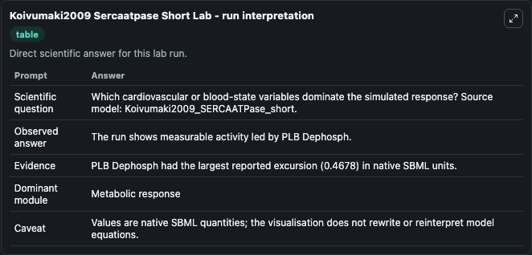
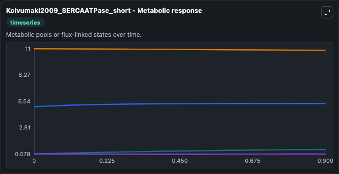
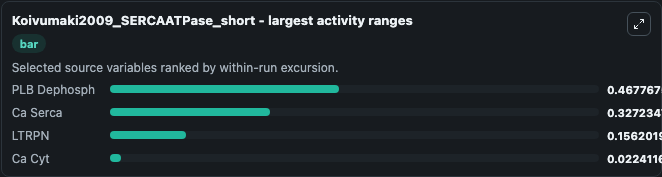
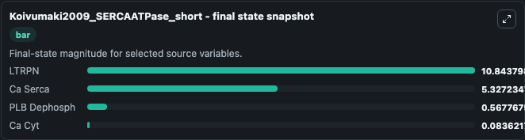
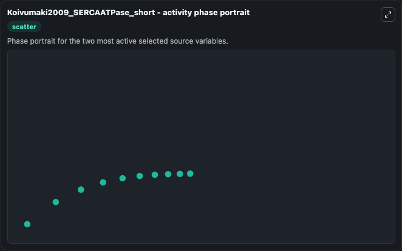

# Koivumaki2009 Sercaatpase Short

This Biosimulant lab wraps `Koivumaki2009 Sercaatpase Short` as a runnable systems biology model with a companion visualization module.
This a model from the article: Modelling sarcoplasmic reticulum calcium ATPase and its regulation in cardiacmyocytes. It can be used to explore the configured dynamics and compare scenario outcomes across configurations.

## What You'll See

The lab asks: Which cardiovascular or blood-state variables dominate the simulated response? Source model: Koivumaki2009_SERCAATPase_short. It runs for 1.0 time units with a communication step of 0.1. The run uses the model defaults declared by the curated SBML wrapper. The generated visualizations focus on PLB Dephosph, LTRPN, Ca Serca, and Ca Cyt, combining trajectory, endpoint-comparison, and summary-table views from one completed dark-mode run.

In this captured run, **PLB Dephosph** moved from 0.1000 to 0.5678 across 1.0 simulation windows.


### Output Visualizations



*Summary table for Koivumaki2009 Sercaatpase Short, reporting the scientific question, observed answer, dominant module, and caveat.*



*Trajectories of PLB Dephosph, Ca Serca, LTRPN, and Ca Cyt across the 1.0 simulation. In this run **PLB Dephosph** climbed from 0.1000 to 0.5678 and **LTRPN** fell from 11.000 to 10.844 — the largest movements among the focused observables.*



*Largest-excursion ranking of the focused observables — the absolute movement magnitude during the run. Top 3: **PLB Dephosph** = 0.4678, **Ca Serca** = 0.3272, **LTRPN** = 0.1562, with 1 more observable below.*



*Endpoint snapshot of the focused observables — final values from the captured run. Top 3 by value: **LTRPN** = 10.844, **Ca Serca** = 5.327, **PLB Dephosph** = 0.5678, with 1 more observable below.*



*Visualization card from the Koivumaki2009 Sercaatpase Short dark-mode run.*


## Model Context

- Core model: `models/core`
- Visualization model: `models/visualisation`
- Standard: `other`
- Upstream source: `biomodels_ebi:MODEL1006230029`
- License: `CC0`

## Inputs

| Input | Maps To | Default | Notes |
|---|---|---|---|
| Initial Plb Dephosph | `systemsbiology_sbml_koivumaki2009_sercaatpase_short_model1006230029_model.initial_plb_dephosph` | | Source state initial condition exposed as a model-specific control because no explicit intervention parameter is identifiable. Maps to SBML symbol `PLB_dephosph`. |
| Initial Ltrpn | `systemsbiology_sbml_koivumaki2009_sercaatpase_short_model1006230029_model.initial_ltrpn` | | Source state initial condition exposed as a model-specific control because no explicit intervention parameter is identifiable. Maps to SBML symbol `LTRPN`. |
| Initial Ca Serca | `systemsbiology_sbml_koivumaki2009_sercaatpase_short_model1006230029_model.initial_ca_serca` | | Source state initial condition exposed as a model-specific control because no explicit intervention parameter is identifiable. Maps to SBML symbol `Ca_serca`. |
| Initial Ca Cyt | `systemsbiology_sbml_koivumaki2009_sercaatpase_short_model1006230029_model.initial_ca_cyt` | | Source state initial condition exposed as a model-specific control because no explicit intervention parameter is identifiable. Maps to SBML symbol `Ca_cyt`. |

## Outputs

| Output | Maps To | Role |
|---|---|---|
| `state` | `systemsbiology_sbml_koivumaki2009_sercaatpase_short_model1006230029_model.state` | Available to the visualization model and downstream workflows. |
| `summary` | `systemsbiology_sbml_koivumaki2009_sercaatpase_short_model1006230029_model.summary` | Available to the visualization model and downstream workflows. |
| `species_labels` | `systemsbiology_sbml_koivumaki2009_sercaatpase_short_model1006230029_model.species_labels` | Available to the visualization model and downstream workflows. |
| `plb_dephosph` | `systemsbiology_sbml_koivumaki2009_sercaatpase_short_model1006230029_model.plb_dephosph` | Available to the visualization model and downstream workflows. |
| `ltrpn` | `systemsbiology_sbml_koivumaki2009_sercaatpase_short_model1006230029_model.ltrpn` | Available to the visualization model and downstream workflows. |
| `ca_serca` | `systemsbiology_sbml_koivumaki2009_sercaatpase_short_model1006230029_model.ca_serca` | Available to the visualization model and downstream workflows. |
| `ca_cyt` | `systemsbiology_sbml_koivumaki2009_sercaatpase_short_model1006230029_model.ca_cyt` | Available to the visualization model and downstream workflows. |

## Runtime

- Duration: `1.0`
- Communication step: `0.1`

## Running Locally

```bash
biosimulant labs serve
```
