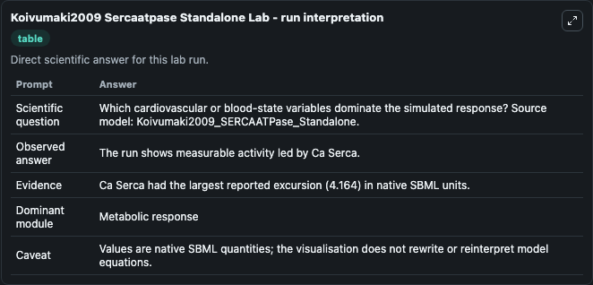
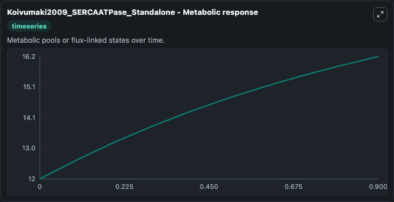
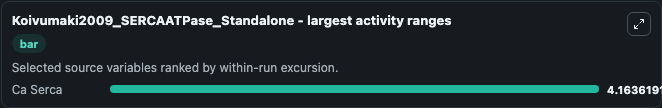
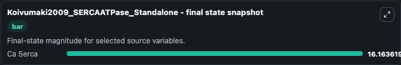

# Koivumaki2009 Sercaatpase Standalone

This Biosimulant lab wraps `Koivumaki2009 Sercaatpase Standalone` as a runnable systems biology model with a companion visualization module.
This a model from the article: Modelling sarcoplasmic reticulum calcium ATPase and its regulation in cardiacmyocytes. It can be used to explore the configured dynamics and compare scenario outcomes across configurations.

## What You'll See

The lab asks: Which cardiovascular or blood-state variables dominate the simulated response? Source model: Koivumaki2009_SERCAATPase_Standalone. It runs for 1.0 time units with a communication step of 0.1. The run uses the model defaults declared by the curated SBML wrapper. The generated visualizations focus on Ca Serca, combining trajectory, endpoint-comparison, and summary-table views from one completed dark-mode run.

In this captured run, **Ca Serca** moved from 12.000 to 16.164 across 1.0 simulation windows.


### Output Visualizations



*Summary table for Koivumaki2009 Sercaatpase Standalone, reporting the scientific question, observed answer, dominant module, and caveat.*



*Trajectories of Ca Serca across the 1.0 simulation. In this run **Ca Serca** climbed from 12.000 to 16.164 — the largest movements among the focused observables.*



*Largest-excursion ranking of the focused observables — the absolute movement magnitude during the run. Top 1: **Ca Serca** = 4.164.*



*Endpoint snapshot of the focused observables — final values from the captured run. Top 1 by value: **Ca Serca** = 16.164.*


## Model Context

- Core model: `models/core`
- Visualization model: `models/visualisation`
- Standard: `other`
- Upstream source: `biomodels_ebi:MODEL1006230023`
- License: `CC0`

## Inputs

| Input | Maps To | Default | Notes |
|---|---|---|---|
| Initial Ca Serca | `systemsbiology_sbml_koivumaki2009_sercaatpase_standalone_model1006230023_model.initial_ca_serca` | | Source state initial condition exposed as a model-specific control because no explicit intervention parameter is identifiable. Maps to SBML symbol `Ca_serca`. |

## Outputs

| Output | Maps To | Role |
|---|---|---|
| `state` | `systemsbiology_sbml_koivumaki2009_sercaatpase_standalone_model1006230023_model.state` | Available to the visualization model and downstream workflows. |
| `summary` | `systemsbiology_sbml_koivumaki2009_sercaatpase_standalone_model1006230023_model.summary` | Available to the visualization model and downstream workflows. |
| `species_labels` | `systemsbiology_sbml_koivumaki2009_sercaatpase_standalone_model1006230023_model.species_labels` | Available to the visualization model and downstream workflows. |
| `ca_serca` | `systemsbiology_sbml_koivumaki2009_sercaatpase_standalone_model1006230023_model.ca_serca` | Available to the visualization model and downstream workflows. |

## Runtime

- Duration: `1.0`
- Communication step: `0.1`

## Running Locally

```bash
biosimulant labs serve
```
