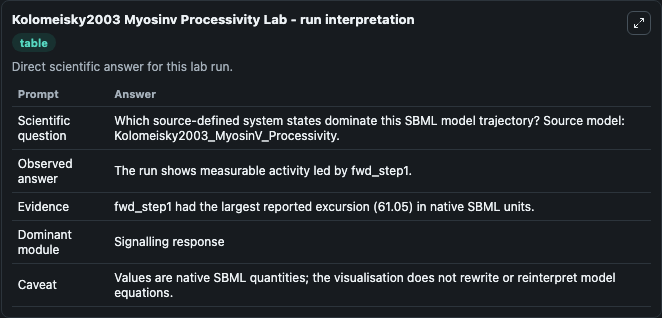
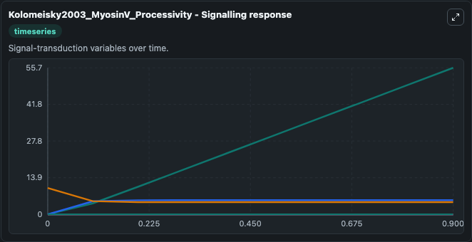
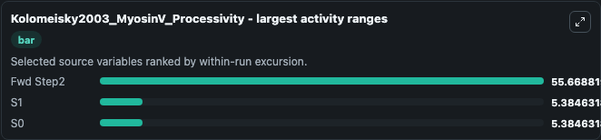
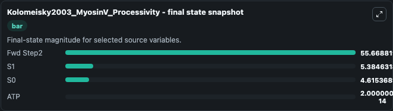
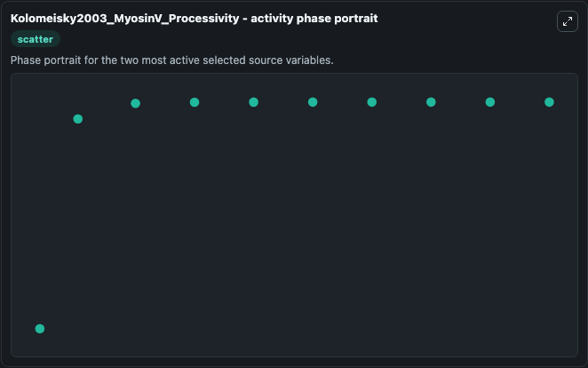

# Kolomeisky2003 Myosinv Processivity

This Biosimulant lab wraps `Kolomeisky2003 Myosinv Processivity` as a runnable systems biology model with a companion visualization module.
This is the 2 state model of Myosin V movement described in the article: A simple kinetic model describes the processivity of myosin-v. It can be used to explore the configured dynamics and compare scenario outcomes across configurations.

## What You'll See

The lab asks: Which source-defined system states dominate this SBML model trajectory? Source model: Kolomeisky2003_MyosinV_Processivity. It runs for 1.0 time units with a communication step of 0.1. The run uses the model defaults declared by the curated SBML wrapper. The generated visualizations focus on ATP, ADP, S0, S1, Pi, and Fwd Step2, combining trajectory, endpoint-comparison, and summary-table views from one completed dark-mode run.

In this captured run, **Fwd Step2** moved from 0 to 55.669 across 1.0 simulation windows.


### Output Visualizations



*Summary table for Kolomeisky2003 Myosinv Processivity, reporting the scientific question, observed answer, dominant module, and caveat.*



*Trajectories of Fwd Step2, S1, S0, ATP, ADP, and Pi across the 1.0 simulation. In this run **Fwd Step2** climbed from 0 to 55.669 and **S0** fell from 10.000 to 4.615 — the largest movements among the focused observables.*



*Largest-excursion ranking of the focused observables — the absolute movement magnitude during the run. Top 3: **Fwd Step2** = 55.669, **S1** = 5.385, **S0** = 5.385.*



*Endpoint snapshot of the focused observables — final values from the captured run. Top 3 by value: **Fwd Step2** = 55.669, **S1** = 5.385, **S0** = 4.615, with 1 more observable below.*



*Visualization card from the Kolomeisky2003 Myosinv Processivity dark-mode run.*


## Model Context

- Core model: `models/core`
- Visualization model: `models/visualisation`
- Standard: `other`
- Upstream source: `biomodels_ebi:BIOMD0000000305`
- License: `CC0`

## Inputs

| Input | Maps To | Default | Notes |
|---|---|---|---|
| Initial Model State ATP | `systemsbiology_sbml_kolomeisky2003_myosinv_processivity_biomd0000000305_model.initial_model_state_atp` | | Source state initial condition exposed as a model-specific control because no explicit intervention parameter is identifiable. Maps to SBML symbol `ATP`. |
| Initial Model State ADP | `systemsbiology_sbml_kolomeisky2003_myosinv_processivity_biomd0000000305_model.initial_model_state_adp` | | Source state initial condition exposed as a model-specific control because no explicit intervention parameter is identifiable. Maps to SBML symbol `ADP`. |
| Initial Model State S0 | `systemsbiology_sbml_kolomeisky2003_myosinv_processivity_biomd0000000305_model.initial_model_state_s0` | | Source state initial condition exposed as a model-specific control because no explicit intervention parameter is identifiable. Maps to SBML symbol `S0`. |
| Initial Model State S1 | `systemsbiology_sbml_kolomeisky2003_myosinv_processivity_biomd0000000305_model.initial_model_state_s1` | | Source state initial condition exposed as a model-specific control because no explicit intervention parameter is identifiable. Maps to SBML symbol `S1`. |
| Initial Model State Pi | `systemsbiology_sbml_kolomeisky2003_myosinv_processivity_biomd0000000305_model.initial_model_state_pi` | | Source state initial condition exposed as a model-specific control because no explicit intervention parameter is identifiable. Maps to SBML symbol `Pi_`. |
| Initial Fwd Step2 | `systemsbiology_sbml_kolomeisky2003_myosinv_processivity_biomd0000000305_model.initial_fwd_step2` | | Source state initial condition exposed as a model-specific control because no explicit intervention parameter is identifiable. Maps to SBML symbol `fwd_step2`. |

## Outputs

| Output | Maps To | Role |
|---|---|---|
| `state` | `systemsbiology_sbml_kolomeisky2003_myosinv_processivity_biomd0000000305_model.state` | Available to the visualization model and downstream workflows. |
| `summary` | `systemsbiology_sbml_kolomeisky2003_myosinv_processivity_biomd0000000305_model.summary` | Available to the visualization model and downstream workflows. |
| `species_labels` | `systemsbiology_sbml_kolomeisky2003_myosinv_processivity_biomd0000000305_model.species_labels` | Available to the visualization model and downstream workflows. |
| `atp` | `systemsbiology_sbml_kolomeisky2003_myosinv_processivity_biomd0000000305_model.atp` | Available to the visualization model and downstream workflows. |
| `adp` | `systemsbiology_sbml_kolomeisky2003_myosinv_processivity_biomd0000000305_model.adp` | Available to the visualization model and downstream workflows. |
| `model_state_s0` | `systemsbiology_sbml_kolomeisky2003_myosinv_processivity_biomd0000000305_model.model_state_s0` | Available to the visualization model and downstream workflows. |
| `model_state_s1` | `systemsbiology_sbml_kolomeisky2003_myosinv_processivity_biomd0000000305_model.model_state_s1` | Available to the visualization model and downstream workflows. |
| `model_state_pi` | `systemsbiology_sbml_kolomeisky2003_myosinv_processivity_biomd0000000305_model.model_state_pi` | Available to the visualization model and downstream workflows. |
| `fwd_step2` | `systemsbiology_sbml_kolomeisky2003_myosinv_processivity_biomd0000000305_model.fwd_step2` | Available to the visualization model and downstream workflows. |

## Runtime

- Duration: `1.0`
- Communication step: `0.1`

## Running Locally

```bash
biosimulant labs serve
```
