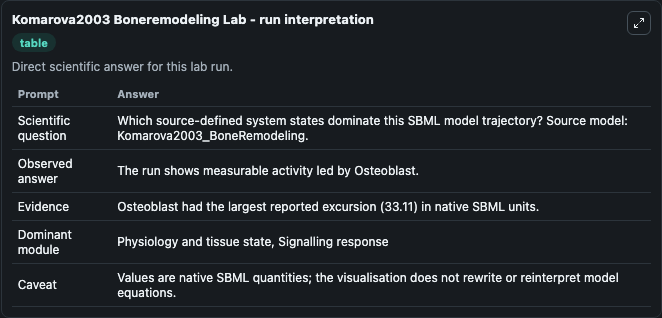
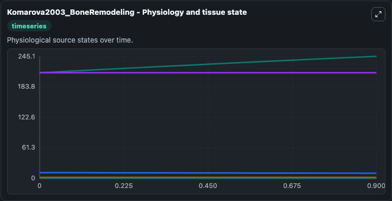
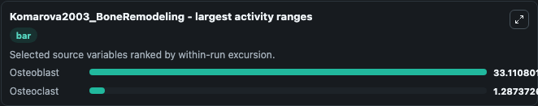
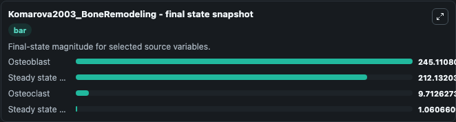
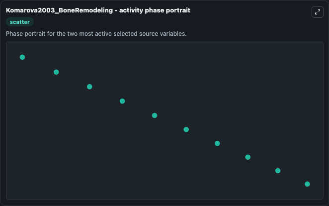

# Komarova2003 Boneremodeling

This Biosimulant lab wraps `Komarova2003 Boneremodeling` as a runnable systems biology model with a companion visualization module.
This a model from the article: Mathematical model predicts a critical role for osteoclast autocrine regulation in the control of bone remodeling. It can be used to explore the configured dynamics and compare scenario outcomes across configurations.

## What You'll See

The lab asks: Which source-defined system states dominate this SBML model trajectory? Source model: Komarova2003_BoneRemodeling. It runs for 1.0 time units with a communication step of 0.1. The run uses the model defaults declared by the curated SBML wrapper. The generated visualizations focus on Steady state osteoclast, Steady state osteoblast, Osteoblast, Osteoclast, Cells actively resorbing bone, and Cells actively forming bone, combining trajectory, endpoint-comparison, and summary-table views from one completed dark-mode run.

In this captured run, **Osteoblast** moved from 212.0 to 245.1 across 1.0 simulation windows.


### Output Visualizations



*Summary table for Komarova2003 Boneremodeling, reporting the scientific question, observed answer, dominant module, and caveat.*



*Trajectories of Osteoblast, Osteoclast, Steady state osteoclast, Steady state osteoblast, Cells actively resorbing bone, and Cells actively forming bone across the 1.0 simulation. In this run **Osteoblast** climbed from 212.0 to 245.1 and **Osteoclast** fell from 11.000 to 9.713 — the largest movements among the focused observables.*



*Largest-excursion ranking of the focused observables — the absolute movement magnitude during the run. Top 2: **Osteoblast** = 33.111, **Osteoclast** = 1.287.*



*Endpoint snapshot of the focused observables — final values from the captured run. Top 3 by value: **Osteoblast** = 245.1, **Steady state osteoblast** = 212.1, **Osteoclast** = 9.713, with 1 more observable below.*



*Visualization card from the Komarova2003 Boneremodeling dark-mode run.*


## Model Context

- Core model: `models/core`
- Visualization model: `models/visualisation`
- Standard: `other`
- Upstream source: `biomodels_ebi:BIOMD0000000148`
- License: `CC0`

## Inputs

| Input | Maps To | Default | Notes |
|---|---|---|---|
| Initial Steady State Osteoclast | `systemsbiology_sbml_komarova2003_boneremodeling_biomd0000000148_model.initial_steady_state_osteoclast` | | Source state initial condition exposed as a model-specific control because no explicit intervention parameter is identifiable. Maps to SBML symbol `x1_bar`. |
| Initial Steady State Osteoblast | `systemsbiology_sbml_komarova2003_boneremodeling_biomd0000000148_model.initial_steady_state_osteoblast` | | Source state initial condition exposed as a model-specific control because no explicit intervention parameter is identifiable. Maps to SBML symbol `x2_bar`. |
| Initial Osteoblast | `systemsbiology_sbml_komarova2003_boneremodeling_biomd0000000148_model.initial_osteoblast` | | Source state initial condition exposed as a model-specific control because no explicit intervention parameter is identifiable. Maps to SBML symbol `x2`. |
| Initial Osteoclast | `systemsbiology_sbml_komarova2003_boneremodeling_biomd0000000148_model.initial_osteoclast` | | Source state initial condition exposed as a model-specific control because no explicit intervention parameter is identifiable. Maps to SBML symbol `x1`. |
| Initial Cells Actively Resorbing Bone | `systemsbiology_sbml_komarova2003_boneremodeling_biomd0000000148_model.initial_cells_actively_resorbing_bone` | | Source state initial condition exposed as a model-specific control because no explicit intervention parameter is identifiable. Maps to SBML symbol `y1`. |
| Initial Cells Actively Forming Bone | `systemsbiology_sbml_komarova2003_boneremodeling_biomd0000000148_model.initial_cells_actively_forming_bone` | | Source state initial condition exposed as a model-specific control because no explicit intervention parameter is identifiable. Maps to SBML symbol `y2`. |

## Outputs

| Output | Maps To | Role |
|---|---|---|
| `state` | `systemsbiology_sbml_komarova2003_boneremodeling_biomd0000000148_model.state` | Available to the visualization model and downstream workflows. |
| `summary` | `systemsbiology_sbml_komarova2003_boneremodeling_biomd0000000148_model.summary` | Available to the visualization model and downstream workflows. |
| `species_labels` | `systemsbiology_sbml_komarova2003_boneremodeling_biomd0000000148_model.species_labels` | Available to the visualization model and downstream workflows. |
| `steady_state_osteoclast` | `systemsbiology_sbml_komarova2003_boneremodeling_biomd0000000148_model.steady_state_osteoclast` | Available to the visualization model and downstream workflows. |
| `steady_state_osteoblast` | `systemsbiology_sbml_komarova2003_boneremodeling_biomd0000000148_model.steady_state_osteoblast` | Available to the visualization model and downstream workflows. |
| `osteoblast` | `systemsbiology_sbml_komarova2003_boneremodeling_biomd0000000148_model.osteoblast` | Available to the visualization model and downstream workflows. |
| `osteoclast` | `systemsbiology_sbml_komarova2003_boneremodeling_biomd0000000148_model.osteoclast` | Available to the visualization model and downstream workflows. |
| `cells_actively_resorbing_bone` | `systemsbiology_sbml_komarova2003_boneremodeling_biomd0000000148_model.cells_actively_resorbing_bone` | Available to the visualization model and downstream workflows. |
| `cells_actively_forming_bone` | `systemsbiology_sbml_komarova2003_boneremodeling_biomd0000000148_model.cells_actively_forming_bone` | Available to the visualization model and downstream workflows. |

## Runtime

- Duration: `1.0`
- Communication step: `0.1`

## Running Locally

```bash
biosimulant labs serve
```
