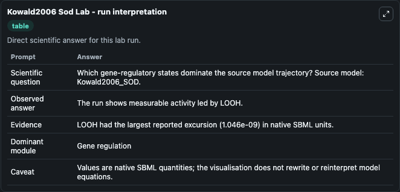
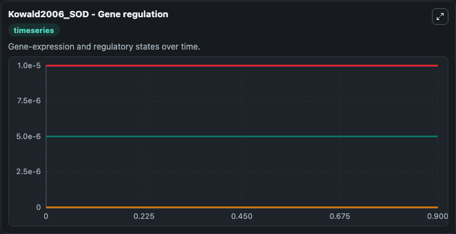
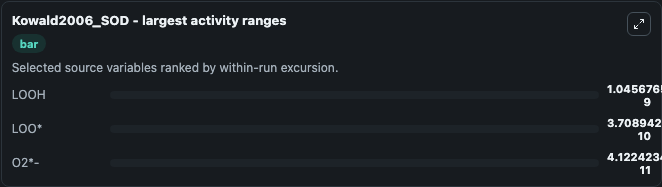
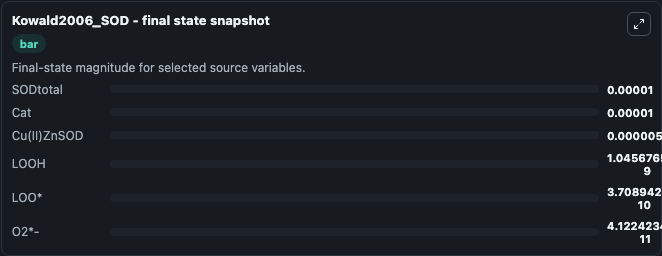
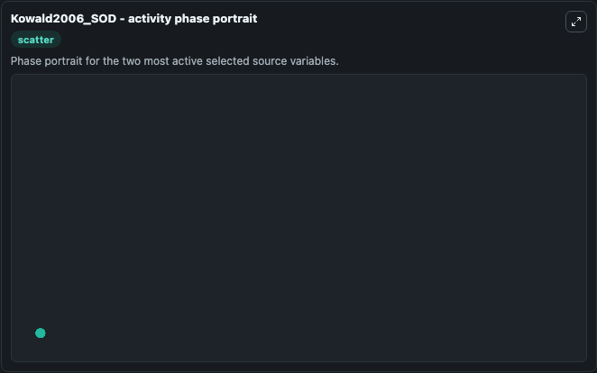

# Kowald2006 Sod

This Biosimulant lab wraps `Kowald2006 Sod` as a runnable systems biology model with a companion visualization module.
This model is according to the paper from Axel Kowald Alternative pathways as mechanism for the negative effects associated with overexpression of superoxide dismutase. It can be used to explore the configured dynamics and compare scenario outcomes across configurations.

## What You'll See

The lab asks: Which gene-regulatory states dominate the source model trajectory? Source model: Kowald2006_SOD. It runs for 1.0 time units with a communication step of 0.1. The run uses the model defaults declared by the curated SBML wrapper. The generated visualizations focus on SODtotal, Cat, Cu(II)ZnSOD, O2*-, LOOH, and LOO*, combining trajectory, endpoint-comparison, and summary-table views from one completed dark-mode run.

In this captured run, **LOOH** moved from 0 to 1.05e-09 across 1.0 simulation windows.


### Output Visualizations



*Summary table for Kowald2006 Sod, reporting the scientific question, observed answer, dominant module, and caveat.*



*Trajectories of LOOH, LOO*, O2*-, SODtotal, Cat, and Cu(II)ZnSOD across the 1.0 simulation. In this run **LOOH** climbed from 0 to 1.05e-09 — the largest movements among the focused observables.*



*Largest-excursion ranking of the focused observables — the absolute movement magnitude during the run. Top 3: **LOOH** = 1.05e-09, **LOO*** = 3.71e-10, **O2*-** = 4.12e-11.*



*Endpoint snapshot of the focused observables — final values from the captured run. Top 3 by value: **SODtotal** = 1e-05, **Cat** = 1e-05, **Cu(II)ZnSOD** = 5e-06, with 3 more observables below.*



*Visualization card from the Kowald2006 Sod dark-mode run.*


## Model Context

- Core model: `models/core`
- Visualization model: `models/visualisation`
- Standard: `other`
- Upstream source: `biomodels_ebi:BIOMD0000000108`
- License: `CC0`

## Inputs

| Input | Maps To | Default | Notes |
|---|---|---|---|
| Initial So Dtotal | `systemsbiology_sbml_kowald2006_sod_biomd0000000108_model.initial_so_dtotal` | | Source state initial condition exposed as a model-specific control because no explicit intervention parameter is identifiable. Maps to SBML symbol `species_0000016`. |
| Initial Model State Cat | `systemsbiology_sbml_kowald2006_sod_biomd0000000108_model.initial_model_state_cat` | | Source state initial condition exposed as a model-specific control because no explicit intervention parameter is identifiable. Maps to SBML symbol `species_0000017`. |
| Initial Cu Ii Zn Sod | `systemsbiology_sbml_kowald2006_sod_biomd0000000108_model.initial_cu_ii_zn_sod` | | Source state initial condition exposed as a model-specific control because no explicit intervention parameter is identifiable. Maps to SBML symbol `species_0000002`. |
| Initial Model State O2 | `systemsbiology_sbml_kowald2006_sod_biomd0000000108_model.initial_model_state_o2` | | Source state initial condition exposed as a model-specific control because no explicit intervention parameter is identifiable. Maps to SBML symbol `species_0000001`. |
| Initial Looh | `systemsbiology_sbml_kowald2006_sod_biomd0000000108_model.initial_looh` | | Source state initial condition exposed as a model-specific control because no explicit intervention parameter is identifiable. Maps to SBML symbol `species_0000009`. |
| Initial Model State Loo | `systemsbiology_sbml_kowald2006_sod_biomd0000000108_model.initial_model_state_loo` | | Source state initial condition exposed as a model-specific control because no explicit intervention parameter is identifiable. Maps to SBML symbol `species_0000007`. |

## Outputs

| Output | Maps To | Role |
|---|---|---|
| `state` | `systemsbiology_sbml_kowald2006_sod_biomd0000000108_model.state` | Available to the visualization model and downstream workflows. |
| `summary` | `systemsbiology_sbml_kowald2006_sod_biomd0000000108_model.summary` | Available to the visualization model and downstream workflows. |
| `species_labels` | `systemsbiology_sbml_kowald2006_sod_biomd0000000108_model.species_labels` | Available to the visualization model and downstream workflows. |
| `so_dtotal` | `systemsbiology_sbml_kowald2006_sod_biomd0000000108_model.so_dtotal` | Available to the visualization model and downstream workflows. |
| `cat` | `systemsbiology_sbml_kowald2006_sod_biomd0000000108_model.cat` | Available to the visualization model and downstream workflows. |
| `cu_ii_zn_sod` | `systemsbiology_sbml_kowald2006_sod_biomd0000000108_model.cu_ii_zn_sod` | Available to the visualization model and downstream workflows. |
| `model_state_o2` | `systemsbiology_sbml_kowald2006_sod_biomd0000000108_model.model_state_o2` | Available to the visualization model and downstream workflows. |
| `looh` | `systemsbiology_sbml_kowald2006_sod_biomd0000000108_model.looh` | Available to the visualization model and downstream workflows. |
| `loo` | `systemsbiology_sbml_kowald2006_sod_biomd0000000108_model.loo` | Available to the visualization model and downstream workflows. |

## Runtime

- Duration: `1.0`
- Communication step: `0.1`

## Running Locally

```bash
biosimulant labs serve
```
