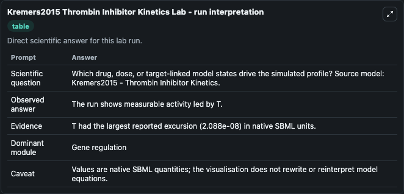
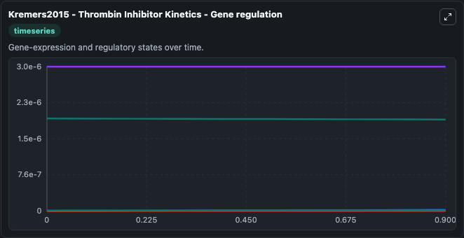
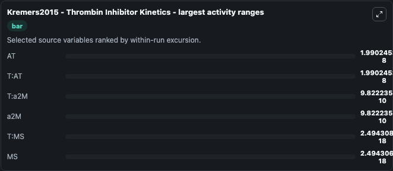
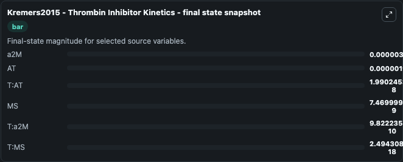
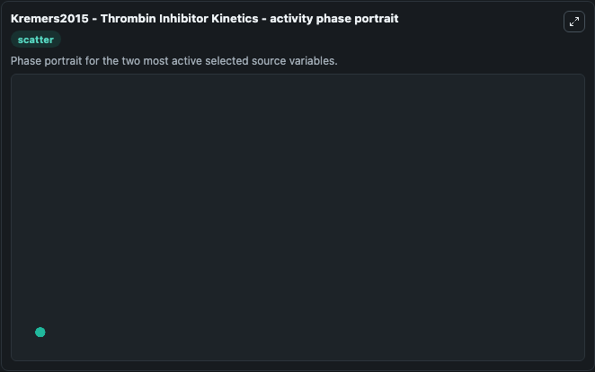

# Kremers2015 Thrombin Inhibitor Kinetics

This Biosimulant lab wraps `Kremers2015 Thrombin Inhibitor Kinetics` as a runnable systems biology model with a companion visualization module.
Mathematical model of thrombin inhibition by ATIII, alpha-2-macroglobulin and miscellaneous serpins (a1-antitrypsin, a1-proteinase inhibitor, a1-antichymotrypsin, protease nexin-1, C1inhibitor and oth. It can be used to explore the configured dynamics and compare scenario outcomes across configurations.

## What You'll See

The lab asks: Which drug, dose, or target-linked model states drive the simulated profile? Source model: Kremers2015 - Thrombin Inhibitor Kinetics. It runs for 1.0 time units with a communication step of 0.1. The run uses the model defaults declared by the curated SBML wrapper. The generated visualizations focus on a2M, T:a2M, T:MS, T:AT, AT, and MS, combining trajectory, endpoint-comparison, and summary-table views from one completed dark-mode run.

In this captured run, **AT** moved from 1.94e-06 to 1.92e-06 across 1.0 simulation windows.


### Output Visualizations



*Summary table for Kremers2015 Thrombin Inhibitor Kinetics, reporting the scientific question, observed answer, dominant module, and caveat.*



*Trajectories of AT, T:AT, T:a2M, a2M, T:MS, and MS across the 1.0 simulation. In this run **T:AT** climbed from 0 to 1.99e-08 and **AT** fell from 1.94e-06 to 1.92e-06 — the largest movements among the focused observables.*



*Largest-excursion ranking of the focused observables — the absolute movement magnitude during the run. Top 3: **AT** = 1.99e-08, **T:AT** = 1.99e-08, **T:a2M** = 9.82e-10, with 3 more observables below.*



*Endpoint snapshot of the focused observables — final values from the captured run. Top 3 by value: **a2M** = 3.03e-06, **AT** = 1.92e-06, **T:AT** = 1.99e-08, with 3 more observables below.*



*Visualization card from the Kremers2015 Thrombin Inhibitor Kinetics dark-mode run.*


## Model Context

- Core model: `models/core`
- Visualization model: `models/visualisation`
- Standard: `other`
- Upstream source: `biomodels_ebi:MODEL1808210001`
- License: `CC0`

## Inputs

| Input | Maps To | Default | Notes |
|---|---|---|---|
| Initial A2 M | `systemsbiology_sbml_kremers2015_thrombin_inhibitor_kinetics_model1808210001_model.initial_a2_m` | | Source state initial condition exposed as a model-specific control because no explicit intervention parameter is identifiable. Maps to SBML symbol `a2M`. |
| Initial T A2 M | `systemsbiology_sbml_kremers2015_thrombin_inhibitor_kinetics_model1808210001_model.initial_t_a2_m` | | Source state initial condition exposed as a model-specific control because no explicit intervention parameter is identifiable. Maps to SBML symbol `T_a2M`. |
| Initial T Ms | `systemsbiology_sbml_kremers2015_thrombin_inhibitor_kinetics_model1808210001_model.initial_t_ms` | | Source state initial condition exposed as a model-specific control because no explicit intervention parameter is identifiable. Maps to SBML symbol `T_MS`. |
| Initial T At | `systemsbiology_sbml_kremers2015_thrombin_inhibitor_kinetics_model1808210001_model.initial_t_at` | | Source state initial condition exposed as a model-specific control because no explicit intervention parameter is identifiable. Maps to SBML symbol `T_AT`. |
| Initial Model State At | `systemsbiology_sbml_kremers2015_thrombin_inhibitor_kinetics_model1808210001_model.initial_model_state_at` | | Source state initial condition exposed as a model-specific control because no explicit intervention parameter is identifiable. Maps to SBML symbol `AT`. |
| Initial Model State Ms | `systemsbiology_sbml_kremers2015_thrombin_inhibitor_kinetics_model1808210001_model.initial_model_state_ms` | | Source state initial condition exposed as a model-specific control because no explicit intervention parameter is identifiable. Maps to SBML symbol `MS`. |

## Outputs

| Output | Maps To | Role |
|---|---|---|
| `state` | `systemsbiology_sbml_kremers2015_thrombin_inhibitor_kinetics_model1808210001_model.state` | Available to the visualization model and downstream workflows. |
| `summary` | `systemsbiology_sbml_kremers2015_thrombin_inhibitor_kinetics_model1808210001_model.summary` | Available to the visualization model and downstream workflows. |
| `species_labels` | `systemsbiology_sbml_kremers2015_thrombin_inhibitor_kinetics_model1808210001_model.species_labels` | Available to the visualization model and downstream workflows. |
| `a2_m` | `systemsbiology_sbml_kremers2015_thrombin_inhibitor_kinetics_model1808210001_model.a2_m` | Available to the visualization model and downstream workflows. |
| `t_a2_m` | `systemsbiology_sbml_kremers2015_thrombin_inhibitor_kinetics_model1808210001_model.t_a2_m` | Available to the visualization model and downstream workflows. |
| `t_ms` | `systemsbiology_sbml_kremers2015_thrombin_inhibitor_kinetics_model1808210001_model.t_ms` | Available to the visualization model and downstream workflows. |
| `t_at` | `systemsbiology_sbml_kremers2015_thrombin_inhibitor_kinetics_model1808210001_model.t_at` | Available to the visualization model and downstream workflows. |
| `model_state_at` | `systemsbiology_sbml_kremers2015_thrombin_inhibitor_kinetics_model1808210001_model.model_state_at` | Available to the visualization model and downstream workflows. |
| `model_state_ms` | `systemsbiology_sbml_kremers2015_thrombin_inhibitor_kinetics_model1808210001_model.model_state_ms` | Available to the visualization model and downstream workflows. |

## Runtime

- Duration: `1.0`
- Communication step: `0.1`

## Running Locally

```bash
biosimulant labs serve
```
