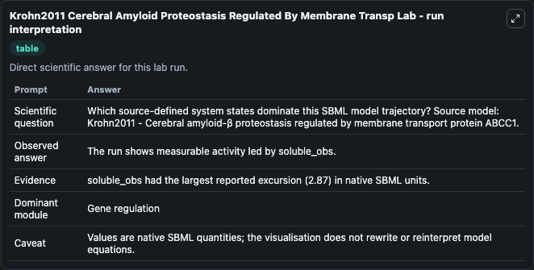
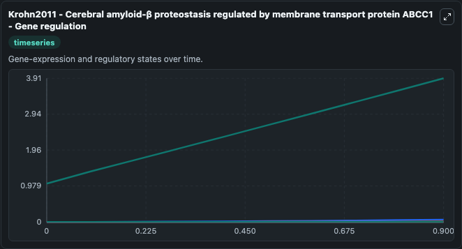
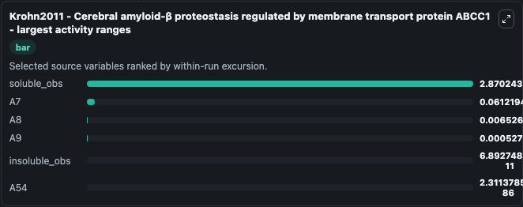
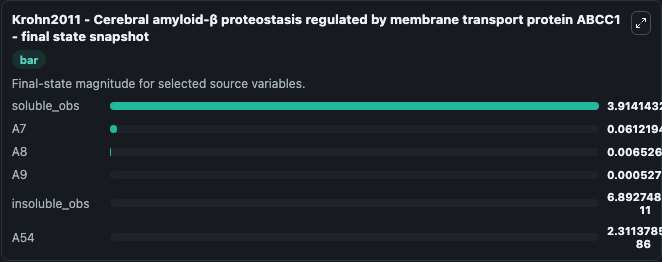
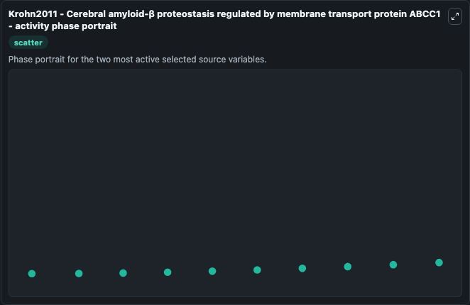

# Krohn2011 Cerebral Amyloid Proteostasis Regulated By Membrane Transp

This Biosimulant lab wraps `Krohn2011 Cerebral Amyloid Proteostasis Regulated By Membrane Transp` as a runnable systems biology model with a companion visualization module.
Krohn2011 - Cerebral amyloid-βproteostasis regulated by membrane transport protein ABCC1 This model is described in the article: Cerebral amyloid-β proteostasis is regulated by the membrane transport. It can be used to explore the configured dynamics and compare scenario outcomes across configurations.

## What You'll See

The lab asks: Which source-defined system states dominate this SBML model trajectory? Source model: Krohn2011 - Cerebral amyloid-β proteostasis regulated by membrane transport protein ABCC1. It runs for 1.0 time units with a communication step of 0.1. The run uses the model defaults declared by the curated SBML wrapper. The generated visualizations focus on soluble_obs, insoluble_obs, A9, A8, A7, and A54, combining trajectory, endpoint-comparison, and summary-table views from one completed dark-mode run.

In this captured run, **soluble_obs** moved from 1.044 to 3.914 across 1.0 simulation windows.


### Output Visualizations



*Summary table for Krohn2011 Cerebral Amyloid Proteostasis Regulated By Membrane Transp, reporting the scientific question, observed answer, dominant module, and caveat.*



*Trajectories of soluble_obs, A7, A8, A9, insoluble_obs, and A54 across the 1.0 simulation. In this run **soluble_obs** climbed from 1.044 to 3.914 — the largest movements among the focused observables.*



*Largest-excursion ranking of the focused observables — the absolute movement magnitude during the run. Top 3: **soluble_obs** = 2.870, **A7** = 0.0612, **A8** = 0.00653, with 3 more observables below.*



*Endpoint snapshot of the focused observables — final values from the captured run. Top 3 by value: **soluble_obs** = 3.914, **A7** = 0.0612, **A8** = 0.00653, with 3 more observables below.*



*Visualization card from the Krohn2011 Cerebral Amyloid Proteostasis Regulated By Membrane Transp dark-mode run.*


## Model Context

- Core model: `models/core`
- Visualization model: `models/visualisation`
- Standard: `other`
- Upstream source: `biomodels_ebi:BIOMD0000000618`
- License: `CC0`

## Inputs

| Input | Maps To | Default | Notes |
|---|---|---|---|
| Initial Soluble Obs | `systemsbiology_sbml_krohn2011_cerebral_amyloid_proteostasis_regulate_biomd0000000618_model.initial_soluble_obs` | | Source state initial condition exposed as a model-specific control because no explicit intervention parameter is identifiable. Maps to SBML symbol `soluble_obs`. |
| Initial Insoluble Obs | `systemsbiology_sbml_krohn2011_cerebral_amyloid_proteostasis_regulate_biomd0000000618_model.initial_insoluble_obs` | | Source state initial condition exposed as a model-specific control because no explicit intervention parameter is identifiable. Maps to SBML symbol `insoluble_obs`. |
| Initial Model State A9 | `systemsbiology_sbml_krohn2011_cerebral_amyloid_proteostasis_regulate_biomd0000000618_model.initial_model_state_a9` | | Source state initial condition exposed as a model-specific control because no explicit intervention parameter is identifiable. Maps to SBML symbol `A9`. |
| Initial Model State A8 | `systemsbiology_sbml_krohn2011_cerebral_amyloid_proteostasis_regulate_biomd0000000618_model.initial_model_state_a8` | | Source state initial condition exposed as a model-specific control because no explicit intervention parameter is identifiable. Maps to SBML symbol `A8`. |
| Initial Model State A7 | `systemsbiology_sbml_krohn2011_cerebral_amyloid_proteostasis_regulate_biomd0000000618_model.initial_model_state_a7` | | Source state initial condition exposed as a model-specific control because no explicit intervention parameter is identifiable. Maps to SBML symbol `A7`. |
| Initial Model State A54 | `systemsbiology_sbml_krohn2011_cerebral_amyloid_proteostasis_regulate_biomd0000000618_model.initial_model_state_a54` | | Source state initial condition exposed as a model-specific control because no explicit intervention parameter is identifiable. Maps to SBML symbol `A54`. |

## Outputs

| Output | Maps To | Role |
|---|---|---|
| `state` | `systemsbiology_sbml_krohn2011_cerebral_amyloid_proteostasis_regulate_biomd0000000618_model.state` | Available to the visualization model and downstream workflows. |
| `summary` | `systemsbiology_sbml_krohn2011_cerebral_amyloid_proteostasis_regulate_biomd0000000618_model.summary` | Available to the visualization model and downstream workflows. |
| `species_labels` | `systemsbiology_sbml_krohn2011_cerebral_amyloid_proteostasis_regulate_biomd0000000618_model.species_labels` | Available to the visualization model and downstream workflows. |
| `soluble_obs` | `systemsbiology_sbml_krohn2011_cerebral_amyloid_proteostasis_regulate_biomd0000000618_model.soluble_obs` | Available to the visualization model and downstream workflows. |
| `insoluble_obs` | `systemsbiology_sbml_krohn2011_cerebral_amyloid_proteostasis_regulate_biomd0000000618_model.insoluble_obs` | Available to the visualization model and downstream workflows. |
| `model_state_a9` | `systemsbiology_sbml_krohn2011_cerebral_amyloid_proteostasis_regulate_biomd0000000618_model.model_state_a9` | Available to the visualization model and downstream workflows. |
| `model_state_a8` | `systemsbiology_sbml_krohn2011_cerebral_amyloid_proteostasis_regulate_biomd0000000618_model.model_state_a8` | Available to the visualization model and downstream workflows. |
| `model_state_a7` | `systemsbiology_sbml_krohn2011_cerebral_amyloid_proteostasis_regulate_biomd0000000618_model.model_state_a7` | Available to the visualization model and downstream workflows. |
| `a54` | `systemsbiology_sbml_krohn2011_cerebral_amyloid_proteostasis_regulate_biomd0000000618_model.a54` | Available to the visualization model and downstream workflows. |

## Runtime

- Duration: `1.0`
- Communication step: `0.1`

## Running Locally

```bash
biosimulant labs serve
```
