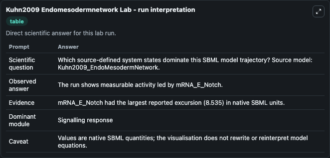
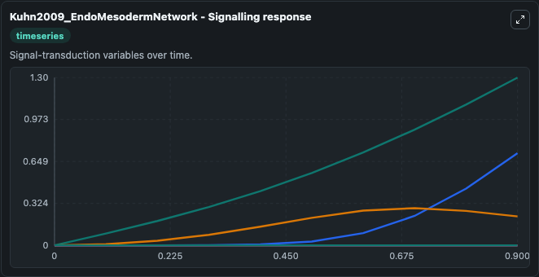
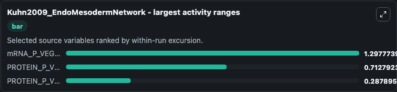
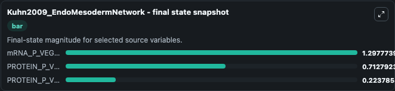
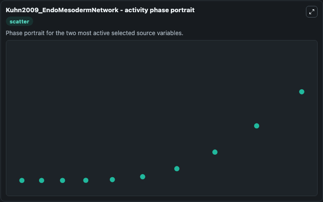

# Kuhn2009 Endomesodermnetwork

This Biosimulant lab wraps `Kuhn2009 Endomesodermnetwork` as a runnable systems biology model with a companion visualization module.
This a model from the article: Monte Carlo analysis of an ODE Model of the Sea Urchin Endomesoderm Network. It can be used to explore the configured dynamics and compare scenario outcomes across configurations.

## What You'll See

The lab asks: Which source-defined system states dominate this SBML model trajectory? Source model: Kuhn2009_EndoMesodermNetwork. It runs for 1.0 time units with a communication step of 0.1. The run uses the model defaults declared by the curated SBML wrapper. The generated visualizations focus on mRNA_P_VEGFR, mRNA_M_VEGFR, mRNA_E_VEGFR, PROTEIN_P_VEGFSignal, PROTEIN_P_VEGFR, and PROTEIN_M_VEGFSignal, combining trajectory, endpoint-comparison, and summary-table views from one completed dark-mode run.

In this captured run, **mRNA_P_VEGFR** moved from 0 to 1.298 across 1.0 simulation windows.


### Output Visualizations



*Summary table for Kuhn2009 Endomesodermnetwork, reporting the scientific question, observed answer, dominant module, and caveat.*



*Trajectories of mRNA_P_VEGFR, PROTEIN_P_VEGFSignal, PROTEIN_P_VEGFR, mRNA_M_VEGFR, mRNA_E_VEGFR, and PROTEIN_M_VEGFSignal across the 1.0 simulation. In this run **mRNA_P_VEGFR** climbed from 0 to 1.298 — the largest movements among the focused observables.*



*Largest-excursion ranking of the focused observables — the absolute movement magnitude during the run. Top 3: **mRNA_P_VEGFR** = 1.298, **PROTEIN_P_VEGFSignal** = 0.7128, **PROTEIN_P_VEGFR** = 0.2879.*



*Endpoint snapshot of the focused observables — final values from the captured run. Top 3 by value: **mRNA_P_VEGFR** = 1.298, **PROTEIN_P_VEGFSignal** = 0.7128, **PROTEIN_P_VEGFR** = 0.2238.*



*Visualization card from the Kuhn2009 Endomesodermnetwork dark-mode run.*


## Model Context

- Core model: `models/core`
- Visualization model: `models/visualisation`
- Standard: `other`
- Upstream source: `biomodels_ebi:BIOMD0000000235`
- License: `CC0`

## Inputs

| Input | Maps To | Default | Notes |
|---|---|---|---|
| Initial MRNA P Vegfr | `systemsbiology_sbml_kuhn2009_endomesodermnetwork_biomd0000000235_model.initial_mrna_p_vegfr` | | Source state initial condition exposed as a model-specific control because no explicit intervention parameter is identifiable. Maps to SBML symbol `mRNA_P_VEGFR`. |
| Initial MRNA M Vegfr | `systemsbiology_sbml_kuhn2009_endomesodermnetwork_biomd0000000235_model.initial_mrna_m_vegfr` | | Source state initial condition exposed as a model-specific control because no explicit intervention parameter is identifiable. Maps to SBML symbol `mRNA_M_VEGFR`. |
| Initial MRNA E Vegfr | `systemsbiology_sbml_kuhn2009_endomesodermnetwork_biomd0000000235_model.initial_mrna_e_vegfr` | | Source state initial condition exposed as a model-specific control because no explicit intervention parameter is identifiable. Maps to SBML symbol `mRNA_E_VEGFR`. |
| Initial Protein P Vegf Signal | `systemsbiology_sbml_kuhn2009_endomesodermnetwork_biomd0000000235_model.initial_protein_p_vegf_signal` | | Source state initial condition exposed as a model-specific control because no explicit intervention parameter is identifiable. Maps to SBML symbol `PROTEIN_P_VEGFSignal`. |
| Initial Protein P Vegfr | `systemsbiology_sbml_kuhn2009_endomesodermnetwork_biomd0000000235_model.initial_protein_p_vegfr` | | Source state initial condition exposed as a model-specific control because no explicit intervention parameter is identifiable. Maps to SBML symbol `PROTEIN_P_VEGFR`. |
| Initial Protein M Vegf Signal | `systemsbiology_sbml_kuhn2009_endomesodermnetwork_biomd0000000235_model.initial_protein_m_vegf_signal` | | Source state initial condition exposed as a model-specific control because no explicit intervention parameter is identifiable. Maps to SBML symbol `PROTEIN_M_VEGFSignal`. |

## Outputs

| Output | Maps To | Role |
|---|---|---|
| `state` | `systemsbiology_sbml_kuhn2009_endomesodermnetwork_biomd0000000235_model.state` | Available to the visualization model and downstream workflows. |
| `summary` | `systemsbiology_sbml_kuhn2009_endomesodermnetwork_biomd0000000235_model.summary` | Available to the visualization model and downstream workflows. |
| `species_labels` | `systemsbiology_sbml_kuhn2009_endomesodermnetwork_biomd0000000235_model.species_labels` | Available to the visualization model and downstream workflows. |
| `mrna_p_vegfr` | `systemsbiology_sbml_kuhn2009_endomesodermnetwork_biomd0000000235_model.mrna_p_vegfr` | Available to the visualization model and downstream workflows. |
| `mrna_m_vegfr` | `systemsbiology_sbml_kuhn2009_endomesodermnetwork_biomd0000000235_model.mrna_m_vegfr` | Available to the visualization model and downstream workflows. |
| `mrna_e_vegfr` | `systemsbiology_sbml_kuhn2009_endomesodermnetwork_biomd0000000235_model.mrna_e_vegfr` | Available to the visualization model and downstream workflows. |
| `protein_p_vegf_signal` | `systemsbiology_sbml_kuhn2009_endomesodermnetwork_biomd0000000235_model.protein_p_vegf_signal` | Available to the visualization model and downstream workflows. |
| `protein_p_vegfr` | `systemsbiology_sbml_kuhn2009_endomesodermnetwork_biomd0000000235_model.protein_p_vegfr` | Available to the visualization model and downstream workflows. |
| `protein_m_vegf_signal` | `systemsbiology_sbml_kuhn2009_endomesodermnetwork_biomd0000000235_model.protein_m_vegf_signal` | Available to the visualization model and downstream workflows. |

## Runtime

- Duration: `1.0`
- Communication step: `0.1`

## Running Locally

```bash
biosimulant labs serve
```
