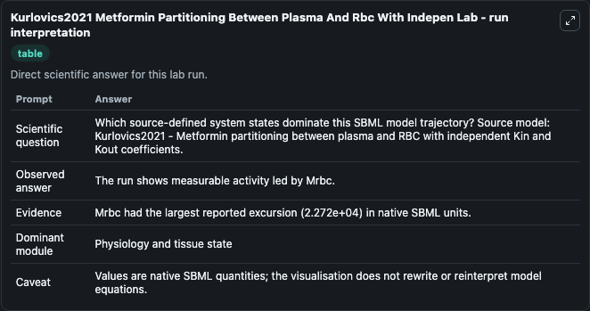
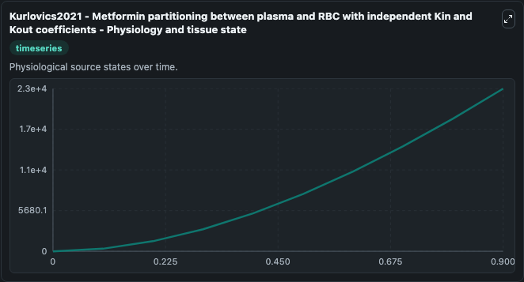
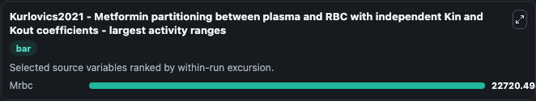
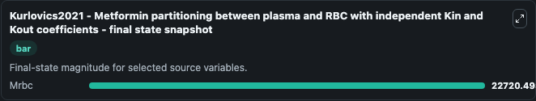

# Kurlovics2021 Metformin Partitioning Between Plasma And Rbc With Indepen

This Biosimulant lab wraps `Kurlovics2021 Metformin Partitioning Between Plasma And Rbc With Indepen` as a runnable systems biology model with a companion visualization module.
This model is a supplementary material of a manuscript'Diffusion driven metformin exchange transport rates between plasma and red blood cells'by Janis Kurlovics, Darta Maija Zake, Linda Zaharenko, Kri. It can be used to explore the configured dynamics and compare scenario outcomes across configurations.

## What You'll See

The lab asks: Which source-defined system states dominate this SBML model trajectory? Source model: Kurlovics2021 - Metformin partitioning between plasma and RBC with independent Kin and Kout coefficients. It runs for 1.0 time units with a communication step of 0.1. The run uses the model defaults declared by the curated SBML wrapper. The generated visualizations focus on Mrbc, combining trajectory, endpoint-comparison, and summary-table views from one completed dark-mode run.

In this captured run, **Mrbc** moved from 0 to 2.27e+04 across 1.0 simulation windows.


### Output Visualizations



*Summary table for Kurlovics2021 Metformin Partitioning Between Plasma And Rbc With Indepen, reporting the scientific question, observed answer, dominant module, and caveat.*



*Trajectories of Mrbc across the 1.0 simulation. In this run **Mrbc** climbed from 0 to 2.27e+04 — the largest movements among the focused observables.*



*Largest-excursion ranking of the focused observables — the absolute movement magnitude during the run. Top 1: **Mrbc** = 2.27e+04.*



*Endpoint snapshot of the focused observables — final values from the captured run. Top 1 by value: **Mrbc** = 2.27e+04.*


## Model Context

- Core model: `models/core`
- Visualization model: `models/visualisation`
- Standard: `other`
- Upstream source: `biomodels_ebi:BIOMD0000001026`
- License: `CC0`

## Inputs

| Input | Maps To | Default | Notes |
|---|---|---|---|
| Initial Mrbc | `systemsbiology_sbml_kurlovics2021_metformin_partitioning_between_pla_biomd0000001026_model.initial_mrbc` | | Source state initial condition exposed as a model-specific control because no explicit intervention parameter is identifiable. Maps to SBML symbol `Mrbc`. |

## Outputs

| Output | Maps To | Role |
|---|---|---|
| `state` | `systemsbiology_sbml_kurlovics2021_metformin_partitioning_between_pla_biomd0000001026_model.state` | Available to the visualization model and downstream workflows. |
| `summary` | `systemsbiology_sbml_kurlovics2021_metformin_partitioning_between_pla_biomd0000001026_model.summary` | Available to the visualization model and downstream workflows. |
| `species_labels` | `systemsbiology_sbml_kurlovics2021_metformin_partitioning_between_pla_biomd0000001026_model.species_labels` | Available to the visualization model and downstream workflows. |
| `mrbc` | `systemsbiology_sbml_kurlovics2021_metformin_partitioning_between_pla_biomd0000001026_model.mrbc` | Available to the visualization model and downstream workflows. |

## Runtime

- Duration: `1.0`
- Communication step: `0.1`

## Running Locally

```bash
biosimulant labs serve
```
