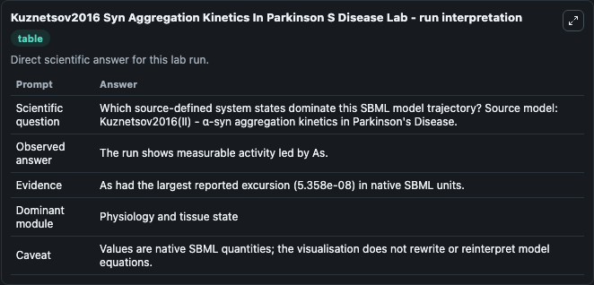
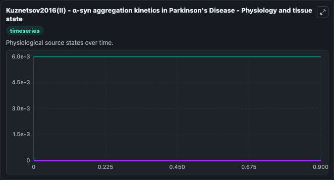
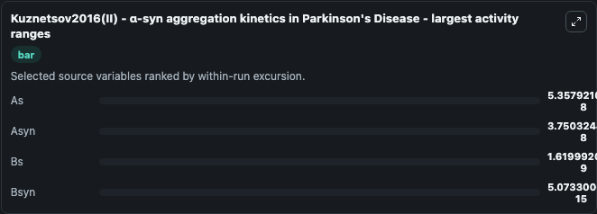
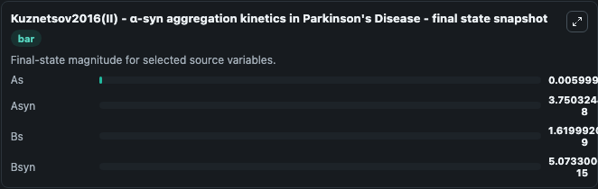
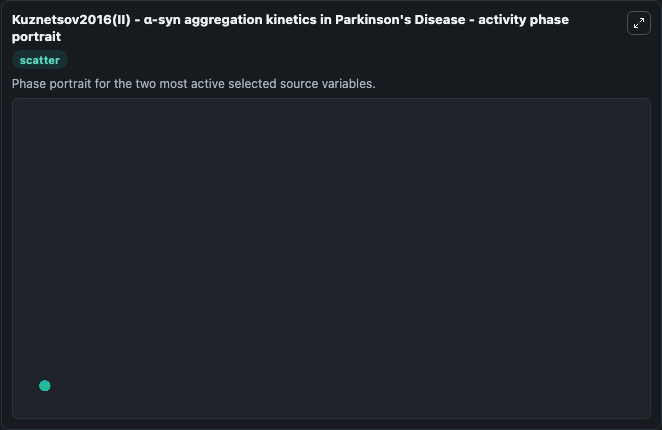

# Kuznetsov2016 Syn Aggregation Kinetics In Parkinson S Disease

This Biosimulant lab wraps `Kuznetsov2016 Syn Aggregation Kinetics In Parkinson S Disease` as a runnable systems biology model with a companion visualization module.
Kuznetsov2016(II) - α-syn aggregationkinetics in Parkinson's This theoretical model uses 2-step Finke-Watzky (FW) kineticstodescribe the production, misfolding, aggregation, transport anddegradation o. It can be used to explore the configured dynamics and compare scenario outcomes across configurations.

## What You'll See

The lab asks: Which source-defined system states dominate this SBML model trajectory? Source model: Kuznetsov2016(II) - α-syn aggregation kinetics in Parkinson's Disease. It runs for 1.0 time units with a communication step of 0.1. The run uses the model defaults declared by the curated SBML wrapper. The generated visualizations focus on As, Bsyn, Bs, and Asyn, combining trajectory, endpoint-comparison, and summary-table views from one completed dark-mode run.

In this captured run, **As** moved from 0.006 to 0.006 across 1.0 simulation windows.


### Output Visualizations



*Summary table for Kuznetsov2016 Syn Aggregation Kinetics In Parkinson S Disease, reporting the scientific question, observed answer, dominant module, and caveat.*



*Trajectories of As, Asyn, Bs, and Bsyn across the 1.0 simulation. In this run **Asyn** climbed from 0 to 3.75e-08 and **As** fell from 0.006 to 0.006 — the largest movements among the focused observables.*



*Largest-excursion ranking of the focused observables — the absolute movement magnitude during the run. Top 3: **As** = 5.36e-08, **Asyn** = 3.75e-08, **Bs** = 1.62e-09, with 1 more observable below.*



*Trajectories of As, Asyn, Bs, and Bsyn across the 1.0 simulation. In this run **Asyn** climbed from 0 to 3.75e-08 and **As** fell from 0.006 to 0.006 — the largest movements among the focused observables.*



*Visualization card from the Kuznetsov2016 Syn Aggregation Kinetics In Parkinson S Disease dark-mode run.*


## Model Context

- Core model: `models/core`
- Visualization model: `models/visualisation`
- Standard: `other`
- Upstream source: `biomodels_ebi:BIOMD0000000615`
- License: `CC0`

## Inputs

| Input | Maps To | Default | Notes |
|---|---|---|---|
| Initial As Value | `systemsbiology_sbml_kuznetsov2016_ii_syn_aggregation_kinetics_in_par_biomd0000000615_model.initial_as_value` | | Source state initial condition exposed as a model-specific control because no explicit intervention parameter is identifiable. Maps to SBML symbol `As`. |
| Initial Bsyn | `systemsbiology_sbml_kuznetsov2016_ii_syn_aggregation_kinetics_in_par_biomd0000000615_model.initial_bsyn` | | Source state initial condition exposed as a model-specific control because no explicit intervention parameter is identifiable. Maps to SBML symbol `Bsyn`. |
| Initial Model State Bs | `systemsbiology_sbml_kuznetsov2016_ii_syn_aggregation_kinetics_in_par_biomd0000000615_model.initial_model_state_bs` | | Source state initial condition exposed as a model-specific control because no explicit intervention parameter is identifiable. Maps to SBML symbol `Bs`. |
| Initial Asyn | `systemsbiology_sbml_kuznetsov2016_ii_syn_aggregation_kinetics_in_par_biomd0000000615_model.initial_asyn` | | Source state initial condition exposed as a model-specific control because no explicit intervention parameter is identifiable. Maps to SBML symbol `Asyn`. |

## Outputs

| Output | Maps To | Role |
|---|---|---|
| `state` | `systemsbiology_sbml_kuznetsov2016_ii_syn_aggregation_kinetics_in_par_biomd0000000615_model.state` | Available to the visualization model and downstream workflows. |
| `summary` | `systemsbiology_sbml_kuznetsov2016_ii_syn_aggregation_kinetics_in_par_biomd0000000615_model.summary` | Available to the visualization model and downstream workflows. |
| `species_labels` | `systemsbiology_sbml_kuznetsov2016_ii_syn_aggregation_kinetics_in_par_biomd0000000615_model.species_labels` | Available to the visualization model and downstream workflows. |
| `as_value` | `systemsbiology_sbml_kuznetsov2016_ii_syn_aggregation_kinetics_in_par_biomd0000000615_model.as_value` | Available to the visualization model and downstream workflows. |
| `bsyn` | `systemsbiology_sbml_kuznetsov2016_ii_syn_aggregation_kinetics_in_par_biomd0000000615_model.bsyn` | Available to the visualization model and downstream workflows. |
| `model_state_bs` | `systemsbiology_sbml_kuznetsov2016_ii_syn_aggregation_kinetics_in_par_biomd0000000615_model.model_state_bs` | Available to the visualization model and downstream workflows. |
| `asyn` | `systemsbiology_sbml_kuznetsov2016_ii_syn_aggregation_kinetics_in_par_biomd0000000615_model.asyn` | Available to the visualization model and downstream workflows. |

## Runtime

- Duration: `1.0`
- Communication step: `0.1`

## Running Locally

```bash
biosimulant labs serve
```
