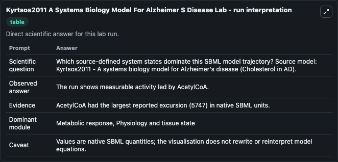
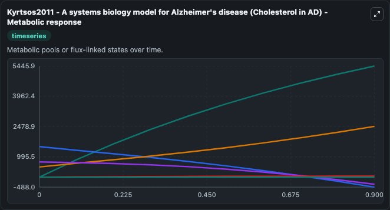
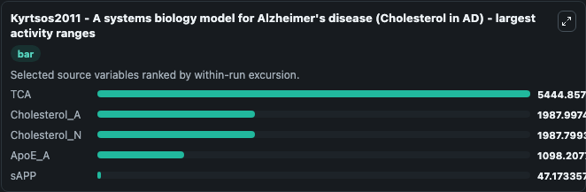
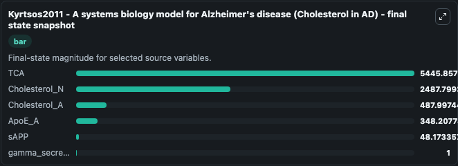
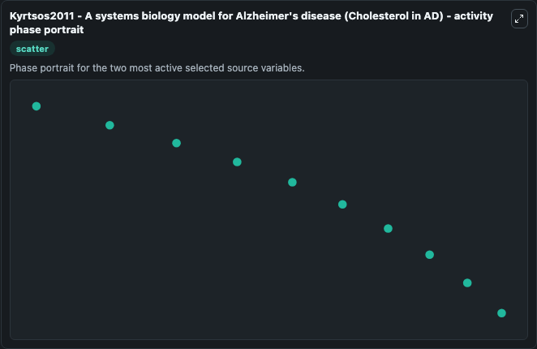

# Kyrtsos2011 A Systems Biology Model For Alzheimer S Disease

This Biosimulant lab wraps `Kyrtsos2011 A Systems Biology Model For Alzheimer S Disease` as a runnable systems biology model with a companion visualization module.
Kyrtsos2011 - A systems biology model forAlzheimer's disease (Cholesterol in AD) Encoded non-curated model. It can be used to explore the configured dynamics and compare scenario outcomes across configurations.

## What You'll See

The lab asks: Which source-defined system states dominate this SBML model trajectory? Source model: Kyrtsos2011 - A systems biology model for Alzheimer's disease (Cholesterol in AD). It runs for 1.0 time units with a communication step of 0.1. The run uses the model defaults declared by the curated SBML wrapper. The generated visualizations focus on TCA, Cholesterol_A, ApoE_A, Cholesterol_N, sAPP, and gamma_secretase, combining trajectory, endpoint-comparison, and summary-table views from one completed dark-mode run.

In this captured run, **TCA** moved from 1.000 to 5445.9 across 1.0 simulation windows.


### Output Visualizations



*Summary table for Kyrtsos2011 A Systems Biology Model For Alzheimer S Disease, reporting the scientific question, observed answer, dominant module, and caveat.*



*Trajectories of TCA, Cholesterol_A, Cholesterol_N, ApoE_A, sAPP, and gamma_secretase across the 1.0 simulation. In this run **TCA** climbed from 1.000 to 5445.9 and **Cholesterol_A** fell from 1500.0 to -488.0 — the largest movements among the focused observables.*



*Largest-excursion ranking of the focused observables — the absolute movement magnitude during the run. Top 3: **TCA** = 5444.9, **Cholesterol_A** = 1988.0, **Cholesterol_N** = 1987.8, with 2 more observables below.*



*Endpoint snapshot of the focused observables — final values from the captured run. Top 3 by value: **TCA** = 5445.9, **Cholesterol_N** = 2487.8, **Cholesterol_A** = 488.0, with 3 more observables below.*



*Visualization card from the Kyrtsos2011 A Systems Biology Model For Alzheimer S Disease dark-mode run.*


## Model Context

- Core model: `models/core`
- Visualization model: `models/visualisation`
- Standard: `other`
- Upstream source: `biomodels_ebi:MODEL1504240000`
- License: `CC0`

## Inputs

| Input | Maps To | Default | Notes |
|---|---|---|---|
| Initial Model State Tca | `systemsbiology_sbml_kyrtsos2011_a_systems_biology_model_for_alzheime_model1504240000_model.initial_model_state_tca` | | Source state initial condition exposed as a model-specific control because no explicit intervention parameter is identifiable. Maps to SBML symbol `TCA`. |
| Initial Cholesterol A | `systemsbiology_sbml_kyrtsos2011_a_systems_biology_model_for_alzheime_model1504240000_model.initial_cholesterol_a` | | Source state initial condition exposed as a model-specific control because no explicit intervention parameter is identifiable. Maps to SBML symbol `Cholesterol_A`. |
| Initial Apo E A | `systemsbiology_sbml_kyrtsos2011_a_systems_biology_model_for_alzheime_model1504240000_model.initial_apo_e_a` | | Source state initial condition exposed as a model-specific control because no explicit intervention parameter is identifiable. Maps to SBML symbol `ApoE_A`. |
| Initial Cholesterol N | `systemsbiology_sbml_kyrtsos2011_a_systems_biology_model_for_alzheime_model1504240000_model.initial_cholesterol_n` | | Source state initial condition exposed as a model-specific control because no explicit intervention parameter is identifiable. Maps to SBML symbol `Cholesterol_N`. |
| Initial S App | `systemsbiology_sbml_kyrtsos2011_a_systems_biology_model_for_alzheime_model1504240000_model.initial_s_app` | | Source state initial condition exposed as a model-specific control because no explicit intervention parameter is identifiable. Maps to SBML symbol `sAPP`. |
| Initial Gamma Secretase | `systemsbiology_sbml_kyrtsos2011_a_systems_biology_model_for_alzheime_model1504240000_model.initial_gamma_secretase` | | Source state initial condition exposed as a model-specific control because no explicit intervention parameter is identifiable. Maps to SBML symbol `gamma_secretase`. |

## Outputs

| Output | Maps To | Role |
|---|---|---|
| `state` | `systemsbiology_sbml_kyrtsos2011_a_systems_biology_model_for_alzheime_model1504240000_model.state` | Available to the visualization model and downstream workflows. |
| `summary` | `systemsbiology_sbml_kyrtsos2011_a_systems_biology_model_for_alzheime_model1504240000_model.summary` | Available to the visualization model and downstream workflows. |
| `species_labels` | `systemsbiology_sbml_kyrtsos2011_a_systems_biology_model_for_alzheime_model1504240000_model.species_labels` | Available to the visualization model and downstream workflows. |
| `tca` | `systemsbiology_sbml_kyrtsos2011_a_systems_biology_model_for_alzheime_model1504240000_model.tca` | Available to the visualization model and downstream workflows. |
| `cholesterol_a` | `systemsbiology_sbml_kyrtsos2011_a_systems_biology_model_for_alzheime_model1504240000_model.cholesterol_a` | Available to the visualization model and downstream workflows. |
| `apo_e_a` | `systemsbiology_sbml_kyrtsos2011_a_systems_biology_model_for_alzheime_model1504240000_model.apo_e_a` | Available to the visualization model and downstream workflows. |
| `cholesterol_n` | `systemsbiology_sbml_kyrtsos2011_a_systems_biology_model_for_alzheime_model1504240000_model.cholesterol_n` | Available to the visualization model and downstream workflows. |
| `s_app` | `systemsbiology_sbml_kyrtsos2011_a_systems_biology_model_for_alzheime_model1504240000_model.s_app` | Available to the visualization model and downstream workflows. |
| `gamma_secretase` | `systemsbiology_sbml_kyrtsos2011_a_systems_biology_model_for_alzheime_model1504240000_model.gamma_secretase` | Available to the visualization model and downstream workflows. |

## Runtime

- Duration: `1.0`
- Communication step: `0.1`

## Running Locally

```bash
biosimulant labs serve
```
