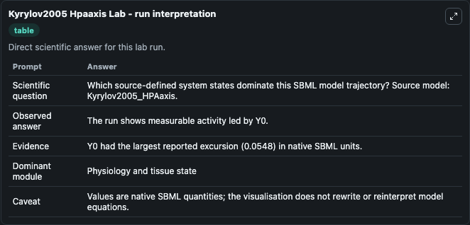
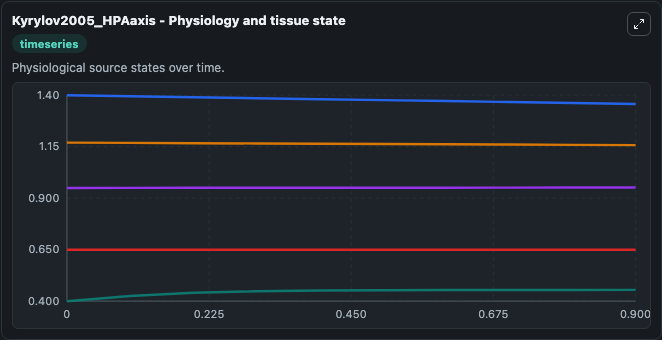
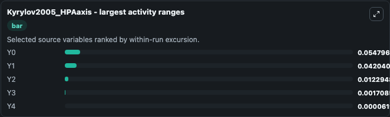
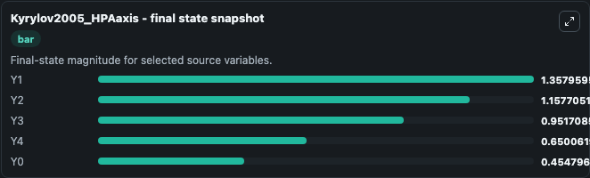
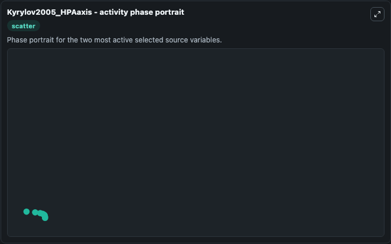

# Kyrylov2005 Hpaaxis

This Biosimulant lab wraps `Kyrylov2005 Hpaaxis` as a runnable systems biology model with a companion visualization module.
This a model from the article: Modeling robust oscillatory behavior of the hypothalamic-pituitary-adrenal axis. It can be used to explore the configured dynamics and compare scenario outcomes across configurations.

## What You'll See

The lab asks: Which source-defined system states dominate this SBML model trajectory? Source model: Kyrylov2005_HPAaxis. It runs for 1.0 time units with a communication step of 0.1. The run uses the model defaults declared by the curated SBML wrapper. The generated visualizations focus on Y4, Y3, Y2, Y1, and Y0, combining trajectory, endpoint-comparison, and summary-table views from one completed dark-mode run.

In this captured run, **Y0** moved from 0.4000 to 0.4548 across 1.0 simulation windows.


### Output Visualizations



*Summary table for Kyrylov2005 Hpaaxis, reporting the scientific question, observed answer, dominant module, and caveat.*



*Trajectories of Y0, Y1, Y2, Y3, and Y4 across the 1.0 simulation. In this run **Y0** climbed from 0.4000 to 0.4548 and **Y1** fell from 1.400 to 1.358 — the largest movements among the focused observables.*



*Largest-excursion ranking of the focused observables — the absolute movement magnitude during the run. Top 3: **Y0** = 0.0548, **Y1** = 0.0420, **Y2** = 0.0123, with 2 more observables below.*



*Endpoint snapshot of the focused observables — final values from the captured run. Top 3 by value: **Y1** = 1.358, **Y2** = 1.158, **Y3** = 0.9517, with 2 more observables below.*



*Visualization card from the Kyrylov2005 Hpaaxis dark-mode run.*


## Model Context

- Core model: `models/core`
- Visualization model: `models/visualisation`
- Standard: `other`
- Upstream source: `biomodels_ebi:MODEL0478740924`
- License: `CC0`

## Inputs

| Input | Maps To | Default | Notes |
|---|---|---|---|
| Initial Model State Y4 | `systemsbiology_sbml_kyrylov2005_hpaaxis_model0478740924_model.initial_model_state_y4` | | Source state initial condition exposed as a model-specific control because no explicit intervention parameter is identifiable. Maps to SBML symbol `y4`. |
| Initial Model State Y3 | `systemsbiology_sbml_kyrylov2005_hpaaxis_model0478740924_model.initial_model_state_y3` | | Source state initial condition exposed as a model-specific control because no explicit intervention parameter is identifiable. Maps to SBML symbol `y3`. |
| Initial Model State Y2 | `systemsbiology_sbml_kyrylov2005_hpaaxis_model0478740924_model.initial_model_state_y2` | | Source state initial condition exposed as a model-specific control because no explicit intervention parameter is identifiable. Maps to SBML symbol `y2`. |
| Initial Model State Y1 | `systemsbiology_sbml_kyrylov2005_hpaaxis_model0478740924_model.initial_model_state_y1` | | Source state initial condition exposed as a model-specific control because no explicit intervention parameter is identifiable. Maps to SBML symbol `y1`. |
| Initial Model State Y0 | `systemsbiology_sbml_kyrylov2005_hpaaxis_model0478740924_model.initial_model_state_y0` | | Source state initial condition exposed as a model-specific control because no explicit intervention parameter is identifiable. Maps to SBML symbol `y0`. |

## Outputs

| Output | Maps To | Role |
|---|---|---|
| `state` | `systemsbiology_sbml_kyrylov2005_hpaaxis_model0478740924_model.state` | Available to the visualization model and downstream workflows. |
| `summary` | `systemsbiology_sbml_kyrylov2005_hpaaxis_model0478740924_model.summary` | Available to the visualization model and downstream workflows. |
| `species_labels` | `systemsbiology_sbml_kyrylov2005_hpaaxis_model0478740924_model.species_labels` | Available to the visualization model and downstream workflows. |
| `model_state_y4` | `systemsbiology_sbml_kyrylov2005_hpaaxis_model0478740924_model.model_state_y4` | Available to the visualization model and downstream workflows. |
| `model_state_y3` | `systemsbiology_sbml_kyrylov2005_hpaaxis_model0478740924_model.model_state_y3` | Available to the visualization model and downstream workflows. |
| `model_state_y2` | `systemsbiology_sbml_kyrylov2005_hpaaxis_model0478740924_model.model_state_y2` | Available to the visualization model and downstream workflows. |
| `model_state_y1` | `systemsbiology_sbml_kyrylov2005_hpaaxis_model0478740924_model.model_state_y1` | Available to the visualization model and downstream workflows. |
| `model_state_y0` | `systemsbiology_sbml_kyrylov2005_hpaaxis_model0478740924_model.model_state_y0` | Available to the visualization model and downstream workflows. |

## Runtime

- Duration: `1.0`
- Communication step: `0.1`

## Running Locally

```bash
biosimulant labs serve
```
