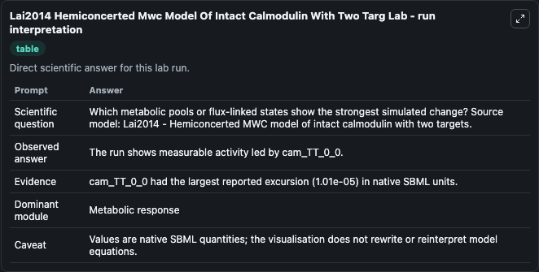
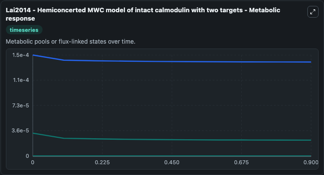
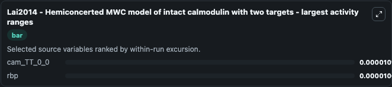
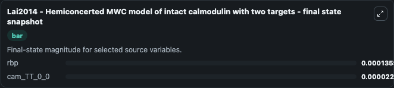
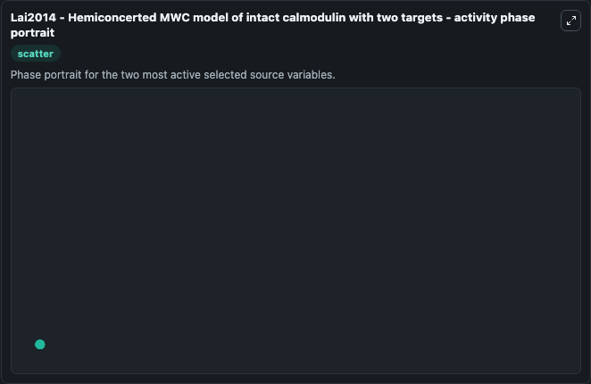

# Lai2014 Hemiconcerted Mwc Model Of Intact Calmodulin With Two Targ

This Biosimulant lab wraps `Lai2014 Hemiconcerted Mwc Model Of Intact Calmodulin With Two Targ` as a runnable systems biology model with a companion visualization module.
Lai2014 - Hemiconcerted MWC model of intactcalmodulin with two targets This model is described in the article: Modulation of calmodulin lobes by different targets: an allosteric model with hemiconcert. It can be used to explore the configured dynamics and compare scenario outcomes across configurations.

## What You'll See

The lab asks: Which metabolic pools or flux-linked states show the strongest simulated change? Source model: Lai2014 - Hemiconcerted MWC model of intact calmodulin with two targets. It runs for 1.0 time units with a communication step of 0.1. The run uses the model defaults declared by the curated SBML wrapper. The generated visualizations focus on rbp, cam_TT_0_0, tbp, cam_TT_D_tbp, cam_TT_D_rbp, and cam_TT_D_0, combining trajectory, endpoint-comparison, and summary-table views from one completed dark-mode run.

In this captured run, **cam_TT_0_0** moved from 3.3e-05 to 2.29e-05 across 1.0 simulation windows.


### Output Visualizations



*Summary table for Lai2014 Hemiconcerted Mwc Model Of Intact Calmodulin With Two Targ, reporting the scientific question, observed answer, dominant module, and caveat.*



*Trajectories of cam_TT_0_0, rbp, tbp, cam_TT_D_tbp, cam_TT_D_rbp, and cam_TT_D_0 across the 1.0 simulation. In this run **cam_TT_0_0** fell from 3.3e-05 to 2.29e-05 — the largest movements among the focused observables.*



*Largest-excursion ranking of the focused observables — the absolute movement magnitude during the run. Top 2: **cam_TT_0_0** = 1.01e-05, **rbp** = 1.01e-05.*



*Endpoint snapshot of the focused observables — final values from the captured run. Top 2 by value: **rbp** = 0.000136, **cam_TT_0_0** = 2.29e-05.*



*Visualization card from the Lai2014 Hemiconcerted Mwc Model Of Intact Calmodulin With Two Targ dark-mode run.*


## Model Context

- Core model: `models/core`
- Visualization model: `models/visualisation`
- Standard: `other`
- Upstream source: `biomodels_ebi:BIOMD0000000574`
- License: `CC0`

## Inputs

| Input | Maps To | Default | Notes |
|---|---|---|---|
| Initial Model State Rbp | `systemsbiology_sbml_lai2014_hemiconcerted_mwc_model_of_intact_calmod_biomd0000000574_model.initial_model_state_rbp` | | Source state initial condition exposed as a model-specific control because no explicit intervention parameter is identifiable. Maps to SBML symbol `rbp`. |
| Initial Cam Tt 0 0 | `systemsbiology_sbml_lai2014_hemiconcerted_mwc_model_of_intact_calmod_biomd0000000574_model.initial_cam_tt_0_0` | | Source state initial condition exposed as a model-specific control because no explicit intervention parameter is identifiable. Maps to SBML symbol `cam_TT_0_0`. |
| Initial Model State Tbp | `systemsbiology_sbml_lai2014_hemiconcerted_mwc_model_of_intact_calmod_biomd0000000574_model.initial_model_state_tbp` | | Source state initial condition exposed as a model-specific control because no explicit intervention parameter is identifiable. Maps to SBML symbol `tbp`. |
| Initial Cam Tt D Tbp | `systemsbiology_sbml_lai2014_hemiconcerted_mwc_model_of_intact_calmod_biomd0000000574_model.initial_cam_tt_d_tbp` | | Source state initial condition exposed as a model-specific control because no explicit intervention parameter is identifiable. Maps to SBML symbol `cam_TT_D_tbp`. |
| Initial Cam Tt D Rbp | `systemsbiology_sbml_lai2014_hemiconcerted_mwc_model_of_intact_calmod_biomd0000000574_model.initial_cam_tt_d_rbp` | | Source state initial condition exposed as a model-specific control because no explicit intervention parameter is identifiable. Maps to SBML symbol `cam_TT_D_rbp`. |
| Initial Cam Tt D 0 | `systemsbiology_sbml_lai2014_hemiconcerted_mwc_model_of_intact_calmod_biomd0000000574_model.initial_cam_tt_d_0` | | Source state initial condition exposed as a model-specific control because no explicit intervention parameter is identifiable. Maps to SBML symbol `cam_TT_D_0`. |

## Outputs

| Output | Maps To | Role |
|---|---|---|
| `state` | `systemsbiology_sbml_lai2014_hemiconcerted_mwc_model_of_intact_calmod_biomd0000000574_model.state` | Available to the visualization model and downstream workflows. |
| `summary` | `systemsbiology_sbml_lai2014_hemiconcerted_mwc_model_of_intact_calmod_biomd0000000574_model.summary` | Available to the visualization model and downstream workflows. |
| `species_labels` | `systemsbiology_sbml_lai2014_hemiconcerted_mwc_model_of_intact_calmod_biomd0000000574_model.species_labels` | Available to the visualization model and downstream workflows. |
| `rbp` | `systemsbiology_sbml_lai2014_hemiconcerted_mwc_model_of_intact_calmod_biomd0000000574_model.rbp` | Available to the visualization model and downstream workflows. |
| `cam_tt_0_0` | `systemsbiology_sbml_lai2014_hemiconcerted_mwc_model_of_intact_calmod_biomd0000000574_model.cam_tt_0_0` | Available to the visualization model and downstream workflows. |
| `tbp` | `systemsbiology_sbml_lai2014_hemiconcerted_mwc_model_of_intact_calmod_biomd0000000574_model.tbp` | Available to the visualization model and downstream workflows. |
| `cam_tt_d_tbp` | `systemsbiology_sbml_lai2014_hemiconcerted_mwc_model_of_intact_calmod_biomd0000000574_model.cam_tt_d_tbp` | Available to the visualization model and downstream workflows. |
| `cam_tt_d_rbp` | `systemsbiology_sbml_lai2014_hemiconcerted_mwc_model_of_intact_calmod_biomd0000000574_model.cam_tt_d_rbp` | Available to the visualization model and downstream workflows. |
| `cam_tt_d_0` | `systemsbiology_sbml_lai2014_hemiconcerted_mwc_model_of_intact_calmod_biomd0000000574_model.cam_tt_d_0` | Available to the visualization model and downstream workflows. |

## Runtime

- Duration: `1.0`
- Communication step: `0.1`

## Running Locally

```bash
biosimulant labs serve
```
