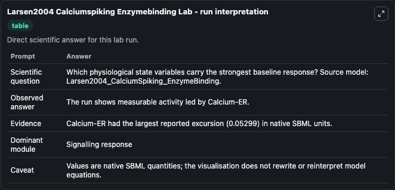
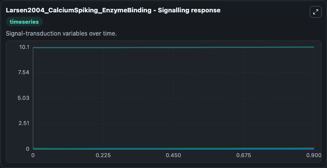
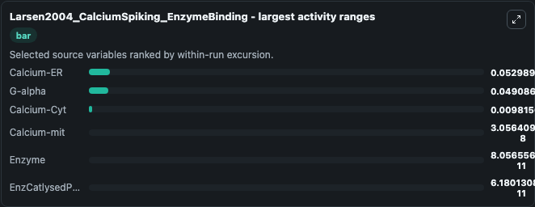
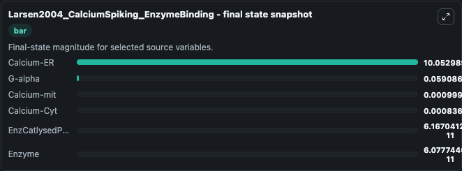
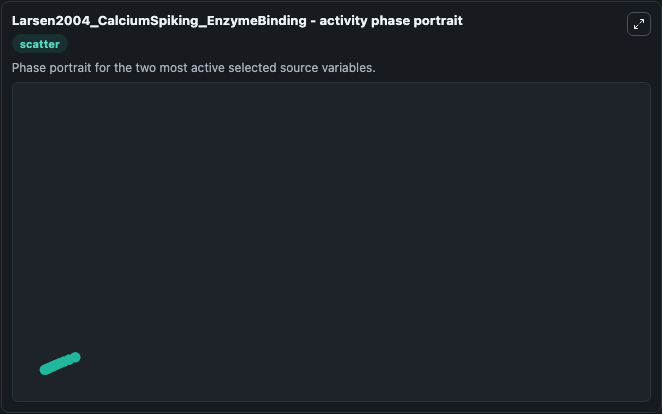

# Larsen2004 Calciumspiking Enzymebinding

This Biosimulant lab wraps `Larsen2004 Calciumspiking Enzymebinding` as a runnable systems biology model with a companion visualization module.
This a model from the article: On the encoding and decoding of calcium signals in hepatocytes Ann Zahle Larsen, Lars Folke Olsen and Ursula Kummera Biophysical Chemistry Volume 107, Issue 1, 1 January. It can be used to explore the configured dynamics and compare scenario outcomes across configurations.

## What You'll See

The lab asks: Which physiological state variables carry the strongest baseline response? Source model: Larsen2004_CalciumSpiking_EnzymeBinding. It runs for 1.0 time units with a communication step of 0.1. The run uses the model defaults declared by the curated SBML wrapper. The generated visualizations focus on Calcium-ER, G-alpha, Calcium-Cyt, Calcium-mit, Enzyme, and EnzCatlysedProduct, combining trajectory, endpoint-comparison, and summary-table views from one completed dark-mode run.

In this captured run, **Calcium-ER** moved from 10.000 to 10.053 across 1.0 simulation windows.


### Output Visualizations



*Summary table for Larsen2004 Calciumspiking Enzymebinding, reporting the scientific question, observed answer, dominant module, and caveat.*



*Trajectories of Calcium-ER, G-alpha, Calcium-Cyt, Calcium-mit, Enzyme, and EnzCatlysedProduct across the 1.0 simulation. In this run **Calcium-ER** climbed from 10.000 to 10.053 and **Calcium-Cyt** fell from 0.0100 to 0.000837 — the largest movements among the focused observables.*



*Largest-excursion ranking of the focused observables — the absolute movement magnitude during the run. Top 3: **Calcium-ER** = 0.0530, **G-alpha** = 0.0491, **Calcium-Cyt** = 0.00982, with 3 more observables below.*



*Endpoint snapshot of the focused observables — final values from the captured run. Top 3 by value: **Calcium-ER** = 10.053, **G-alpha** = 0.0591, **Calcium-mit** = 0.001, with 3 more observables below.*



*Visualization card from the Larsen2004 Calciumspiking Enzymebinding dark-mode run.*


## Model Context

- Core model: `models/core`
- Visualization model: `models/visualisation`
- Standard: `other`
- Upstream source: `biomodels_ebi:BIOMD0000000331`
- License: `CC0`

## Inputs

| Input | Maps To | Default | Notes |
|---|---|---|---|
| Initial Calcium Er | `systemsbiology_sbml_larsen2004_calciumspiking_enzymebinding_biomd0000000331_model.initial_calcium_er` | | Source state initial condition exposed as a model-specific control because no explicit intervention parameter is identifiable. Maps to SBML symbol `Ca_ER`. |
| Initial G Alpha | `systemsbiology_sbml_larsen2004_calciumspiking_enzymebinding_biomd0000000331_model.initial_g_alpha` | | Source state initial condition exposed as a model-specific control because no explicit intervention parameter is identifiable. Maps to SBML symbol `G_alpha`. |
| Initial Calcium Cyt | `systemsbiology_sbml_larsen2004_calciumspiking_enzymebinding_biomd0000000331_model.initial_calcium_cyt` | | Source state initial condition exposed as a model-specific control because no explicit intervention parameter is identifiable. Maps to SBML symbol `Ca_cyt`. |
| Initial Calcium Mit | `systemsbiology_sbml_larsen2004_calciumspiking_enzymebinding_biomd0000000331_model.initial_calcium_mit` | | Source state initial condition exposed as a model-specific control because no explicit intervention parameter is identifiable. Maps to SBML symbol `Ca_mit`. |
| Initial Enzyme | `systemsbiology_sbml_larsen2004_calciumspiking_enzymebinding_biomd0000000331_model.initial_enzyme` | | Source state initial condition exposed as a model-specific control because no explicit intervention parameter is identifiable. Maps to SBML symbol `Enz`. |
| Initial Enz Catlysed Product | `systemsbiology_sbml_larsen2004_calciumspiking_enzymebinding_biomd0000000331_model.initial_enz_catlysed_product` | | Source state initial condition exposed as a model-specific control because no explicit intervention parameter is identifiable. Maps to SBML symbol `Product`. |

## Outputs

| Output | Maps To | Role |
|---|---|---|
| `state` | `systemsbiology_sbml_larsen2004_calciumspiking_enzymebinding_biomd0000000331_model.state` | Available to the visualization model and downstream workflows. |
| `summary` | `systemsbiology_sbml_larsen2004_calciumspiking_enzymebinding_biomd0000000331_model.summary` | Available to the visualization model and downstream workflows. |
| `species_labels` | `systemsbiology_sbml_larsen2004_calciumspiking_enzymebinding_biomd0000000331_model.species_labels` | Available to the visualization model and downstream workflows. |
| `calcium_er` | `systemsbiology_sbml_larsen2004_calciumspiking_enzymebinding_biomd0000000331_model.calcium_er` | Available to the visualization model and downstream workflows. |
| `g_alpha` | `systemsbiology_sbml_larsen2004_calciumspiking_enzymebinding_biomd0000000331_model.g_alpha` | Available to the visualization model and downstream workflows. |
| `calcium_cyt` | `systemsbiology_sbml_larsen2004_calciumspiking_enzymebinding_biomd0000000331_model.calcium_cyt` | Available to the visualization model and downstream workflows. |
| `calcium_mit` | `systemsbiology_sbml_larsen2004_calciumspiking_enzymebinding_biomd0000000331_model.calcium_mit` | Available to the visualization model and downstream workflows. |
| `enzyme` | `systemsbiology_sbml_larsen2004_calciumspiking_enzymebinding_biomd0000000331_model.enzyme` | Available to the visualization model and downstream workflows. |
| `enz_catlysed_product` | `systemsbiology_sbml_larsen2004_calciumspiking_enzymebinding_biomd0000000331_model.enz_catlysed_product` | Available to the visualization model and downstream workflows. |

## Runtime

- Duration: `1.0`
- Communication step: `0.1`

## Running Locally

```bash
biosimulant labs serve
```
